# የZENOVA ምስላዊ ሥርዓት መመሪያ መጽሐፍ

<div style="text-align: center; padding: 40px 0;">

# 📘 ZENOVA

## የትምህርት ቴክኖሎጂ ማኔጅመንት ሲስተም

### ምስላዊ የሥርዓት ሰነድ

**የሰነድ ዓይነት፦** የሥርዓት አርክቴክቸር እና ዲዛይን ሰነድ  
**ስሪት፦** 1.0  
**ተመድሯል፦** ሐምሌ 2026

---

**ZENOVA የትምህርት ተቋማትን ሙሉ በሙሉ በዲጂታል መንገድ ለማስተዳደር የተሰራ የተቀናጀ የትምህርት ቴክኖሎጂ (EdTech) መድረክ ነው።**

</div>

---

## 📑 የዘረዘር ሰንጠረዥ (Table of Contents)

| ምዕራፍ | ርዕስ | ገጽ |
|---------|-------|------|
| 1 | ZENOVA ምንድን ነው? | 1 |
| 2 | የሲስተም አርክቴክቸር | 4 |
| 3 | ሱፐር አድሚን | 8 |
| 4 | የትምህርት ቤት ባለቤት | 12 |
| 5 | ዳይሬክተር | 16 |
| 6 | አድሚን | 20 |
| 7 | ሬጅስትራር | 24 |
| 8 | ፋይናንስ | 28 |
| 9 | መምህር | 36 |
| 10 | ወላጅ | 40 |
| 11 | ተማሪ | 44 |
| 12 | ቤተ-መጻሕፍት | 48 |
| 13 | ካፍቴሪያ | 52 |
| 14 | መደብር | 56 |
| 15 | NFC ሥርዓት | 60 |
| 16 | QR ኮድ ሥርዓት | 64 |
| 17 | የደህንነት ሥርዓት | 68 |
| 18 | የፍቃድ አሰጣጥ ሥርዓት | 72 |
| 19 | የደመና ማመሳሰል | 76 |
| 20 | የሲስተም አሰማራት | 80 |
| 21 | የውሂብ ጎታ ዝምድና | 84 |
| 22 | የፍቃድ ተዋረድ | 88 |
| 23 | ዕለታዊ ምሳሌ | 92 |
| 24 | የወደፊት ዕቅድ | 96 |

---

<div style="page-break-before: always;"></div>

# ምዕራፍ 1 — ZENOVA ምንድን ነው? (What is ZENOVA?)

## 📋 አጠቃላይ እይታ (Overview)

ZENOVA የትምህርት ተቋማትን ከሥር እስከ ቅጠል በዲጂታል መንገድ ለማስተዳደር የተሰራ የተቀናጀ የEdTech መድረክ ነው። ሲስተሙ **13+ የተለያዩ ሚናዎችን**፣ **229 ገፆችን**፣ **3-ደረጃ አርክቴክቸር**ን እና **NFC/QR ቴክኖሎጂ**ን ያጣምራል።

---

## 🧠 የZENOVA አእምሮአዊ ካርታ (Mind Map)

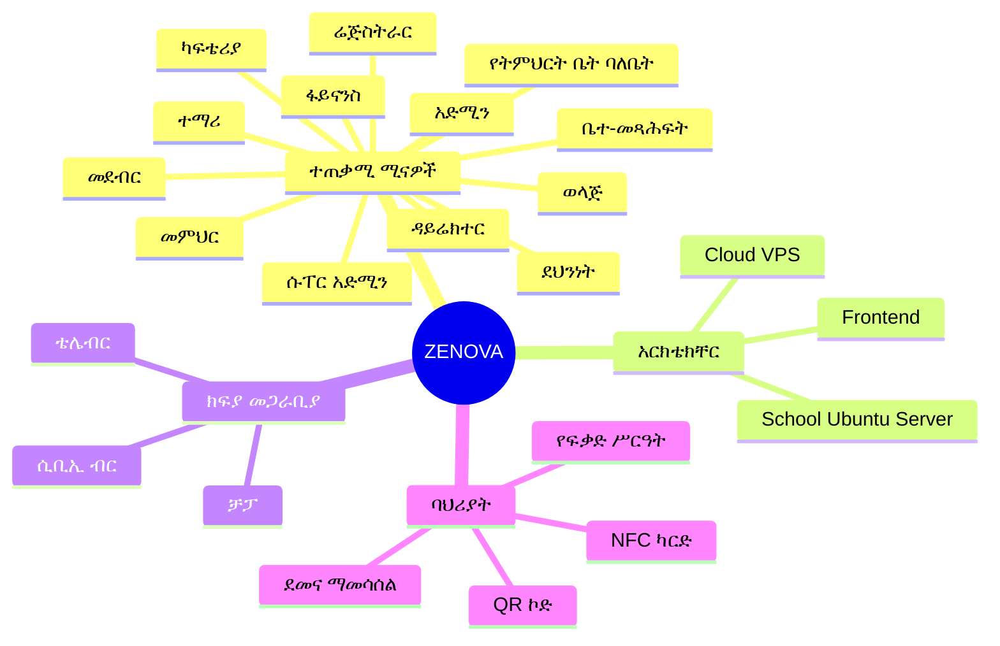

---

## 🏛️ የZENOVA ምስላዊ መዋቅር (Visual Structure)

```
┌─────────────────────────────────────────────────────────────────┐
│                    ZENOVA ECOSYSTEM                             │
│  ┌───────────────────────────────────────────────────────────┐  │
│  │                    ☁️ CLOUD VPS                           │  │
│  │  ┌─────────────┐  ┌─────────────┐  ┌─────────────┐      │  │
│  │  │ License     │  │ API         │  │ Central     │      │  │
│  │  │ Server      │  │ Gateway     │  │ Database    │      │  │
│  │  └─────────────┘  └─────────────┘  └─────────────┘      │  │
│  └───────────────────────────────────────────────────────────┘  │
│                          │                                       │
│          ┌───────────────┼───────────────┐                       │
│          ▼               ▼               ▼                       │
│  ┌──────────────┐ ┌──────────────┐ ┌──────────────┐              │
│  │ 🏫 School A  │ │ 🏫 School B  │ │ 🏫 School C  │              │
│  │ Ubuntu       │ │ Ubuntu       │ │ Ubuntu       │              │
│  │ Server       │ │ Server       │ │ Server       │              │
│  │              │ │              │ │              │              │
│  │ ├ NFC Reader│ │ ├ NFC Reader│ │ ├ NFC Reader│              │
│  │ ├ QR Scan   │ │ ├ QR Scan   │ │ ├ QR Scan   │              │
│  │ └ Local DB  │ │ └ Local DB  │ │ └ Local DB  │              │
│  └──────────────┘ └──────────────┘ └──────────────┘              │
│                          │                                       │
│          ┌───────────────┴───────────────┐                       │
│          ▼                               ▼                       │
│  ┌──────────────┐               ┌──────────────┐                 │
│  │ 💻 Browser   │               │ 📱 Mobile    │                 │
│  │ (Web App)    │               │ App (Future) │                 │
│  └──────────────┘               └──────────────┘                 │
└─────────────────────────────────────────────────────────────────┘
```

---

## 📊 የሚናዎች ማነጻጸሪያ ሰንጠረዥ (Role Comparison Table)

| ተ.ቁ. | ሚና | ደረጃ | ዋና ተግባር | መዳረሻ |
|------|------|--------|-------------|---------|
| 👑 | ሱፐር አድሚን | ከፍተኛ | መላውን ሲስተም መቆጣጠር | ሁሉም ትምህርት ቤቶች |
| 🏢 | ባለቤት | ከፍተኛ | የራሱን ትምህርት ቤት ማስተዳደር | አንድ ትምህርት ቤት |
| 👔 | ዳይሬክተር | መካከለኛ | አካዳሚክ ተቆጣጣሪ | የትምህርት ቤቱ አካዳሚክ |
| 👨‍💼 | አድሚን | መካከለኛ | ዕለታዊ አስተዳደር | ተማሪ/ሰራተኛ ውሂብ |
| 📝 | ሬጅስትራር | መካከለኛ | ምዝገባ እና ውጤት | የተማሪ አካዳሚክ |
| 💰 | ፋይናንስ | መካከለኛ | ሂሳብ እና ክፍያ | የፋይናንስ ውሂብ |
| 👩‍🏫 | መምህር | መሰረታዊ | የክፍል አስተዳደር | የራሱ ክፍል |
| 👨‍👩‍👧 | ወላጅ | መሰረታዊ | የልጅ ክትትል | የልጁ ውሂብ |
| 👦 | ተማሪ | መሰረታዊ | የራስ መረጃ | የራሱ ውሂብ |
| 📚 | ቤተ-መጻሕፍት | መካከለኛ | የመጻሕፍት አያያዝ | የቤተ-መጻሕፍት ሞጁል |
| 🍽️ | ካፍቴሪያ | መካከለኛ | የምግብ አቅርቦት | የካፍቴሪያ ሞጁል |
| 🛒 | መደብር | መካከለኛ | የእቃ ሽያጭ | የመደብር ሞጁል |
| 🔒 | ደህንነት | መካከለኛ | የተማሪ ክትትል | የደህንነት ሞጁል |

---

## 🔄 የሲስተም መስተጋብር ፍሰት (System Interaction Flow)

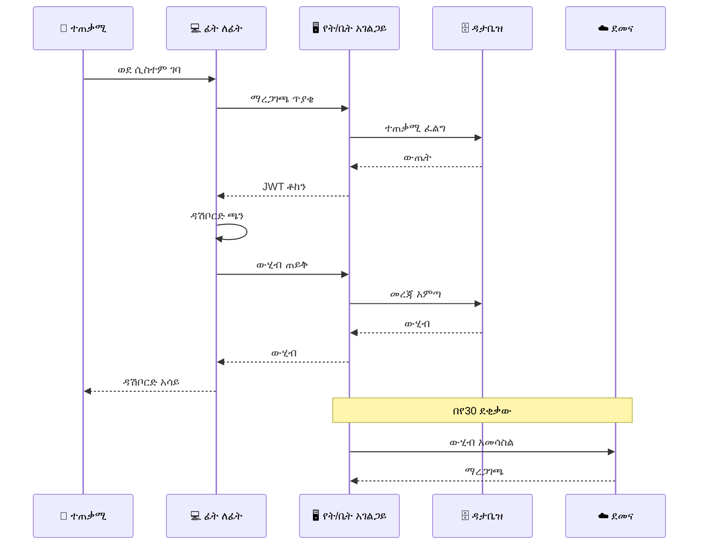

---

## 📈 ዋና ዋና ቁጥሮች (Key Numbers)

| መለኪያ | ቁጥር |
|--------|-------|
| 📄 ጠቅላላ ገፆች | 229 |
| 👥 ሚናዎች | 13+ |
| 🏗️ አርክቴክቸር ደረጃዎች | 3 |
| 💳 የክፍያ መጋራቢያዎች | 3 |
| 📱 ወደ React Query የተቀየሩ | 164/229 (72%) |
| ✅ የTypeScript ስህተቶች | 0 |
| ✅ የESLint ስህተቶች | 0 |

---

## 🎯 ማጠቃለያ (Summary)

ZENOVA የትምህርት ተቋማትን ሙሉ የዲጂታል ለውጥ ያመጣል። ከተማሪ ምዝገባ እስከ ክፍያ አሰባሰብ፣ ከቤተ-መጻሕፍት አያያዝ እስከ ካፍቴሪያ ክፍያ፣ ከNFC ክትትል እስከ ደመና ማመሳሰል — ሁሉም በአንድ የተቀናጀ መድረክ ላይ ይገኛል።

---

<div style="page-break-before: always;"></div>

# ምዕራፍ 2 — የሲስተም አርክቴክቸር (System Architecture)

## 🏗️ የ3-ደረጃ አርክቴክቸር ምስላዊ እይታ

```
                        ☁️ ZENOVA CLOUD VPS
                   (ማዕከላዊ የውሂብ ማዕከል)
                   ════════════════════════
                   ┌─────────────────────┐
                   │   Central Database  │
                   │   License Server    │
                   │   Payment Gateway   │
                   │   Super Admin UI    │
                   │   Cloud Sync API    │
                   └─────────────────────┘
                            │
            ┌───────────────┼───────────────┐
            │               │               │
            ▼               ▼               ▼
    ┌───────────────┐ ┌───────────────┐ ┌───────────────┐
    │  🏫 SCHOOL A  │ │  🏫 SCHOOL B  │ │  🏫 SCHOOL C  │
    │  Ubuntu Srvr  │ │  Ubuntu Srvr  │ │  Ubuntu Srvr  │
    │  ───────────  │ │  ───────────  │ │  ───────────  │
    │  • Local DB   │ │  • Local DB   │ │  • Local DB   │
    │  • NFC Reader │ │  • NFC Reader │ │  • NFC Reader │
    │  • QR Scanner │ │  • QR Scanner │ │  • QR Scanner │
    │  • API Server │ │  • API Server │ │  • API Server │
    └───────────────┘ └───────────────┘ └───────────────┘
            │               │               │
            └───────────────┼───────────────┘
                            │
                            ▼
                    ┌───────────────┐
                    │   💻 USERS   │
                    │  ───────────  │
                    │  • Browser    │
                    │  • Mobile App │
                    └───────────────┘
```

---

## 🔧 የቴክኖሎጂ ቁልል (Tech Stack)

### የፊት-ለፊት ክፍል (Frontend)

```
┌─────────────────────────────────────────────┐
│           FRONTEND LAYER                    │
├─────────────────────────────────────────────┤
│  ┌───────────────────────────────────────┐  │
│  │  Next.js 14 (React Framework)        │  │
│  └───────────────────────────────────────┘  │
│  ┌───────────────────────────────────────┐  │
│  │  TypeScript (ደህንነቱ የተጠበቀ ኮድ)    │  │
│  └───────────────────────────────────────┘  │
│  ┌───────────────────────────────────────┐  │
│  │  Tailwind CSS (ምላሽ ሰጪ ዲዛይን)       │  │
│  └───────────────────────────────────────┘  │
│  ┌───────────────────────────────────────┐  │
│  │  React Query (ውሂብ አስተዳደር)         │  │
│  └───────────────────────────────────────┘  │
│  ┌───────────────────────────────────────┐  │
│  │  ESLint (የኮድ ጥራት መመሪያ)            │  │
│  └───────────────────────────────────────┘  │
└─────────────────────────────────────────────┘
```

### የኋላ-ተናጋሪ ክፍል (Backend)

```
┌─────────────────────────────────────────────┐
│            BACKEND LAYER                    │
├─────────────────────────────────────────────┤
│  ┌───────────────────────────────────────┐  │
│  │  Node.js (አገልጋይ ፕሮግራሚንግ)          │  │
│  └───────────────────────────────────────┘  │
│  ┌───────────────────────────────────────┐  │
│  │  PostgreSQL (የውሂብ ጎታ)               │  │
│  └───────────────────────────────────────┘  │
│  ┌───────────────────────────────────────┐  │
│  │  REST API (መገናኛ ዘዴ)                │  │
│  └───────────────────────────────────────┘  │
│  ┌───────────────────────────────────────┐  │
│  │  JWT Authentication (ደህንነት)         │  │
│  └───────────────────────────────────────┘  │
└─────────────────────────────────────────────┘
```

### የሃርድዌር እና ሌሎች ክፍሎች

```
┌─────────────────────────────────────────────┐
│         HARDWARE & INFRASTRUCTURE           │
├─────────────────────────────────────────────┤
│  ┌─────────────┐  ┌─────────────┐          │
│  │ 📡 NFC      │  │ 📸 QR      │          │
│  │ Reader      │  │ Scanner    │          │
│  └─────────────┘  └─────────────┘          │
│  ┌───────────────────────────────────────┐  │
│  │ 🐳 Docker (ኮንቴይነር አስተዳደር)        │  │
│  └───────────────────────────────────────┘  │
│  ┌───────────────────────────────────────┐  │
│  │ 🐧 Ubuntu Server (የት/ቤት አገልጋይ)     │  │
│  └───────────────────────────────────────┘  │
└─────────────────────────────────────────────┘
```

---

## 📡 የውሂብ ፍሰት ዲያግራም (Data Flow Diagram)

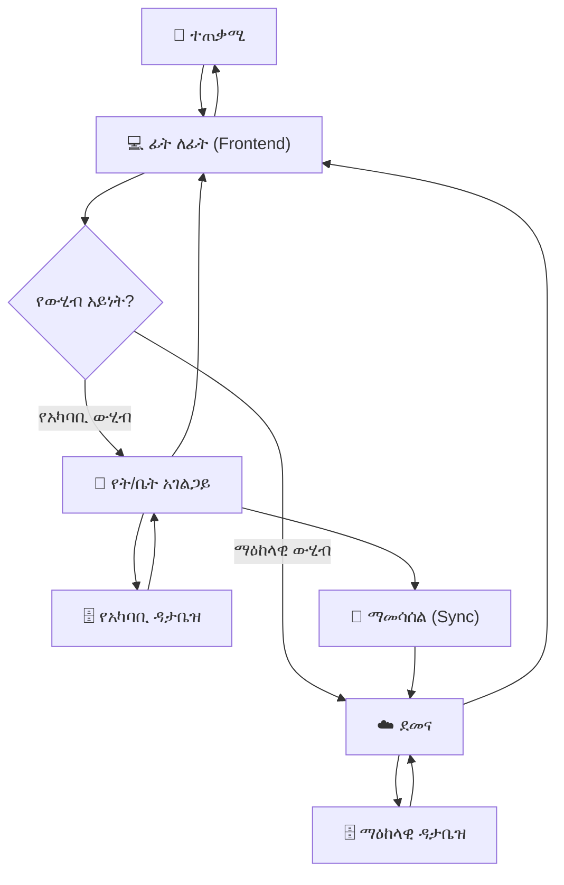

---

## 🌐 የኔትወርክ አርክቴክቸር (Network Architecture)

```
                        INTERNET
                           │
                           ▼
                    ┌───────────────┐
                    │   🛡️ FIREWALL │
                    └───────────────┘
                           │
                           ▼
              ┌─────────────────────────┐
              │   ☁️ CLOUD VPS          │
              │   (ማዕከላዊ አገልጋይ)      │
              │   IP: 203.x.x.x         │
              └─────────────────────────┘
                           │
          ┌────────────────┼────────────────┐
          │                │                │
          ▼                ▼                ▼
   ┌────────────┐   ┌────────────┐   ┌────────────┐
   │🏫 SCHOOL A │   │🏫 SCHOOL B │   │🏫 SCHOOL C │
   │192.168.1.x │   │192.168.2.x │   │192.168.3.x │
   │  ┌──────┐  │   │  ┌──────┐  │   │  ┌──────┐  │
   │  │Router│  │   │  │Router│  │   │  │Router│  │
   │  └──────┘  │   │  └──────┘  │   │  └──────┘  │
   │      │     │   │      │     │   │      │     │
   │  ┌──────┐  │   │  ┌──────┐  │   │  ┌──────┐  │
   │  │Ubuntu│  │   │  │Ubuntu│  │   │  │Ubuntu│  │
   │  │Server│  │   │  │Server│  │   │  │Server│  │
   │  └──────┘  │   │  └──────┘  │   │  └──────┘  │
   │  ┌──────┐  │   │  ┌──────┐  │   │  ┌──────┐  │
   │  │NFC   │  │   │  │NFC   │  │   │  │NFC   │  │
   │  │Reader│  │   │  │Reader│  │   │  │Reader│  │
   │  └──────┘  │   │  └──────┘  │   │  └──────┘  │
   └────────────┘   └────────────┘   └────────────┘
```

---

## 🔐 የደህንነት ንብርብሮች (Security Layers)

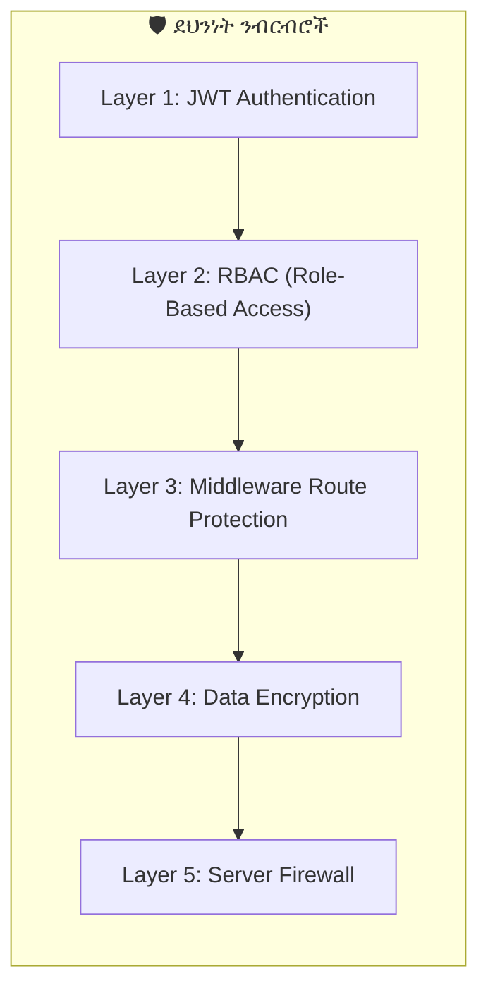

### የደህንነት ንብርብሮች ማብራሪያ

| ንብርብር | ቴክኖሎጂ | ተግባር |
|----------|-----------|---------|
| 1️⃣ | JWT (JSON Web Token) | ተጠቃሚ ማረጋገጫ |
| 2️⃣ | RBAC (14 ሚናዎች) | በሚና ላይ የተመሰረተ ፍቃድ |
| 3️⃣ | Next.js Middleware | ገፆችን ከማሳየቱ በፊት ፍቃድ ማረጋገጥ |
| 4️⃣ | SSL/TLS + Encryption | የውሂብ ምስጠራ |
| 5️⃣ | Firewall + IP Restriction | የአገልጋይ ደህንነት |

---

## 🎯 ማጠቃለያ (Summary)

የZENOVA አርክቴክቸር በሶስት ደረጃዎች የተከፋፈለ ሲሆን ይህም ሲስተሙን **ደህንነቱ የተጠበቀ**፣ **ተከሳሽ** እና **በቀላሉ ሊስፋፋ የሚችል** ያደርገዋል። እያንዳንዱ ትምህርት ቤት የራሱ የሆነ የአካባቢ አገልጋይ ቢኖረውም ከማዕከላዊ ደመና ጋር በመደበኛነት ይሰማማል።

---

<div style="page-break-before: always;"></div>

# ምዕራፍ 3 — ሱፐር አድሚን (Super Admin)

## 👑 የሱፐር አድሚን ሚና

ሱፐር አድሚን የZENOVA ሲስተም ከፍተኛው የአስተዳደር ሚና ነው። ይህ ሰው መላውን ሲስተም — ሁሉንም ትምህርት ቤቶች፣ ተጠቃሚዎች፣ ፍቃዶች እና የሲስተም ውቅሮችን — የማስተዳደር ሙሉ ስልጣን አለው።

---

## 🏛️ የፍቃድ ተዋረድ (Permission Hierarchy)

```
                        ┌──────────────┐
                        │  👑 SUPER   │
                        │   ADMIN      │
                        │  (Level 13)  │
                        └──────┬───────┘
                               │
                               ▼
                        ┌──────────────┐
                        │  🏢 SCHOOL  │
                        │   OWNER     │
                        │  (Level 12)  │
                        └──────┬───────┘
                               │
                               ▼
                        ┌──────────────┐
                        │  👔 DIRECTOR│
                        │  (Level 11)  │
                        └──────┬───────┘
                               │
                    ┌──────────┴──────────┐
                    ▼                     ▼
             ┌────────────┐       ┌────────────┐
             │👨‍💼 ADMIN  │       │📝 REGISTRAR│
             │(Level 10)  │       │(Level 10)  │
             └──────┬─────┘       └──────┬─────┘
                    │                    │
                    └──────────┬─────────┘
                               │
                    ┌──────────┴──────────┐
                    ▼                     ▼
             ┌────────────┐       ┌────────────┐
             │💰 FINANCE │       │👩‍🏫 TEACHER│
             │(Level 9)  │       │(Level 9)  │
             └────────────┘       └────────────┘
                               │
                    ┌──────────┴──────────┐
                    ▼                     ▼
             ┌────────────┐       ┌────────────┐
             │👨‍👩‍👧 PARENT │       │👦 STUDENT │
             │(Level 8)  │       │(Level 8)  │
             └────────────┘       └────────────┘
```

---

## 📊 የሱፐር አድሚን ዳሽቦርድ ምስላዊ ንድፍ (Dashboard Wireframe)

```
┌─────────────────────────────────────────────────────────────────┐
│  🔵 ZENOVA  ● ሱፐር አድሚን                    👤 አድሚን │ ውጣ │
├─────────────────────────────────────────────────────────────────┤
│ ┌──────────┐ ┌──────────┐ ┌──────────┐ ┌──────────┐ ┌────────┐│
│ │ 🏫 ት/ቤቶች │ │ 📄 ፍቃዶች │ │ 💰 ገቢ   │ │ ⏰ ማብቂያ │ │ 👥 ተ/ቤት│
│ │   126    │ │   118   │ │ 2.5M ብር │ │   12    │ │ 12,450 ││
│ │  ጠቅላላ  │ │  ንቁ     │ │  ወርሃዊ  │ │  ማስጠን  │ │ ተማሪዎች│
│ └──────────┘ └──────────┘ └──────────┘ └──────────┘ └────────┘│
├─────────────────────────────────────────────────────────────────┤
│  📋 የቅርብ ጊዜ ትምህርት ቤቶች (Recent Schools)              │
│ ┌─────────────────────────────────────────────────────────────┐ │
│ │ ትምህርት ቤት            │ ከተማ │ ፍቃድ │ ሁኔታ  │ ተማሪዎች │ │
│ ├─────────────────────────────────────────────────────────────┤ │
│ │ ቅዱስ ጊዮርጊስ ት/ቤት    │ አ.አ  │ ንቁ   │ ✅    │ 1,250  │ │
│ │ መዋለ ህጻናት ኮከብ     │ ባህርዳር │ ንቁ │ ✅    │ 340    │ │
│ │ ዘመን ትምህርት ቤት     │ አ.አ  │ ያለቀ │ ⚠️    │ 890    │ │
│ │ ራስ መኮንን ት/ቤት     │ ጎንደር│ ንቁ   │ ✅    │ 2,100  │ │
│ └─────────────────────────────────────────────────────────────┘ │
├─────────────────────────────────────────────────────────────────┤
│ ┌─────────────────────────┐ ┌─────────────────────────────┐    │
│ │  📈 ወርሃዊ ምዝገባ      │ │  🖥️ የሲስተም ሁኔታ          │    │
│ │                         │ │  CPU: ████████░░ 80%      │    │
│ │  ██                     │ │  RAM: ██████░░░░ 60%      │    │
│ │  ████████               │ │  DISK: ████████░░ 75%    │    │
│ │  ████████████           │ │  ማመሳሰል: ✅ ተሰምሯል      │    │
│ │  ████████████████       │ └─────────────────────────────┘    │
│ │  ──────────────────     │                                     │
│ │  ጥር የካቲት መጋቢት ሚያዚያ│                                     │
│ └─────────────────────────┘                                     │
└─────────────────────────────────────────────────────────────────┘
```

---

## 🔄 የትምህርት ቤት ምዝገባ ሂደት (School Registration Flow)

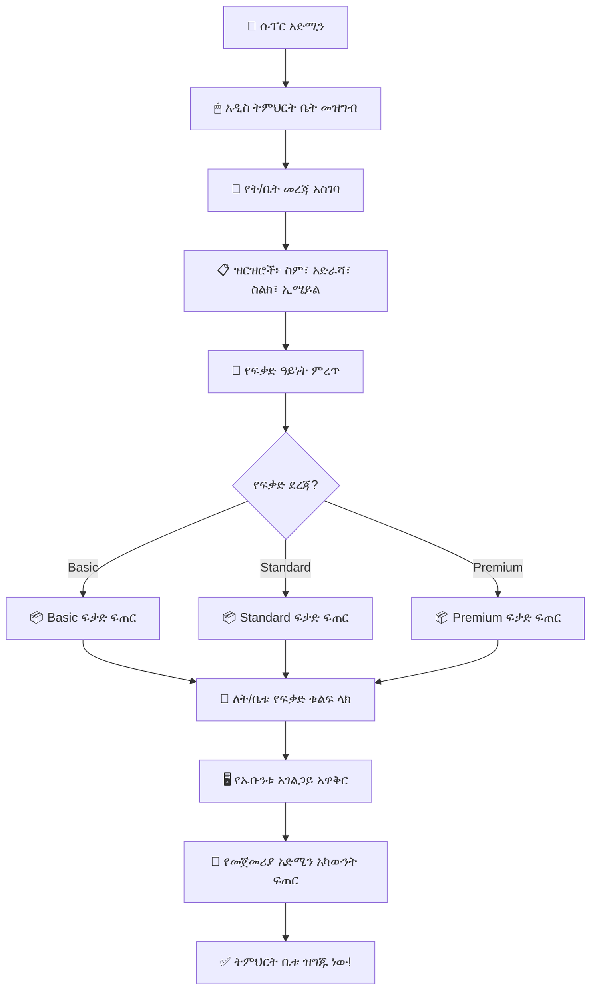

---

## ⚙️ የሱፐር አድሚን ተግባራት ዝርዝር

### የትምህርት ቤቶች አስተዳደር
```
┌─────────────────────────────────────────────────────────────────┐
│  🏫 የትምህርት ቤቶች አስተዳደር                                │
├─────────────────────────────────────────────────────────────────┤
│  ✅ አዲስ ትምህርት ቤት መመዝገብ                                    │
│  ✅ የትምህርት ቤት መረጃ ማስተካከል                                 │
│  ✅ ትምህርት ቤት ማንቃት / ማጥፋት                                  │
│  ✅ የትምህርት ቤቶች ዝርዝር እና ሁኔታ መከታተል                     │
│  ✅ የትምህርት ቤት መለኪያዎች (ስታቲስቲክስ) ማየት                    │
└─────────────────────────────────────────────────────────────────┘
```

### የፍቃድ አስተዳደር
```
┌─────────────────────────────────────────────────────────────────┐
│  🔑 የፍቃድ አስተዳደር                                          │
├─────────────────────────────────────────────────────────────────┤
│  ✅ ለአዳዲስ ትምህርት ቤቶች ፍቃድ መስጠት                            │
│  ✅ የነባር ፍቃዶች ማራዘሚያ                                       │
│  ✅ ፍቃድ ማቋረጥ                                                  │
│  ✅ የፍቃድ አጠቃቀም ሪፖርት                                      │
│  ✅ ፍቃድ ደረጃ ማሻሻል (Basic → Standard → Premium)               │
└─────────────────────────────────────────────────────────────────┘
```

### የሲስተም ክትትል
```
┌─────────────────────────────────────────────────────────────────┐
│  🖥️ የሲስተም ክትትል                                             │
├─────────────────────────────────────────────────────────────────┤
│  ✅ የአገልጋይ ሁኔታ (CPU፣ RAM፣ Disk) መከታተል                    │
│  ✅ የደመና ማመሳሰል ሁኔታ                                         │
│  ✅ የስህተት ሪፖርቶች                                             │
│  ✅ የሲስተም እንቅስቃሴ ምዝግብ (System Logs)                     │
└─────────────────────────────────────────────────────────────────┘
```

---

## 📈 የሪፖርት ዓይነቶች (Report Types)

| የሪፖርት ዓይነት | ድግግሞሽ | ይዘት |
|-------------------|-----------|-------|
| 📊 አጠቃላይ የሲስተም አጠቃቀም | ዕለታዊ | ጠቅላላ ት/ቤቶች፣ ተማሪዎች፣ እንቅስቃሴ |
| 📋 የት/ቤቶች አፈጻጸም | ሳምንታዊ | የእያንዳንዱ ት/ቤት አፈጻጸም |
| ⏰ የፍቃድ ጊዜ ማብቂያ | ዕለታዊ | በቅርቡ የሚያልቁ ፍቃዶች |
| 🔄 የደመና ማመሳሰል | ዕለታዊ | የማመሳሰል ሁኔታ እና ስህተቶች |
| ❌ የሲስተም ስህተት | በተከሰተ ጊዜ | የስህተት ዝርዝር እና መፍትሄ |

---

## 🎯 ማጠቃለያ (Summary)

ሱፐር አድሚን የZENOVA ሲስተም በረት ያህል ነው። ሁሉንም ትምህርት ቤቶች ያስተዳድራል፣ ፍቃዶችን ይሰጣል፣ የሲስተሙን ጤና ይከታተላል እና ማንኛውንም ዓይነት ሪፖርት ያዘጋጃል።

---

<div style="page-break-before: always;"></div>

# ምዕራፍ 4 — የትምህርት ቤት ባለቤት (School Owner)

## 🏢 ሚና እና ሃላፊነት

የትምህርት ቤት ባለቤት የአንድ የተወሰነ ትምህርት ቤት ከፍተኛ የአስተዳደር ስልጣን ያለው ሰው ነው። ከሱፐር አድሚን የሚለየው የራሱን ትምህርት ቤት ብቻ ነው የሚያስተዳድረው።

---

## 🏛️ የትምህርት ቤት መዋቅር (School Organizational Chart)

```
┌─────────────────────────────────────────────────────────────────┐
│                    🏢 የትምህርት ቤት ባለቤት                       │
│                         (Owner)                                  │
└─────────────────────────────┬───────────────────────────────────┘
                              │
                              ▼
┌─────────────────────────────────────────────────────────────────┐
│                    👔 ዳይሬክተር (Director)                        │
└─────────────┬───────────────────────────────────┬───────────────┘
              │                                   │
              ▼                                   ▼
┌─────────────────────────┐         ┌─────────────────────────────┐
│     👨‍💼 አድሚን (Admin)     │         │   📝 ሬጅስትራር (Registrar)  │
└─────────────┬───────────┘         └──────────────┬──────────────┘
              │                                    │
              ▼                                    ▼
┌─────────────────────────┐         ┌─────────────────────────────┐
│     💰 ፋይናንስ (Finance) │         │   👩‍🏫 መምህራን (Teachers)      │
└─────────────────────────┘         └─────────────────────────────┘
                                              │
                    ┌─────────────────────────┼──────────┐
                    ▼                         ▼          ▼
          ┌──────────────────┐     ┌──────────────┐ ┌──────────┐
          │ 📚 ቤተ-መጻሕፍት  │     │ 🍽️ ካፍቴሪያ │ │ 🛒 መደብር│
          └──────────────────┘     └──────────────┘ └──────────┘
```

---

## 📊 የባለቤት ዳሽቦርድ ምስላዊ ንድፍ

```
┌─────────────────────────────────────────────────────────────────┐
│  🏢 የተከበሩ ልጆች ትምህርት ቤት      👤 አቶ ኃይሉ │ ውጣ │
├─────────────────────────────────────────────────────────────────┤
│ ┌──────────┐ ┌──────────┐ ┌──────────┐ ┌──────────┐ ┌────────┐│
│ │ 👦 ተማሪዎች│ │ 👩‍🏫 መምህራን│ │ 💰 ገቢ   │ │ 📈 መገኘት│ │ ⏰ ማሳሰቢ│
│ │  1,250   │ │   45    │ │ 350,000  │ │  95%    │ │   3    ││
│ └──────────┘ └──────────┘ └──────────┘ └──────────┘ └────────┘│
├─────────────────────────────────────────────────────────────────┤
│ ┌─────────────────────────────┐ ┌─────────────────────────────┐│
│ │  📈 ወርሃዊ ገቢ እና ወጪ     │ │  👦 የክፍል ተማሪ ብዛት      ││
│ │  ገቢ ████████████████ 350K │ │  ቅ.መ ████████ 120         ││
│ │  ወጪ ██████████░░░░ 250K  │ │  1ኛ  ██████████████ 180    ││
│ │  ትርፍ ██████░░░░░░ 100K  │ │  2ኛ  ████████████ 150      ││
│ │                           │ │  3ኛ  ████████████████ 200   ││
│ └─────────────────────────────┘ └─────────────────────────────┘│
├─────────────────────────────────────────────────────────────────┤
│ ┌─────────────────────────────────────────────────────────────┐│
│ │  ⚠️ ያልተከፈሉ ክፍያዎች (Unpaid Fees)                      ││
│ │ ┌─────────────┬────────┬──────────┬───────────┬────────┐   ││
│ │ │ ተማሪ        │ ክፍል   │ መጠን    │ ዕዳ ከ    │ ሁኔታ  │   ││
│ │ ├─────────────┼────────┼──────────┼───────────┼────────┤   ││
│ │ │ አበበ ከበደ  │ 12ኛ ኤ│ 5,000   │ 3 ወር    │ ⚠️    │   ││
│ │ │ ሳራ ኃይሉ  │ 10ኛ ቢ│ 3,500   │ 2 ወር    │ ⚠️    │   ││
│ │ │ ዮናስ ተስፋ │ 8ኛ ሲ │ 2,000   │ 1 ወር    │ 🟡    │   ││
│ │ └─────────────┴────────┴──────────┴───────────┴────────┘   ││
│ └─────────────────────────────────────────────────────────────┘│
└─────────────────────────────────────────────────────────────────┘
```

---

## 🔑 የባለቤት ተግባራት (Owner Functions)

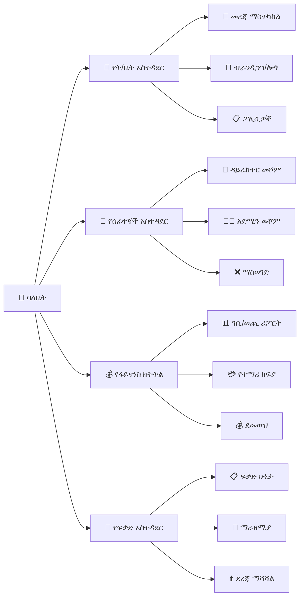

---

## 💰 የፋይናንስ ክትትል (Financial Monitoring)

| መለኪያ | የአሁኑ ወር | ያለፈው ወር | ለውጥ |
|--------|------------|------------|--------|
| 💵 ጠቅላላ ገቢ | 350,000 ብር | 320,000 ብር | 📈 +9% |
| 💸 ጠቅላላ ወጪ | 250,000 ብር | 240,000 ብር | 📈 +4% |
| 📈 ትርፍ | 100,000 ብር | 80,000 ብር | 📈 +25% |
| 📋 የተከፈለ ክፍያ | 85% | 82% | 📈 +3% |
| ⚠️ ያልተከፈለ ዕዳ | 45,000 ብር | 50,000 ብር | 📉 -10% |

---

## 🎯 ማጠቃለያ (Summary)

የትምህርት ቤት ባለቤት የራሱን ትምህርት ቤት አጠቃላይ አስተዳደር፣ የሰራተኞች አስተዳደር፣ የፋይናንስ ክትትል እና የፍቃድ አስተዳደር ያከናውናል። ከሱፐር አድሚን በታች ቢሆንም በራሱ ትምህርት ቤት ውስጥ ሙሉ ስልጣን አለው።

---

<div style="page-break-before: always;"></div>

# ምዕራፍ 5 — ዳይሬክተር (Director)

## 👔 ሚና እና ሃላፊነት

ዳይሬክተር የትምህርት ቤቱ ዋና የአካዳሚክ እና የአስተዳደር ተቆጣጣሪ ነው። ይህ ሚና በትምህርት ቤት ባለቤት እና በሌሎች ሰራተኞች መካከል የድልድይ ሚና ይጫወታል።

---

## 🎯 የዳይሬክተር ኃላፊነቶች ካርታ (Responsibility Map)

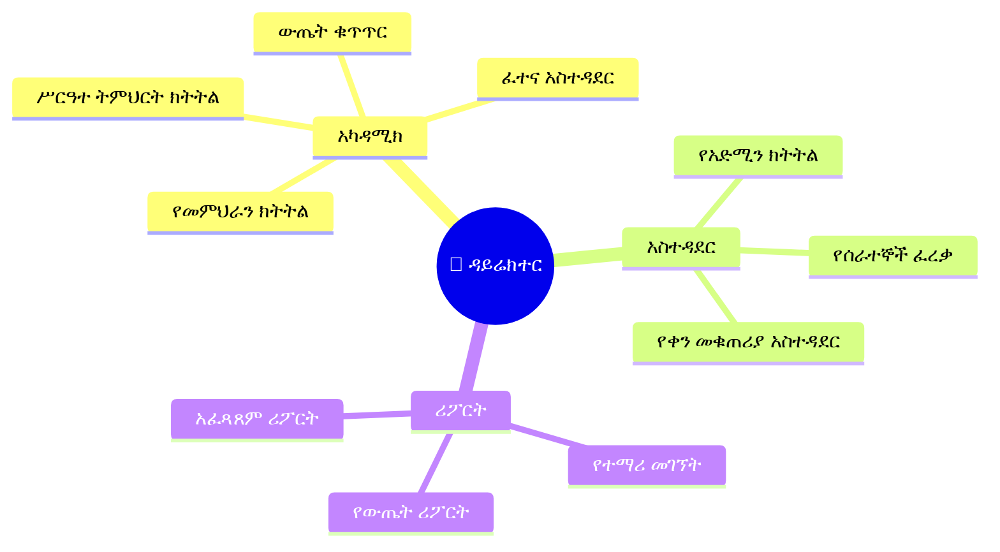

---

## 📊 የዳይሬክተር ዳሽቦርድ ምስላዊ ንድፍ

```
┌─────────────────────────────────────────────────────────────────┐
│  👔 ዳይሬክተር ዳሽቦርድ              የ2017 ዓ.ም ትምህርት ዘመን │
├─────────────────────────────────────────────────────────────────┤
│ ┌──────────┐ ┌──────────┐ ┌──────────┐ ┌──────────┐ ┌────────┐│
│ │ 👦 ተማሪ  │ │ 👩‍🏫 መምህር│ │ 📈 መገኘት│ │ 📊 አማካይ│ │ 📝 ክፍል ││
│ │  1,250  │ │   45    │ │   95%   │ │   78%   │ │   32   ││
│ └──────────┘ └──────────┘ └──────────┘ └──────────┘ └────────┘│
├─────────────────────────────────────────────────────────────────┤
│ ┌─────────────────────────────┐ ┌─────────────────────────────┐│
│ │  📈 የክፍል አፈጻጸም       │ │  👩‍🏫 የመምህራን መገኘት      ││
│ │  ቅ.መ  ████████ 85%        │ │  ወ/ሮ አስቴር  ██████████ 98% ││
│ │  1ኛ   ██████████ 78%      │ │  አቶ ኃይሉ    ████████ 85%   ││
│ │  2ኛ   ████████████ 82%    │ │  ወ/ሮ ሳራ    ██████████ 92% ││
│ │  3ኛ   ██████████ 76%      │ │  አቶ ተስፋ   ██████ 72%     ││
│ │  4ኛ   ████████ 70%        │ │                           ││
│ └─────────────────────────────┘ └─────────────────────────────┘│
├─────────────────────────────────────────────────────────────────┤
│ ┌─────────────────────────────────────────────────────────────┐│
│ │  📋 ዛሬ ያልተገኙ ተማሪዎች (Today's Absent Students)       ││
│ │ ┌─────────────┬────────┬──────────┬────────────┬────────┐   ││
│ │ │ ተማሪ        │ ክፍል   │ ምክንያት │ ወላጅ      │ ሁኔታ  │   ││
│ │ ├─────────────┼────────┼──────────┼────────────┼────────┤   ││
│ │ │ አበበ ከበደ │ 12ኛ ኤ│ ሕመም   │ ተነግሯል  │ 📞    │   ││
│ │ │ ሳራ ኃይሉ │ 10ኛ ቢ│ ፈቃድ   │ ተነግሯል  │ ✅    │   ││
│ │ │ ዮናስ ተስፋ│ 8ኛ ሲ │ ያልታወቀ│ አልተነገረም │ ⚠️    │   ││
│ │ └─────────────┴────────┴──────────┴────────────┴────────┘   ││
│ └─────────────────────────────────────────────────────────────┘│
├─────────────────────────────────────────────────────────────────┤
│  ⏰ የፈተና መርሐ ግብር (Exam Schedule)                         │
│  ┌────────────┬───────────┬──────────┬───────────┬──────────┐  │
│  │ ቀን        │ ክፍል     │ ትምህርት │ ሰዓት     │ ክፍል     │  │
│  ├────────────┼───────────┼──────────┼───────────┼──────────┤  │
│  │ ሰኞ        │ 12ኛ ኤ    │ ሒሳብ    │ 8:00-10:00│ ሀላ ኃይሉ│  │
│  │ ማክሰኞ    │ 12ኛ ቢ   │ እንግሊዝኛ│ 8:00-10:00│ ክፍል 1   │  │
│  │ ረቡዕ      │ 11ኛ ኤ   │ ፊዚክስ  │ 10:00-12:00│ ክፍል 2  │  │
│  └────────────┴───────────┴──────────┴───────────┴──────────┘  │
└─────────────────────────────────────────────────────────────────┘
```

---

## 🔄 የዳይሬክተር ዕለታዊ ፍሰት (Daily Director Workflow)

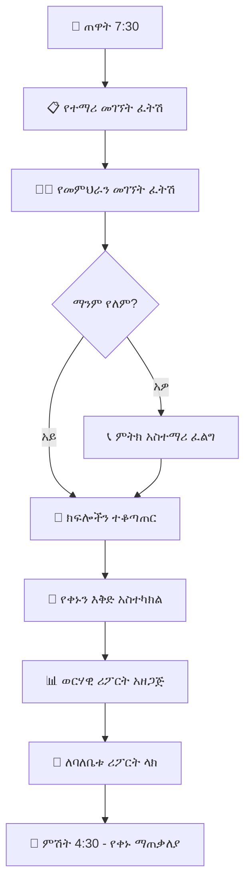

---

## 📋 የዳይሬክተር ተግባራት ማጠቃለያ

| ተግባር | መግለጫ | ድግግሞሽ |
|---------|---------|-----------|
| 📊 የተማሪ መገኘት ክትትል | የዕለቱን መገኘት ፍትሽ እና ሪፖርት አዘጋጅ | ዕለታዊ |
| 👩‍🏫 የመምህራን ክትትል | የመምህራንን መገኘት እና አፈጻጸም ተከታተል | ዕለታዊ |
| 📝 የፈተና አስተዳደር | የፈተና መርሐ ግብር አዘጋጅ እና ተቆጣጠር | ወርሃዊ |
| 📋 የሪፖርት አዘጋጀት | ለባለቤቱ ወርሃዊ ሪፖርት አዘጋጅ | ወርሃዊ |
| 👔 የሰራተኞች ፈረቃ | የሰራተኞችን ፈረቃ እና የእረፍት ጊዜ አስተዳድር | ሳምንታዊ |

---

## 🎯 ማጠቃለያ (Summary)

ዳይሬክተሩ የትምህርት ቤቱ ዋና አካዳሚክ እና አስተዳደር ተቆጣጣሪ ነው። የተማሪ መገኘት፣ የመምህራን አፈጻጸም፣ የፈተና አስተዳደር እና ለባለቤቱ ሪፖርት ማቅረብ ዋና ዋና ተግባራቱ ናቸው።

---

<div style="page-break-before: always;"></div>

# ምዕራፍ 6 — አድሚን (Admin)

## 👨‍💼 ሚና እና ሃላፊነት

አድሚን የትምህርት ቤቱ ዕለታዊ የአስተዳደር ስራዎችን የሚያከናውን ሰው ነው። የተማሪ ምዝገባ፣ የሰራተኛ አስተዳደር እና የክፍል አደረጃጀትን ያከናውናል።

---

## 🔄 የአድሚን ዕለታዊ ፍሰት (Admin Daily Flow)

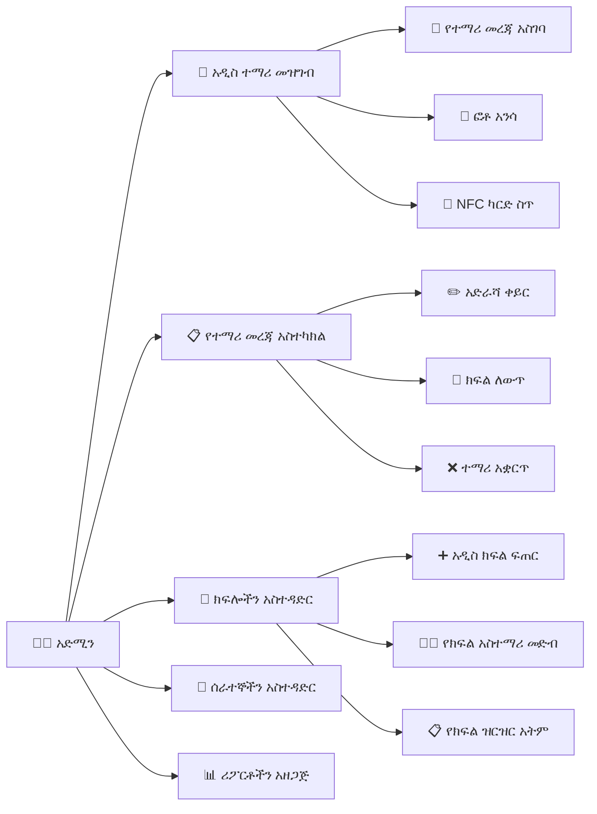

---

## 📊 የአድሚን ዳሽቦርድ ምስላዊ ንድፍ

```
┌─────────────────────────────────────────────────────────────────┐
│  👨‍💼 አድሚን ዳሽቦርድ                         የ2017 ዓ.ም       │
├─────────────────────────────────────────────────────────────────┤
│ ┌──────────┐ ┌──────────┐ ┌──────────┐ ┌──────────┐ ┌────────┐│
│ │ 👦 ተማሪ  │ │ 👩‍🏫 ሰራተኛ │ │ 🏫 ክፍል  │ │ 📈 መገኘት│ │ ⏰ ዛሬ  ││
│ │  1,250  │ │   68    │ │   32    │ │   95%   │ │ አዲስ 3 ││
│ └──────────┘ └──────────┘ └──────────┘ └──────────┘ └────────┘│
├─────────────────────────────────────────────────────────────────┤
│ ┌─────────────────────────────┐ ┌─────────────────────────────┐│
│ │  📝 በምዝገባ ላይ ያሉ       │ │  🏫 የክፍል ተማሪ ብዛት     ││
│ │  አዳዲስ ተማሪዎች           │ │  12ኛ ኤ    ████████████ 45  ││
│ │  ┌──────────┬─────────┐    │ │  12ኛ ቢ   ██████████ 38    ││
│ │  │ ስም     │ ክፍል   │    │ │  11ኛ ኤ   ████████████ 42  ││
│ │  ├──────────┼─────────┤    │ │  11ኛ ቢ   ████████ 30     ││
│ │  │ አለም ኃይሉ│ 1ኛ ኤ  │    │ │  10ኛ ኤ   ███████████ 35  ││
│ │  │ ሳራ ተስፋ│ 2ኛ ቢ  │    │ └─────────────────────────────┘│
│ │  │ ዮሐንስ ገ/እ│ 3ኛ ሲ │    │                               │
│ │  └──────────┴─────────┘    │                               │
│ └─────────────────────────────┘                               │
├─────────────────────────────────────────────────────────────────┤
│  📋 የቅርብ ጊዜ እንቅስቃሴ (Recent Activity)                     │
│  ┌────────────┬────────────────────────────┬──────────┬──────┐  │
│  │ ሰዓት      │ እንቅስቃሴ                  │ ተጠቃሚ   │ ሁኔታ │  │
│  ├────────────┼────────────────────────────┼──────────┼──────┤  │
│  │ 8:30 ጠዋት│ አዲስ ተማሪ ተመዝግቧል      │ አድሚን   │ ✅   │  │
│  │ 9:15 ጠዋት│ የ12ኛ ኤ ክፍል ተለውጧል    │ ሬጅስ    │ ✅   │  │
│  │ 10:00    │ አዲስ NFC ካርድ ተሰጥቷል    │ አድሚን   │ ✅   │  │
│  │ 11:30    │ ተማሪ አቋርጧል             │ አድሚን   │ ⚠️  │  │
│  └────────────┴────────────────────────────┴──────────┴──────┘  │
└─────────────────────────────────────────────────────────────────┘
```

---

## 🎯 ማጠቃለያ (Summary)

አድሚን የትምህርት ቤቱ ዕለታዊ አስተዳደር ዋና ሞተር ነው። የተማሪ ምዝገባ፣ የሰራተኛ አስተዳደር፣ የክፍል አደረጃጀት እና የNFC ካርድ አሰጣጥ ዋና ዋና ተግባራቱ ናቸው።

---

<div style="page-break-before: always;"></div>

# ምዕራፍ 7 — ሬጅስትራር (Registrar)

## 📝 ሚና እና ሃላፊነት

ሬጅስትራር የተማሪ ምዝገባ፣ የውጤት አያያዝ እና የአካዳሚክ መዛግብትን የማስተዳደር ሃላፊነት አለው።

---

## 🔄 የተማሪ ምዝገባ ሂደት (Student Registration Process)

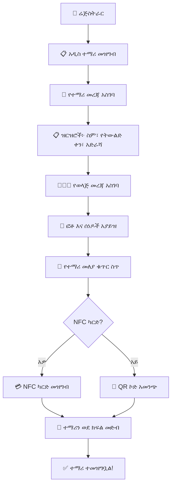

---

## 📊 የሬጅስትራር ዳሽቦርድ ምስላዊ ንድፍ

```
┌─────────────────────────────────────────────────────────────────┐
│  📝 ሬጅስትራር ዳሽቦርድ                                          │
├─────────────────────────────────────────────────────────────────┤
│ ┌──────────┐ ┌──────────┐ ┌──────────┐ ┌──────────┐ ┌────────┐│
│ │ 👦 ተማሪ  │ │ 📋 ዛሬ   │ │ 📊 ውጤት │ │ 🎓 ተመራቂ│ │ ⏰ በማየት│
│ │  1,250  │ │  አዲስ 5 │ │  ለማረጋገጥ│ │   120   │ │   15   ││
│ │  ጠቅላላ  │ │  ምዝገባ  │ │  23     │ │  ተመራቂ  │ │  ማስተካከል│
│ └──────────┘ └──────────┘ └──────────┘ └──────────┘ └────────┘│
├─────────────────────────────────────────────────────────────────┤
│ ┌─────────────────────────────┐ ┌─────────────────────────────┐│
│ │  📋 ዛሬ የተመዘገቡ ተማሪዎች  │ │  📊 ወደ ማረጋገጥ የሚጠብቁ      ││
│ │  ┌──────────┬─────────┐    │ │  ውጤቶች                      ││
│ │  │ ስም     │ ክፍል   │    │ │  ┌────────────┬──────────┐   ││
│ │  ├──────────┼─────────┤    │ │  │ ክፍል      │ ብዛቤ   │   ││
│ │  │ አለም ኃይሉ│ 1ኛ ኤ  │    │ │  ├────────────┼──────────┤   ││
│ │  │ ሳራ ተስፋ│ 2ኛ ቢ  │    │ │  │ 12ኛ ኤ     │ 15      │   ││
│ │  │ ዮሐንስ ገ/እ│ 3ኛ ሲ │    │ │  │ 12ኛ ቢ    │ 12      │   ││
│ │  │ ማርያም ጴጥ│ 1ኛ ቢ │    │ │  │ 10ኛ ኤ     │ 20      │   ││
│ │  └──────────┴─────────┘    │ │  └────────────┴──────────┘   ││
│ └─────────────────────────────┘ └─────────────────────────────┘│
├─────────────────────────────────────────────────────────────────┤
│  📋 የተማሪ ብዛት በክፍል (Students per Grade)                  │
│  ┌─────┬─────┬─────┬─────┬─────┬─────┬─────┬─────┬─────┬────┐ │
│  │ቅ.መ │ 1ኛ │ 2ኛ │ 3ኛ │ 4ኛ │ 5ኛ │ 6ኛ │ 7ኛ │ 8ኛ │... │ │
│  │ 120 │ 180 │ 150 │ 200 │ 175 │ 160 │ 140 │ 130 │ 145 │    │ │
│  └─────┴─────┴─────┴─────┴─────┴─────┴─────┴─────┴─────┴────┘ │
└─────────────────────────────────────────────────────────────────┘
```

---

## 🎓 የውጤት አስተዳደር ፍሰት (Grade Management Flow)

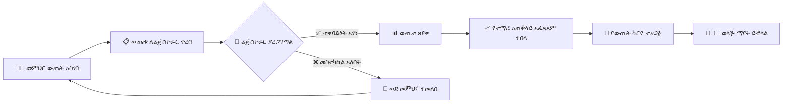

---

## 🎯 ማጠቃለያ (Summary)

ሬጅስትራር የተማሪ ምዝገባ፣ የውጤት ማረጋገጫ እና የአካዳሚክ መዛግብትን ያስተዳድራል። የተማሪ መረጃ ትክክለኛነት እና ደህንነት ዋነኛ ኃላፊነቱ ነው።

---

<div style="page-break-before: always;"></div>

# ምዕራፍ 8 — ፋይናንስ (Finance)

## 💰 የፋይናንስ ሞጁል አጠቃላይ እይታ

የፋይናንስ ሞጁል የትምህርት ቤቱን የገንዘብ ፍሰት ከመጀመሪያ እስከ መጨረሻ የሚቆጣጠር ሲሆን ከተማሪ ክፍያ አሰባሰብ ጀምሮ እስከ ደመወዝ አከፋፈል ድረስ ያሉትን ሁሉንም የፋይናንስ ተግባራት ያከናውናል።

---

## 🏗️ የፋይናንስ ሞጁል መዋቅር (Finance Module Structure)

```
┌─────────────────────────────────────────────────────────────────┐
│                    💰 F I N A N C E                             │
│                     M O D U L E                                 │
├─────────────────────────────────────────────────────────────────┤
│                                                                 │
│  ┌───────────────────────────────────────────────────────────┐  │
│  │  1️⃣ የክፍያ መዋቅር (Fee Structure)                          │  │
│  │  • የትምህርት ክፍያ  • የምዝገባ ክፍያ  • የላብራቶሪ ክፍያ  │  │
│  │  • የትራንስፖርት ክፍያ  • የምግብ ክፍያ  • ሌሎች      │  │
│  └───────────────────────────────────────────────────────────┘  │
│                                                                 │
│  ┌───────────────────────────────────────────────────────────┐  │
│  │  2️⃣ የክፍያ አሰባሰብ (Payment Collection)                  │  │
│  │  • በጥሬ ገንዘብ  • በቻፓ  • በቴሌብር  • በሲቢኢ ብር      │  │
│  └───────────────────────────────────────────────────────────┘  │
│                                                                 │
│  ┌───────────────────────────────────────────────────────────┐  │
│  │  3️⃣ የወጪ አስተዳደር (Expense Management)                  │  │
│  │  • ደመወዝ  • ፍጆታ  • ጥገና  • ቁሳቁስ  • ሌሎች        │  │
│  └───────────────────────────────────────────────────────────┘  │
│                                                                 │
│  ┌───────────────────────────────────────────────────────────┐  │
│  │  4️⃣ የሂሳብ ሪፖርቶች (Financial Reports)                    │  │
│  │  • ዕለታዊ  • ወርሃዊ  • ዓመታዊ  • የኦዲት             │  │
│  └───────────────────────────────────────────────────────────┘  │
│                                                                 │
│  ┌───────────────────────────────────────────────────────────┐  │
│  │  5️⃣ የደመወዝ አስተዳደር (Payroll Management)               │  │
│  │  • ደሞዝ ማስላት  • ታክስ  • የደመወዝ ሉህ              │  │
│  └───────────────────────────────────────────────────────────┘  │
│                                                                 │
│  ┌───────────────────────────────────────────────────────────┐  │
│  │  6️⃣ የበጀት እቅድ (Budget Planning)                         │  │
│  │  • ዓመታዊ በጀት  • ክትትል  • ትንተና                   │  │
│  └───────────────────────────────────────────────────────────┘  │
│                                                                 │
└─────────────────────────────────────────────────────────────────┘
```

---

## 💳 የክፍያ መዋቅር ሰንጠረዥ (Fee Structure Table)

| የክፍያ ዓይነት | ቅድመ-መደበኛ | 1ኛ-4ኛ ክፍል | 5ኛ-8ኛ ክፍል | 9ኛ-12ኛ ክፍል | ድግግሞሽ |
|-----------------|--------------|-------------|-------------|--------------|-----------|
| 📚 የትምህርት ክፍያ | 500 ብር | 800 ብር | 1,200 ብር | 1,800 ብር | ወርሃዊ |
| 📝 የምዝገባ ክፍያ | 200 ብር | 300 ብር | 400 ብር | 500 ብር | ዓመታዊ |
| 🔬 የላብራቶሪ ክፍያ | - | - | 100 ብር | 200 ብር | ወርሃዊ |
| 🚌 የትራንስፖርት ክፍያ | 300 ብር | 300 ብር | 400 ብር | 500 ብር | ወርሃዊ |
| 🍽️ የምግብ ክፍያ | 500 ብር | 600 ብር | 700 ብር | 800 ብር | ወርሃዊ |
| 👔 የዩኒፎርም ክፍያ | 800 ብር | 1,000 ብር | 1,200 ብር | 1,500 ብር | ዓመታዊ |

---

## 🔄 የክፍያ ፍሰት ዲያግራም (Payment Flow Diagram)

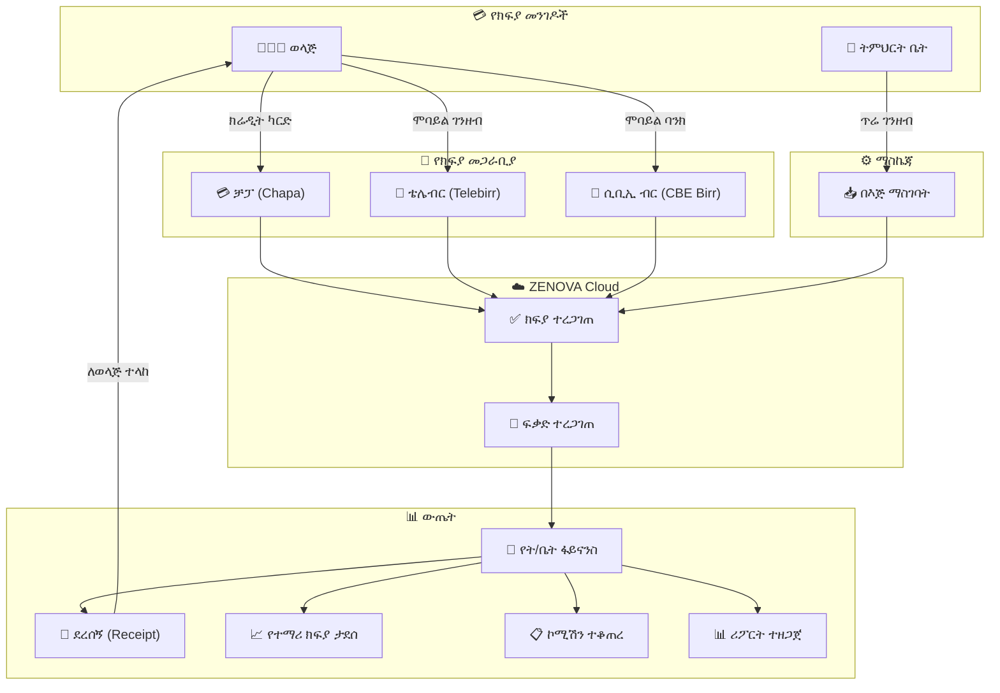

---

## 📊 የፋይናንስ ዳሽቦርድ ምስላዊ ንድፍ

```
┌─────────────────────────────────────────────────────────────────┐
│  💰 ፋይናንስ ዳሽቦርድ                          ጥር 2017 ዓ.ም    │
├─────────────────────────────────────────────────────────────────┤
│ ┌──────────┐ ┌──────────┐ ┌──────────┐ ┌──────────┐ ┌────────┐│
│ │ 💵 ገቢ   │ │ 💸 ወጪ   │ │ 📈 ትርፍ │ │ 📋 ተከፍሏል│ │ ⚠️ ዕዳ ││
│ │ 350,000  │ │ 250,000  │ │ 100,000 │ │   85%   │ │ 45,000 ││
│ │  ወርሃዊ  │ │  ወርሃዊ  │ │  ወርሃዊ  │ │  መቶኛ   │ │  ጠቅላላ ││
│ └──────────┘ └──────────┘ └──────────┘ └──────────┘ └────────┘│
├─────────────────────────────────────────────────────────────────┤
│ ┌─────────────────────────────┐ ┌─────────────────────────────┐│
│ │  📈 ወርሃዊ ገቢ እና ወጪ     │ │  💳 የክፍያ ሁኔታ በክፍል   ││
│ │  ┌─────────────────────┐   │ │  ቅ.መ ████████████ 90%     ││
│ │  │    ████████████     │   │ │  1ኛ  ██████████░░ 80%      ││
│ │  │    ████████████     │   │ │  2ኛ  ████████████ 85%     ││
│ │  │    ░░░░████████     │   │ │  3ኛ  ██████░░░░░░ 60%     ││
│ │  │    ░░░░████████     │   │ │  4ኛ  ████████████ 88%     ││
│ │  │    ገቢ   ወጪ        │   │ │                           ││
│ │  └─────────────────────┘   │ │  ✅ ተከፍሏል  ❌ አልተከፈለም││
│ └─────────────────────────────┘ └─────────────────────────────┘│
├─────────────────────────────────────────────────────────────────┤
│ ┌─────────────────────────────────────────────────────────────┐│
│ │  ⚠️ ያልተከፈለ ዕዳ ዝርዝር (Unpaid Debt List)               ││
│ │ ┌─────────────┬────────┬──────────┬───────────┬──────────┐  ││
│ │ │ ተማሪ        │ ክፍል   │ የሚከፈለው│ የተከፈለው│ ቀሪ    │  ││
│ │ ├─────────────┼────────┼──────────┼───────────┼──────────┤  ││
│ │ │ አበበ ከበደ  │ 12ኛ   │ 18,000   │ 3,000    │ 15,000  │  ││
│ │ │ ሳራ ኃይሉ  │ 10ኛ   │ 15,000   │ 5,000    │ 10,000  │  ││
│ │ │ ዮናስ ተስፋ │ 8ኛ    │ 12,000   │ 4,000    │ 8,000   │  ││
│ │ │ ሩት ዳዊት  │ 6ኛ    │ 10,000   │ 2,000    │ 8,000   │  ││
│ │ └─────────────┴────────┴──────────┴───────────┴──────────┘  ││
│ └─────────────────────────────────────────────────────────────┘│
├─────────────────────────────────────────────────────────────────┤
│  📋 የዛሬው ክፍያ እንቅስቃሴ (Today's Payment Activity)        │
│  ┌────────────┬───────────┬────────────┬──────────┬─────────┐  │
│  │ ሰዓት      │ ተማሪ     │ መጠን      │ ዘዴ     │ ሁኔታ   │  │
│  ├────────────┼───────────┼────────────┼──────────┼─────────┤  │
│  │ 8:30      │ አለም ኃይሉ│ 5,000 ብር │ ቻፓ    │ ✅     │  │
│  │ 9:15      │ ሳራ ተስፋ│ 3,500 ብር │ ቴሌብር │ ✅     │  │
│  │ 10:00     │ ዮሐንስ   │ 8,000 ብር │ ጥሬ    │ ✅     │  │
│  │ 11:30     │ ማርያም   │ 2,000 ብር │ ሲቢኢ   │ ✅     │  │
│  └────────────┴───────────┴────────────┴──────────┴─────────┘  │
└─────────────────────────────────────────────────────────────────┘
```

---

## 📋 የፋይናንስ ሪፖርቶች ዓይነቶች

| የሪፖርት ዓይነት | ድግግሞሽ | ይዘት |
|-------------------|-----------|-------|
| 📊 ዕለታዊ የገቢ ሪፖርት | ዕለታዊ | የዕለቱ ክፍያዎች ዝርዝር |
| 📊 ወርሃዊ የገቢ እና ወጪ | ወርሃዊ | የወሩ ማጠቃለያ |
| 💳 የተማሪ ክፍያ ሪፖርት | ወርሃዊ | በክፍል የተከፈለ ክፍያ |
| 💰 የደመወዝ ሪፖርት | ወርሃዊ | የሰራተኞች ደመወዝ |
| ⚠️ ያልተከፈለ ዕዳ ሪፖርት | ሳምንታዊ | ዕዳ ያለባቸው ተማሪዎች |
| 📈 ዓመታዊ ሒሳብ | ዓመታዊ | የዓመቱ የሒሳብ ማጠቃለያ |

---

## 🧾 የደመወዝ አስተዳደር ሂደት (Payroll Process)

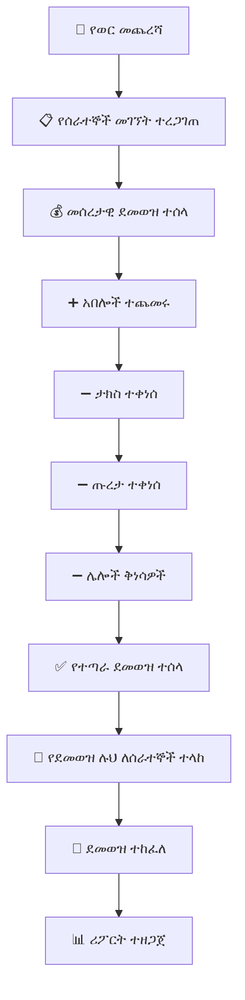

---

## 🎯 ማጠቃለያ (Summary)

የፋይናንስ ሞጁል የZENOVA ሲስተም ዋነኛ ክፍል ነው። የክፍያ መዋቅርን መወሰን፣ ክፍያ መሰብሰብ፣ ወጪ ማስተዳደር፣ ደመወዝ ማከፋፈል እና የተለያዩ ሪፖርቶችን ማዘጋጀት ያካትታል። ሶስት የክፍያ መጋራቢያዎችን (ቻፓ፣ ቴሌብር፣ ሲቢኢ ብር) ይደግፋል።

---

<div style="page-break-before: always;"></div>

# ምዕራፍ 9 — መምህር (Teacher)

## 👩‍🏫 ሚና እና ሃላፊነት

መምህር የZENOVA ሲስተም ውስጥ የትምህርት ሂደቱን በቀጥታ የሚያከናውን ሚና ነው። መምህሩ የራሱን የክፍል እንቅስቃሴ፣ የፈተና ውጤት እና የተማሪ ክትትል ያስተዳድራል።

---

## 🎯 የመምህር ኃላፊነቶች ካርታ

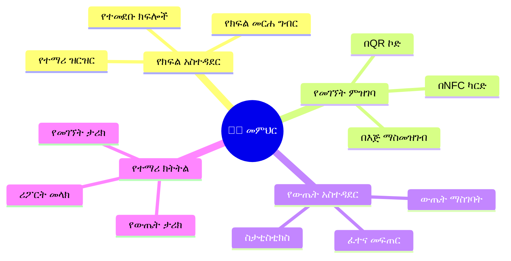

---

## 📊 የመምህር ዳሽቦርድ ምስላዊ ንድፍ

```
┌─────────────────────────────────────────────────────────────────┐
│  👩‍🏫 ወ/ሮ አስቴር ገብረ ማርያም        የሒሳብ መምህር │ ውጣ │
├─────────────────────────────────────────────────────────────────┤
│ ┌──────────┐ ┌──────────┐ ┌──────────┐ ┌──────────┐ ┌────────┐│
│ │ 👦 ተማሪ  │ │ 📚 ትምህርት│ │ 🏫 ክፍል  │ │ 📈 ዛሬ   │ │ ⏰ የሚቀር│
│ │   120   │ │  ሒሳብ   │ │   4    │ │ መገኘት  │ │ ፈተና 2 │
│ │  ጠቅላላ  │ │         │ │  ክፍሎች  │ │   95%   │ │         │
│ └──────────┘ └──────────┘ └──────────┘ └──────────┘ └────────┘│
├─────────────────────────────────────────────────────────────────┤
│ ┌─────────────────────────────┐ ┌─────────────────────────────┐│
│ │  📋 የዛሬ የትምህርት መርሐ ግብር│ │  📈 የክፍል አፈጻጸም       ││
│ │  ┌──────────┬──────────┐   │ │  ┌────────┬────────────┐   ││
│ │  │ ሰዓት    │ ክፍል    │   │ │  │ ክፍል  │ አማካይ    │   ││
│ │  ├──────────┼──────────┤   │ │  ├────────┼────────────┤   ││
│ │  │ 8:00-9:00│ 12ኛ ኤ  │   │ │  │ 12ኛ ኤ │ ████████ 78%│   ││
│ │  │ 9:00-10:00│ 12ኛ ቢ │   │ │  │ 12ኛ ቢ│ ██████ 65% │   ││
│ │  │ 10:00-11:00│ 11ኛ ኤ│   │ │  │ 11ኛ ኤ│ ███████ 72% │   ││
│ │  │ 11:00-12:00│ 11ኛ ቢ│   │ │  │ 11ኛ ቢ│ ██████ 68% │   ││
│ │  └──────────┴──────────┘   │ │  └────────┴────────────┘   ││
│ └─────────────────────────────┘ └─────────────────────────────┘│
├─────────────────────────────────────────────────────────────────┤
│ ┌─────────────────────────────────────────────────────────────┐│
│ │  📝 የመገኘት ምዝገባ (Attendance) - 12ኛ ኤ                 ││
│ │  ┌─────┬─────┬─────┬─────┬─────┬─────┬─────┬─────┬────┐   ││
│ │  │ 1   │ 2   │ 3   │ 4   │ 5   │ 6   │ 7   │ 8   │... │   ││
│ │  │ ✅  │ ✅  │ ✅  │ ❌  │ ✅  │ ✅  │ ✅  │ ✅  │    │   ││
│ │  │ አበበ│ ሳራ│ ኃይሉ│ ተስፋ│... │    │    │    │    │   ││
│ │  ├─────┼─────┼─────┼─────┼─────┼─────┼─────┼─────┼────┤   ││
│ │  │ ዛሬ አልተገኙም: 3 │ ያለ ምክንያት: 1 │ 📞 ለወላጅ ተነግሯል│   ││
│ │  └─────────────────────────────────────────────────────────┘   ││
│ └─────────────────────────────────────────────────────────────┘│
├─────────────────────────────────────────────────────────────────┤
│  📊 ወደ ማስገባት የሚጠብቁ ውጤቶች (Pending Grades)          │
│  ┌────────────┬──────────┬──────────┬───────────┬────────────┐  │
│  │ ፈተና      │ ክፍል     │ ተማሪዎች │ የገባ   │ ሁኔታ      │  │
│  ├────────────┼──────────┼──────────┼───────────┼────────────┤  │
│  │ የወር ፈተና │ 12ኛ ኤ  │ 45      │ 30/45   | ⏳ በሂደት │  │
│  │ የወር ፈተና │ 12ኛ ቢ │ 38      │ 0/38    | ⏳ አልተጀመረም│  │
│  └────────────┴──────────┴──────────┴───────────┴────────────┘  │
└─────────────────────────────────────────────────────────────────┘
```

---

## 🔄 የመገኘት ምዝገባ ፍሰት (Attendance Recording Flow)

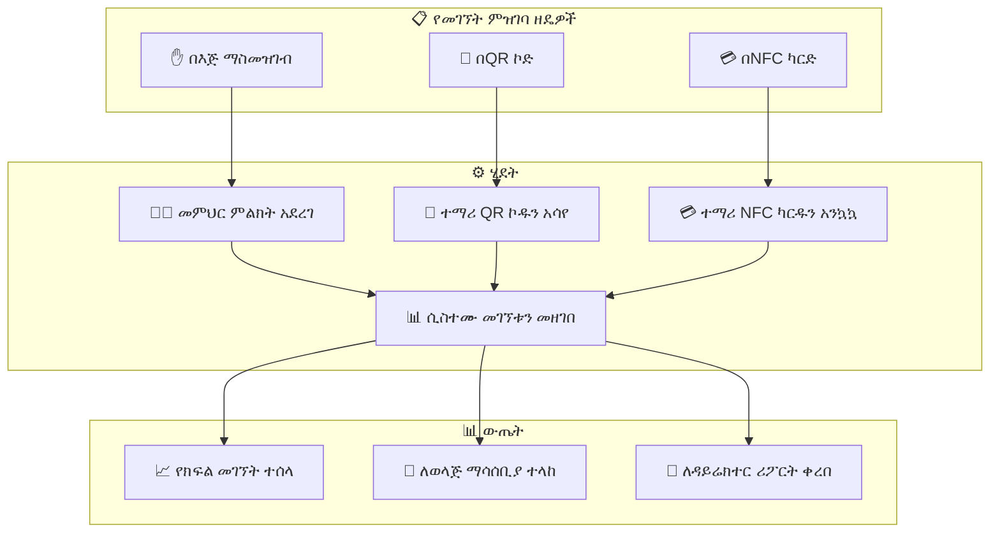

---

## 🎯 ማጠቃለያ (Summary)

መምህሩ የክፍል አስተዳደር፣ የመገኘት ምዝገባ፣ የውጤት አስተዳደር እና የተማሪ ክትትል ያከናውናል። መገኘትን በሶስት ዘዴዎች (በእጅ፣ በQR፣ በNFC) መመዝገብ ይችላል።

---

<div style="page-break-before: always;"></div>

# ምዕራፍ 10 — ወላጅ (Parent)

## 👨‍👩‍👧 ሚና እና ሃላፊነት

ወላጅ የራሱን ልጅ/ልጆች የትምህርት እና የሌሎች እንቅስቃሴዎች መከታተል የሚችል ሚና ነው። ወላጁ በተንቀሳቃሽ ስልክ ወይም በኮምፒውተር በኩል የልጁን መረጃ በማንኛውም ጊዜ ማየት ይችላል።

---

## 🔄 የወላጅ በይነገጽ ፍሰት (Parent Interface Flow)

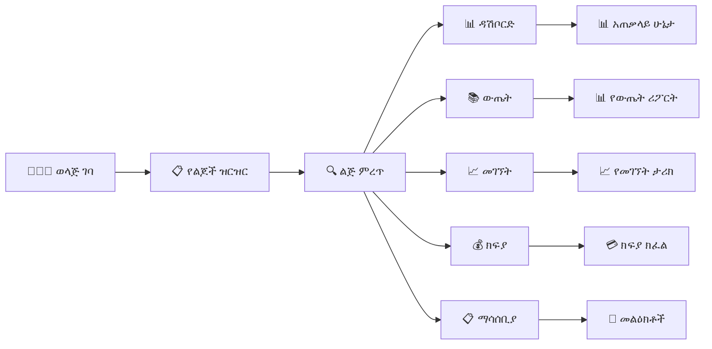

---

## 📊 የወላጅ ዳሽቦርድ ምስላዊ ንድፍ (Mobile View)

```
┌─────────────────────────────────────────────┐
│  👨‍👩‍👧 የአቶ ኃይሉ ዳሽቦርድ              │
├─────────────────────────────────────────────┤
│  ┌───────────────────────────────────────┐  │
│  │  👦 አበበ ኃይሉ                         │  │
│  │  12ኛ ክፍል ኤ · ተማሪ መለያ፦ 2023-001 │  │
│  │  🟢 በትምህርት ቤት ይገኛል             │  │
│  └───────────────────────────────────────┘  │
│                                             │
│  ┌──────────┐ ┌──────────┐ ┌──────────┐     │
│  │ 📚 ውጤት  │ │ 📈 መገኘት│ │ 💰 ክፍያ│     │
│  │  85%    │ │  95%    │ │  ተከፍሏል│     │
│  └──────────┘ └──────────┘ └──────────┘     │
│                                             │
│  📈 የቅርብ ጊዜ ውጤቶች                    │
│  ┌───────────────────────────────────────┐  │
│  │ ሒሳብ        ████████████ 88%       │  │
│  │ እንግሊዝኛ    ██████████ 80%         │  │
│  │ ፊዚክስ      ████████ 70%           │  │
│  │ ኬሚስትሪ    ██████████████ 92%     │  │
│  │ ባዮሎጂ      █████████ 75%          │  │
│  └───────────────────────────────────────┘  │
│                                             │
│  ⏰ የዛሬ መግቢያ: 7:45 ጠዋት              │
│  ⏰ የዛሬ መውጫ: 4:30 ከሰዓት              │
│                                             │
│  ⚠️ ማሳሰቢያ: 2 አልተነበቡም               │
└─────────────────────────────────────────────┘
```

---

## 💳 የወላጅ የክፍያ ፍሰት (Parent Payment Flow)

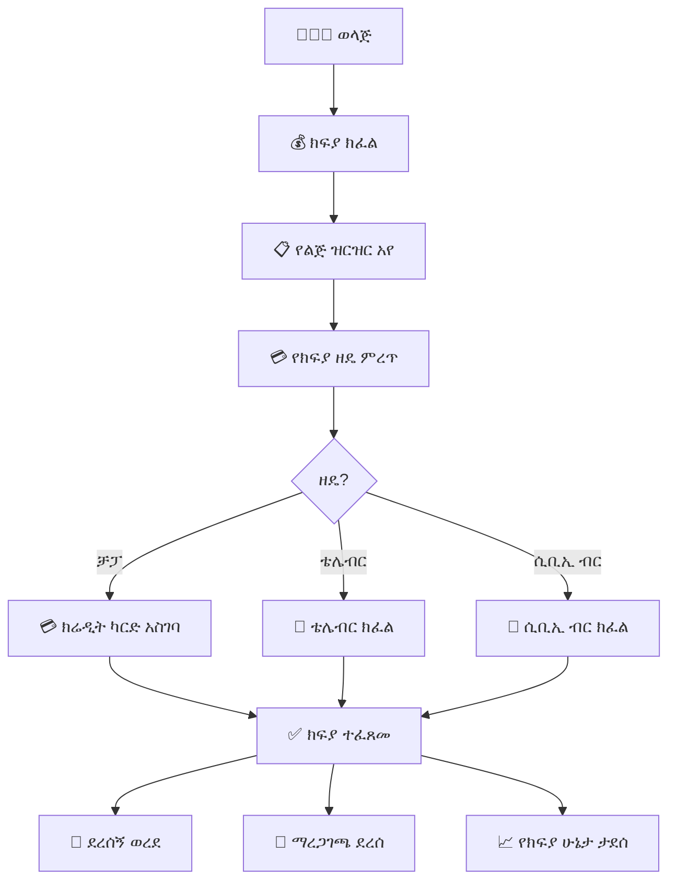

---

## 📊 የወላጅ ጥቅሞች (Parent Benefits)

| ተግባር | ጥቅም | እንዴት እንደሚሰራ |
|---------|-------|-------------------|
| 📚 ውጤት ማየት | የልጅን አፈጻጸም በማንኛውም ጊዜ ማወቅ | በዳሽቦርዱ ላይ ወዲያውኑ ይታያል |
| 📈 መገኘት ክትትል | ልጅ ትምህርት ቤት መግባቱን ማረጋገጥ | NFC/QR ሲያንኳኳ ማሳሰቢያ ይደርሳል |
| 💳 ክፍያ | ከቤት ሆኖ ክፍያ መክፈል | በቻፓ/ቴሌብር/ሲቢኢ ብር |
| 📋 ማሳሰቢያ | ከትምህርት ቤት መልዕክት መቀበል | በSMS/ኢሜይል/ዳሽቦርድ |

---

## 🎯 ማጠቃለያ (Summary)

ወላጅ የልጁን ውጤት፣ መገኘት፣ ክፍያ እና ማሳሰቢያዎች በተንቀሳቃሽ ስልክ ወይም ኮምፒውተር መከታተል ይችላል። ክፍያን ከቤት ሆኖ በመስመር ላይ መክፈል ይችላል።

---

<div style="page-break-before: always;"></div>

# ምዕራፍ 11 — ተማሪ (Student)

## 👦 ሚና እና ሃላፊነት

ተማሪ የZENOVA ሲስተም ዋነኛ ተጠቃሚ ነው። እያንዳንዱ ተማሪ የራሱ የሆነ የተለየ አካውንት አለው ይህም የተማሪውን የትምህርት ቤት ሕይወት ሙሉ በሙሉ የሚሸፍን ነው።

---

## 🆔 የተማሪ መለያ ካርድ ምስላዊ ንድፍ (Student ID Card Mockup)

```
┌────────────────────────────────────┐
│       🏫 የተከበሩ ልጆች ት/ቤት       │
│                                    │
│  ┌────────────────────────────┐    │
│  │                            │    │
│  │      📸 ተማሪ ፎቶ          │    │
│  │                            │    │
│  └────────────────────────────┘    │
│                                    │
│  ስም፦ አበበ ኃይሉ                   │
│  ክፍል፦ 12ኛ ኤ                      │
│  የተማሪ መለያ፦ 2023-001            │
│  የተወለዱበት ቀን፦ 2000-05-15      │
│                                    │
│  ┌──────┐  ┌──────────────────┐   │
│  │📱 QR │  │ 🟦 NFC Chip     │   │
│  │📸    │  │                  │   │
│  └──────┘  └──────────────────┘   │
│                                    │
│  ይህ ካርድ የZENOVA ሲስተም ንብረት ነው   │
│  የተሰጠበት ቀን፦ መስከረም 1 2017    │
└────────────────────────────────────┘
```

---

## 📊 የተማሪ ዳሽቦርድ ምስላዊ ንድፍ

```
┌─────────────────────────────────────────────┐
│  👦 አበበ ኃይሉ · 12ኛ ክፍል ኤ            │
│  የተማሪ መለያᦁ 2023-001                    │
├─────────────────────────────────────────────┤
│  ┌──────────┐ ┌──────────┐ ┌──────────┐     │
│  │ 📚 ውጤት  │ │ 📈 መገኘት│ │ 💳 NFC  │     │
│  │  85%    │ │  95%    │ │  ንቁ     │     │
│  └──────────┘ └──────────┘ └──────────┘     │
│                                             │
│  📋 የዛሬ የትምህርት መርሐ ግብር            │
│  ┌───────────────────────────────────────┐  │
│  │ 8:00-9:00 │ ሒሳብ    │ ወ/ሮ አስቴር  │  │
│  │ 9:00-10:00│ እንግሊዝኛ│ አቶ ኃይሉ    │  │
│  │ 10:00-11:00│ ፊዚክስ  │ አቶ ተስፋ   │  │
│  │ 11:00-12:00│ ኬሚስትሪ│ ወ/ሮ ሳራ    │  │
│  │ 12:00-1:00 │ እረፍት  │ 🍽️ ካፍቴሪያ│  │
│  │ 1:00-2:00  │ ባዮሎጂ  │ ወ/ሮ ማርታ   │  │
│  └───────────────────────────────────────┘  │
│                                             │
│  📈 የቅርብ ጊዜ ውጤቶች                    │
│  ┌───────────────────────────────────────┐  │
│  │ ሒሳብ        ██████████████ 88%      │  │
│  │ እንግሊዝኛ    ██████████ 80%         │  │
│  │ ፊዚክስ      ████████ 70%           │  │
│  └───────────────────────────────────────┘  │
│                                             │
│  ⏰ የሚቀጥለው ፈተና: ሒሳብ - ሰኞ ዕለት   │
└─────────────────────────────────────────────┘
```

---

## 🔄 የተማሪ ዕለታዊ እንቅስቃሴ (Student Daily Journey)

```mermaid
flowchart LR
    A["🏠 ከቤት ወጣ"] --> B["🏫 ወደ ት/ቤት ገባ"]
    B --> C["💳 NFC ካርዱን አንኳኳ"]
    C --> D["📋 መገኘት ተመዘገበ"]
    D --> E["📱 ለወላጅ ማሳሰቢያ ደረሰ"]
    
    E --> F["📚 1ኛ ትምህርት"]
    F --> G["📚 2ኛ ትምህርት"]
    G --> H["🍽️ እረፍት - ካፍቴሪያ"]
    H --> I["💳 NFC በመጠቀም ምግብ ገዛ"]
    I --> J["📚 3ኛ ትምህርት"]
    J --> K["📚 4ኛ ትምህርት"]
    K --> L["🏫 ከት/ቤት ወጣ"]
    L --> M["💳 NFC ካርዱን አንኳኳ"]
    M --> N["📱 ለወላጅ 'ወጥቷል' ማሳሰቢያ"]
    N --> O["🏠 ወደ ቤት ገባ"]
```

---

## 🎯 ማጠቃለይ (Summary)

ተማሪ የራሱን መረጃ፣ የትምህርት መርሐ ግብር፣ ውጤት እና የNFC ካርድ ሁኔታ ማየት ይችላል። የNFC ካርዱን በመጠቀም መገኘቱን ማስመዝገብ፣ ከካፍቴሪያ ምግብ መግዛት እና ከመደብር መግዛት ይችላል።

---

<div style="page-break-before: always;"></div>

# ምዕራፍ 12 — ቤተ-መጻሕፍት (Library)

## 📚 ሚና እና ሃላፊነት

የቤተ-መጻሕፍት ሞጁል የትምህርት ቤቱን ቤተ-መጻሕፍት በዲጂታል መንገድ ለማስተዳደር ያገለግላል። መጻሕፍትን መመዝገብ፣ አበዳሪ ማድረግ፣ መመለስ እና ሪፖርት ማዘጋጀት ያካትታል።

---

## 🔄 የአበዳሪ ሂደት (Borrowing Process)

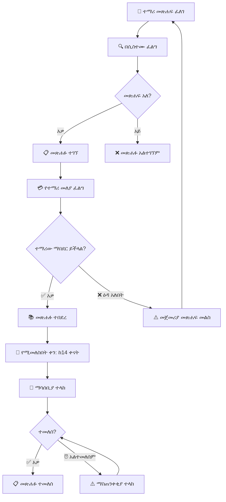

---

## 📊 የቤተ-መጻሕፍት ዳሽቦርድ ምስላዊ ንድፍ

```
┌─────────────────────────────────────────────────────────────────┐
│  📚 ቤተ-መጻሕፍት ዳሽቦርዑ                                     │
├─────────────────────────────────────────────────────────────────┤
│ ┌──────────┐ ┌──────────┐ ┌──────────┐ ┌──────────┐ ┌────────┐│
│ │ 📚 ጠቅላላ │ │ 📕 አበዳሪ │ │ 📗 ዛሬ   │ │ ⏰ ዘግይተው│ │ 📈 ተወዳጅ│
│ │  3,450  │ │   320   │ │ የተበደሩ│ │   45    │ │ ሒሳብ   ││
│ │  መጻሕፍት │ │          │ │ 28      │ │          │ │         ││
│ └──────────┘ └──────────┘ └──────────┘ └──────────┘ └────────┘│
├─────────────────────────────────────────────────────────────────┤
│ ┌─────────────────────────────┐ ┌─────────────────────────────┐│
│ │  📕 ዛሬ የሚመለሱ መጻሕፍት     │ │  ⚠️ ዘግይተው ያልተመለሱ    ││
│ │  ┌─────────┬───────────┐   │ │  ┌─────────┬────────────┐  ││
│ │  │ መጽሐፍ  │ ተማሪ     │   │ │  │ መጽሐፍ │ ዘግይቷል  │  ││
│ │  ├─────────┼───────────┤   │ │  ├─────────┼────────────┤  ││
│ │  │ ሒሳብ 101│ አበበ ኃይሉ│   │ │  │ ፊዚክስ │ 5 ቀናት │  ││
│ │  │ ፊዚክስ  │ ሳራ ተስፋ│   │ │  │ ኬሚስትሪ│ 3 ቀናት │  ││
│ │  │ ታሪክ   │ ኃይሉ ገ/እ│   │ │  │ ባዮሎጂ │ 7 ቀናት │  ││
│ │  └─────────┴───────────┘   │ │  └─────────┴────────────┘  ││
│ └─────────────────────────────┘ └─────────────────────────────┘│
├─────────────────────────────────────────────────────────────────┤
│  📊 የመጻሕፍት ምደባ በዘውግ (Books by Category)               │
│  ┌──────┬──────┬──────┬──────┬──────┬──────┬──────┬──────┐    │
│  │ሒሳብ  │ሳይንስ│ቋንቋ │ታሪክ │ሥነ-ጽሁፍ│ሃይማኖት│ሌሎች │    │    │
│  │ 850  │ 720  │ 580  │ 450  │ 380  │ 270  │ 200  │    │    │
│  └──────┴──────┴──────┴──────┴──────┴──────┴──────┴──────┘    │
└─────────────────────────────────────────────────────────────────┘
```

---

## 📋 የቤተ-መጻሕፍት ተግባራት

| ተግባር | መግለጫ | ድግግሞሽ |
|---------|---------|-----------|
| 📕 አበዳሪ መስጠት | ተማሪዎች መጽሐፍ እንዲበደሩ ማድረግ | ዕለታዊ |
| 📗 መጽሐፍ መመለስ | የተበደሩ መጻሕፍትን መቀበል | ዕለታዊ |
| 📦 አዲስ መጽሐፍ መዝግብ | አዳዲስ መጻሕፍትን ወደ ሲስተም ማስገባት | ሳምንታዊ |
| ⏰ ዘግይቶ የመመለስ ቅጣት | ዘግይተው ለመላሹ ቅጣት ማስላት | ዕለታዊ |
| 📊 ሪፖርት | ወርሃዊ የቤተ-መጻሕፍት ሪፖርት ማዘጋጀት | ወርሃዊ |

---

## 🎯 ማጠቃለያ (Summary)

የቤተ-መጻሕፍት ሞጁል መጻሕፍትን መመዝገብ፣ አበዳሪ ማድረግ፣ መመለስ እና ሪፖርት ማዘጋጀት ያከናውናል። ተማሪዎች በNFC ካርዳቸው መጽሐፍ መበደር ይችላሉ።

---

<div style="page-break-before: always;"></div>

# ምዕራፍ 13 — ካፍቴሪያ (Cafeteria)

## 🍽️ ሚና እና ሃላፊነት

የካፍቴሪያ ሞጁል የትምህርት ቤቱን የምግብ አቅርቦት፣ የተማሪ ምርጫ እና ክፍያ አሰባሰብ ያስተዳድራል። ተማሪዎች በNFC ካርዳቸው በመጠቀም ምግብ መግዛት ይችላሉ።

---

## 🔄 የካፍቴሪያ ክፍያ ፍሰት (Cafeteria Payment Flow)

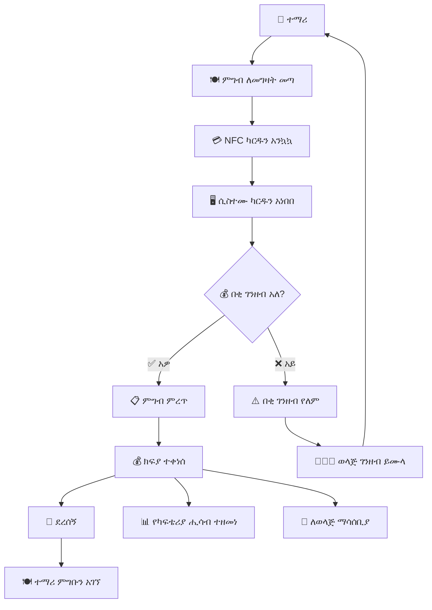

---

## 📊 የካፍቴሪያ ዳሽቦርድ ምስላዊ ንድፍ

```
┌─────────────────────────────────────────────────────────────────┐
│  🍽️ ካፍቴሪያ ዳሽቦርድ                                        │
├─────────────────────────────────────────────────────────────────┤
│ ┌──────────┐ ┌──────────┐ ┌──────────┐ ┌──────────┐ ┌────────┐│
│ │ 🍽️ ዛሬ   │ │ 💰 ዛሬ   │ │ 📈 አማካይ │ │ 🥇 ከፍተኛ│ │ 📦 ክምችት│
│ │ የተሸጠ  │ │ ገቢ     │ │ ዕለታዊ │ │ ሽያጭ  │ │ ሁኔታ  │
│ │  128    │ │ 3,500   │ │ 3,200   │ │ በርገር │ │ ⚠️ ዝቅተኛ│
│ └──────────┘ └──────────┘ └──────────┘ └──────────┘ └────────┘│
├─────────────────────────────────────────────────────────────────┤
│ ┌─────────────────────────────┐ ┌─────────────────────────────┐│
│ │  📋 የዛሬው ሜኑ             │ │  📈 የሽያጭ ስታቲስቲክስ    ││
│ │  ┌──────────┬──────────┐   │ │  በርገር ████████████ 45   ││
│ │  │ ምግብ    │ ዋጋ     │   │ │  ሳንድዊች ████████ 32     ││
│ │  ├──────────┼──────────┤   │ │  ፓስታ    ██████ 25       ││
│ │  │ በርገር   │ 50 ብር  │   │ │  ሩዝ     ████████ 30     ││
│ │  │ ሳንድዊች │ 35 ብር  │   │ │  ሾርባ   ████ 18         ││
│ │  │ ፓስታ    │ 45 ብር  │   │ │  ውሃ      ██████████ 40   ││
│ │  │ ሩዝ     │ 40 ብር  │   │ └─────────────────────────────┘│
│ │  │ ሾርባ   │ 25 ብር  │   │                               │
│ │  │ ውሃ     │ 10 ብር  │   │                               │
│ │  └──────────┴──────────┘   │                               │
│ └─────────────────────────────┘                               │
├─────────────────────────────────────────────────────────────────┤
│  ⚠️ ዝቅተኛ ክምችት (Low Stock Alerts)                           │
│  ┌──────────┬──────────┬──────────┬────────────┬────────────┐  │
│  │ እቃ      │ የአሁኑ   │ ዝቅተኛ   │ ሁኔታ       │ ማዘዝ     │  │
│  ├──────────┼──────────┼──────────┼────────────┼────────────┤  │
│  │ ዳቦ      │ 2       │ 10       │ 🔴 ወሳኝ  │ ✅ ታዝዟል│  │
│  │ ዘይት    │ 5       │ 8        │ 🟡 ማስጠንቀቂያ│ አልታዘዘም│  │
│  │ ስኳር    │ 3       │ 10       │ 🔴 ወሳኝ  │ አልታዘዘም│  │
│  └──────────┴──────────┴──────────┴────────────┴────────────┘  │
└─────────────────────────────────────────────────────────────────┘
```

---

## 📊 የካፍቴሪያ ሪፖርቶች

| የሪፖርት ዓይነት | ድግግሞሽ | ይዘት |
|-------------------|-----------|-------|
| 💰 ዕለታዊ ገቢ | ዕለታዊ | የዕለቱ ሽያጭ |
| 📈 ወርሃዊ ሽያጭ | ወርሃዊ | የወሩ አጠቃላይ ሽያጭ |
| 🥇 ተወዳጅ ምግቦች | ሳምንታዊ | ከፍተኛ ሽያጭ ያላቸው ምግቦች |
| 📦 የእቃ ክምችት | ዕለታዊ | የእቃ ክምችት ሁኔታ |
| 👦 የተማሪ ምርጫ | ወርሃዊ | የተማሪዎች ምርጫ ትንተና |

---

## 🎯 ማጠቃለያ (Summary)

የካፍቴሪያ ሞጁል ምግብ መሸጥ፣ በNFC ካርድ ክፍያ መቀበል፣ የምግብ ክምችት ማስተዳደር እና የሽያጭ ሪፖርቶችን ማዘጋጀት ያከናውናል። ተማሪዎች ያለ ጥሬ ገንዘብ በNFC ካርዳቸው ምግብ መግዛት ይችላሉ።

---

<div style="page-break-before: always;"></div>

# ምዕራፍ 14 — መደብር (Store)

## 🛒 ሚና እና ሃላፊነት

የመደብር ሞጁል የትምህርት ቤቱን ዩኒፎርም፣ የትምህርት ቁሳቁስ እና ሌሎች እቃዎች ሽያጭ በዲጂታል መንገድ ያስተዳድራል።

---

## 🔄 የመደብር ክፍያ ፍሰት (Store Purchase Flow)

```mermaid
flowchart TD
    A["👦 ተማሪ ወደ መደብር ገባ"] --> B["🛒 እቃ መረጠ"]
    B --> C["💳 ክፍያ ዘዴ ምረጥ"]
    
    C --> D{"ዘዴ?"}
    D -->|"NFC ካርድ"| E["💳 ካርዱን አንኳኳ"]
    D -->|"ጥሬ ገንዘብ"| F["💰 ጥሬ ገንዘብ ከፈለ"]
    D -->|"QR"| G["📱 QR ኮዱን አሳየ"]
    
    E --> H["✅ ክፍያ ተፈጸመ"]
    F --> H
    G --> H
    
    H --> I["📦 እቃው ተሰጠ"]
    H --> J["🧾 ደረሰኝ ታተመ"]
    H --> K["📊 ክምችት ተዘመነ"]
```

---

## 📊 የመደብር ዳሽቦርድ ምስላዊ ንድፍ

```
┌─────────────────────────────────────────────────────────────────┐
│  🛒 የትምህርት ቤት መደብር ዳሽቦርድ                            │
├─────────────────────────────────────────────────────────────────┤
│ ┌──────────┐ ┌──────────┐ ┌──────────┐ ┌──────────┐ ┌────────┐│
│ │ 📦 እቃ    │ │ 💰 ዛሬ   │ │ 📈 ወርሃዊ │ │ ⚠️ ዝቅተኛ│ │ 👕 ዩኒፎርም│
│ │  156    │ │ 2,000   │ │ 25,000  │ │   8    │ │ ብዛት │
│ │  ዓይነቶች │ │ ሽያጭ   │ │ ጠቅላላ  │ │ ክምችት  │ │ 120   │
│ └──────────┘ └──────────┘ └──────────┘ └──────────┘ └────────┘│
├─────────────────────────────────────────────────────────────────┤
│ ┌─────────────────────────────┐ ┌─────────────────────────────┐│
│ │  🥇 ከፍተኛ ሽያጭ ያላቸው    │ │  ⚠️ ዝቅተኛ ክምችት ያላቸው  ││
│ │  ┌──────────┬──────────┐   │ │  ┌──────────┬──────────┐   ││
│ │  │ እቃ      │ ብዛት    │   │ │  │ እቃ      │ ቀሪ    │   ││
│ │  ├──────────┼──────────┤   │ │  ├──────────┼──────────┤   ││
│ │  │ ነጭ ሸሚዝ│ 45       │   │ │  │ ጥቁር ካልሲ│ 2       │   ││
│ │  │ ጥቁር ሱሪ│ 38       │   │ │  │ ክራቫት  │ 5       │   ││
│ │  │ ልብስ ስፌት│ 30       │   │ │  │ ስፖርት ቲሸርት│ 3    │   ││
│ │  │ ካልሲ   │ 25       │   │ │  │ ቦርሳ   │ 4       │   ││
│ │  │ ቦርሳ   │ 18       │   │ │  └──────────┴──────────┘   ││
│ │  └──────────┴──────────┘   │ │                           ││
│ └─────────────────────────────┘ └─────────────────────────────┘│
├─────────────────────────────────────────────────────────────────┤
│  📋 የዛሬው ሽያጭ (Today's Sales)                              │
│  ┌────────────┬───────────┬────────┬──────────┬───────────┐   │
│  │ ሰዓት      │ ተማሪ     │ እቃ    │ መጠን    │ ክፍያ     │   │
│  ├────────────┼───────────┼────────┼──────────┼───────────┤   │
│  │ 8:30      │ አበበ    │ ነጭ ሸሚዝ│ 250 ብር│ NFC       │   │
│  │ 9:15      │ ሳራ     │ ጥቁር ሱሪ│ 350 ብር│ ጥሬ      │   │
│  │ 10:00     │ ዮሐንስ  │ ካልሲ   │ 50 ብር │ NFC       │   │
│  │ 11:30     │ ማርያም  │ ቦርሳ   │ 400 ብር│ ጥሬ      │   │
│  └────────────┴───────────┴────────┴──────────┴───────────┘   │
└─────────────────────────────────────────────────────────────────┘
```

---

## 🎯 ማጠቃለያ (Summary)

የመደብር ሞጁል ዩኒፎርም፣ የትምህርት ቁሳቁስ እና ሌሎች እቃዎች ሽያጭ፣ የክምችት አስተዳደር እና የሽያጭ ሪፖርት ያከናውናል። ተማሪዎች በNFC ካርድ ወይም በጥሬ ገንዘብ መግዛት ይችላሉ።

---

<div style="page-break-before: always;"></div>

# ምዕራፍ 15 — NFC ሥርዓት (NFC System)

## 💳 NFC ቴክኖሎጂ ምንድን ነው?

NFC (Near Field Communication) በአጭር ርቀት (4-10 ሴሜ) የሚሰራ ሽቦ አልባ የመገናኛ ቴክኖሎጂ ነው። ZENOVA ውስጥ እያንዳንዱ ተማሪ የራሱ የሆነ የNFC ካርድ ይሰጠዋል።

---

## 🏗️ የNFC ሥርዓት አርክቴክቸር (NFC System Architecture)

```
                        ┌──────────────────┐
                        │    💳 NFC CARD   │
                        │  (ተማሪ ካርድ)      │
                        └────────┬─────────┘
                                 │
                                 ▼
                        ┌──────────────────┐
                        │   📡 NFC READER  │
                        │  (ማንበቢያ)       │
                        └────────┬─────────┘
                                 │
                                 ▼
                        ┌──────────────────┐
                        │  🖥️ UBUNTU      │
                        │  SCHOOL SERVER   │
                        └────────┬─────────┘
                                 │
                    ┌────────────┼────────────┐
                    ▼            ▼            ▼
            ┌────────────┐ ┌────────────┐ ┌────────────┐
            │ 📋 መገኘት  │ │ 🍽️ ካፍቴሪያ │ │ 🛒 መደብር  │
            │ ምዝገባ    │ │ ክፍያ     │ │ ክፍያ     │
            └────────────┘ └────────────┘ └────────────┘
                    │            │            │
                    ▼            ▼            ▼
            ┌──────────────────────────────────────┐
            │          📱 ማሳሰቢያዎች               │
            │  • ለወላጅ: "ልጅዎ ት/ቤት ገብቷል"    │
            │  • ለዳይሬክተር: የመገኘት ሪፖርት     │
            │  • ለፋይናንስ: የካፍቴሪያ ገቢ        │
            └──────────────────────────────────────┘
```

---

## 🔄 የNFC ካርድ አሰራር ፍሰት (NFC Card Flow)

```mermaid
flowchart TD
    subgraph ካርድ_ምዝገባ["💳 የNFC ካርድ ምዝገባ"]
        A["🎫 አዲስ NFC ካርድ"] --> B["📝 ከተማሪ መለያ ጋር አያይዝ"]
        B --> C["🔑 የካርድ UID መዝግብ"]
        C --> D["✅ ካርድ ተመዝገበ"]
    end
    
    subgraph አጠቃቀም["🔁 የNFC አጠቃቀም"]
        E["💳 ተማሪ ካርዱን አንኳኳ"] --> F{"የት?"}
        F -->|"🏫 መግቢያ"| G["📋 መገኘት ተመዘገበ"]
        F -->|"🍽️ ካፍቴሪያ"| H["💰 ክፍያ ተቀነሰ"]
        F -->|"🛒 መደብር"| I["💰 ክፍያ ተፈጸመ"]
        F -->|"📚 ቤተ-መጻሕፍት"| J["📚 አበዳሪ ተመዘገበ"]
    end
    
    subgraph ማሳሰቢያ["📱 ማሳሰቢያ"]
        G --> K["📱 ለወላጅ 'ገብቷል'"]
        H --> L["📱 ለወላጅ 'ገንዘብ ተቀነሰ'"]
        I --> M["📱 ለወላጅ 'ተገዛ'"]
        J --> N["📱 ለወላጅ 'ተበደረ'"]
    end
```

---

## 📊 የNFC አጠቃቀም ስታቲስቲክስ

```
┌─────────────────────────────────────────────────────────────────┐
│  📊 የNFC አጠቃቀም ሪፖርት - ጥር 2017 ዓ.ም                    │
├─────────────────────────────────────────────────────────────────┤
│                                                                 │
│  ጠቅላላ ንቁ ካርዶች: 1,240                                    │
│  የታገዱ ካርዶች: 12                                            │
│  አዲስ የተሰጡ ካርዶች (ይህ ወር): 23                            │
│                                                                 │
│  የNFC አጠቃቀም ስታቲስቲክስ (ዛሬ)                              │
│  ┌──────────────────┬──────────┬──────────┬──────────┐         │
│  │ ቦታ              │ መግቢያ  │ ውጪ     │ ጠቅላላ  │         │
│  ├──────────────────┼──────────┼──────────┼──────────┤         │
│  │ 🏫 ዋና መግቢያ   │ 1,100   │ 1,080   │ 2,180   │         │
│  │ 🍽️ ካፍቴሪያ    │ -       │ -       │ 128     │         │
│  │ 🛒 መደብር       │ -       │ -       │ 45      │         │
│  │ 📚 ቤተ-መጻሕፍት │ -       │ -       │ 28      │         │
│  └──────────────────┴──────────┴──────────┴──────────┘         │
│                                                                 │
│  የካርድ ሁኔታ ስርጭት                                          │
│  ┌────────────────────────────────────────────────────────┐    │
│  │ ንቁ     ██████████████████████████████████████████ 95% │    │
│  │ የታገደ  ██ 1%                                          │    │
│  │ ጠፍቷል   ████ 2%                                       │    │
│  │ አዲስ     ██ 2%                                          │    │
│  └────────────────────────────────────────────────────────┘    │
│                                                                 │
└─────────────────────────────────────────────────────────────────┘
```

---

## 🎯 ማጠቃለያ (Summary)

NFC ሥርዓት የተማሪን መለያ ለመለየት፣ መገኘትን ለመመዝገብ፣ ክፍያ ለመቀበል እና አበዳሪ ለማስተዳደር ያገለግላል። እያንዳንዱ ተማሪ ልዩ የሆነ የNFC ካርድ አለው።

---

<div style="page-break-before: always;"></div>

# ምዕራፍ 16 — QR ኮድ ሥርዓት (QR Code System)

## 📱 QR ኮድ ምንድን ነው?

QR (Quick Response) ኮድ በፍጥነት ሊነበብ የሚችል ባለ ሁለት ልኬት ባርኮድ ነው። ZENOVA ውስጥ እያንዳንዱ ተማሪ ከNFC ካርዱ በተጨማሪ የራሱ የሆነ ልዩ QR ኮድ አለው።

---

## 🏗️ የQR ሥርዓት አሰራር (QR System Operation)

```
                     ┌──────────────────┐
                     │   📱 QR CODE     │
                     │  (በተማሪ ካርድ ላይ) │
                     └────────┬─────────┘
                              │
                              ▼
                     ┌──────────────────┐
                     │   📸 QR SCANNER  │
                     │  (ካሜራ/ስካነር)    │
                     └────────┬─────────┘
                              │
                              ▼
                     ┌──────────────────┐
                     │  🔍 ውሂብ ተነበበ  │
                     │  የተማሪ መለያ ቁጥር│
                     └────────┬─────────┘
                              │
                              ▼
                     ┌──────────────────┐
                     │  🖥️ SCHOOL      │
                     │     SERVER       │
                     └────────┬─────────┘
                              │
                              ▼
                     ┌──────────────────┐
                     │  ✅ መገኘት ተመዘገበ │
                     └──────────────────┘
```

---

## 🔄 የQR ኮድ ንባብ ሂደት (QR Scan Process)

```mermaid
flowchart TD
    A["📱 ተማሪ QR ኮድ አሳየ"] --> B["📸 ስካነር አነበበ"]
    B --> C["🔍 የተማሪ መለያ ተለይቷል"]
    C --> D{"✅ ተማሪ ተገኝቷል?"}
    
    D -->|"✅ አዎ"| E["📋 መገኘት ተመዘገበ"]
    D -->|"❌ የለም"| F["❌ የማይታወቅ ካርድ"]
    
    E --> G["📊 ዳሽቦርድ ታደሰ"]
    E --> H["📱 ለወላጅ ማሳሰቢያ ተላከ"]
    
    F --> I["⚠️ የደህንነት ማንቂያ"]
```

---

## 📊 የQR ኮድ ይዘት (QR Code Content)

```
┌─────────────────────────────────────────────────────────────────┐
│                    📱 QR CODE ይዘት                               │
├─────────────────────────────────────────────────────────────────┤
│                                                                 │
│  አይነት:         የተማሪ መለያ QR ኮድ                           │
│  መረጃ ዓይነት:    JSON                                        │
│                                                                 │
│  {                                                               │
│    "student_id": "2023-001",     ← የተማሪ መለያ ቁጥር          │
│    "name": "አበበ ኃይሉ",           ← ሙሉ ስም                   │
│    "school": "ZENOVA-ETH-001",   ← የት/ቤት ኮድ                │
│    "grade": "12",                ← ክፍል                         │
│    "section": "A",               ← ክፍልፋይ                       │
│    "type": "STUDENT"             ← ዓይነት                       │
│  }                                                               │
│                                                                 │
└─────────────────────────────────────────────────────────────────┘
```

---

## 🆚 የNFC እና QR ንጽጽር (NFC vs QR Comparison)

| ባህሪ | 💳 NFC ካርድ | 📱 QR ኮድ |
|-------|-------------|-----------|
| 📡 ቴክኖሎጂ | ራዲዮ ሞገድ (13.56 MHz) | ኦፕቲካል (ካሜራ) |
| 📏 ርቀት | 4-10 ሴሜ | እስከ 50 ሴሜ |
| ⏱ ፍጥነት | በጣም ፈጣን (0.1 ሰከንድ) | መካከለኛ (1-2 ሰከንድ) |
| 🔒 ደህንነት | ከፍተኛ (ምስጠራ) | መካከለኛ |
| 💵 ዋጋ | ከፍተኛ (ካርድ + ማንበቢያ) | ዝቅተኛ (ህትመት ብቻ) |
| 🔄 መልሶ መጠቀም | ✅ አዎ (እንደገና መሙላት) | ❌ አይ (እንደገና ማተም ያስፈልጋል) |
| 📱 መሣሪያ | ልዩ ማንበቢያ ያስፈልጋል | ማንኛውም ካሜራ ይሰራል |

---

## 🎯 ማጠቃለያ (Summary)

QR ኮድ ሥርዓት የNFC አማራጭ ሲሆን ተማሪዎች የራሳቸውን QR ኮድ በማሳየት መገኘታቸውን ማረጋገጥ ይችላሉ። QR ኮድ ከNFC ያነሰ ወጪ የሚጠይቅ ቢሆንም ደህንነቱ አነስተኛ ነው።

---

<div style="page-break-before: always;"></div>

# ምዕራፍ 17 — የደህንነት ሥርዓት (Security System)

## 🔒 ሚና እና ሃላፊነት

የደህንነት ሞጁል የተማሪዎችን እና የሰራተኞችን ወደ ትምህርት ቤት መግባት እና መውጣት ይቆጣጠራል። የደህንነት ሰራተኞች የተማሪ እንቅስቃሴን በእውነተኛ ጊዜ መከታተል ይችላሉ።

---

## 🏗️ የደህንነት ሥርዓት አርክቴክቸር (Security Architecture)

```
┌─────────────────────────────────────────────────────────────────┐
│                    🔒 የደህንነት ሥርዓት                          │
│                     (Security System)                            │
├─────────────────────────────────────────────────────────────────┤
│                                                                  │
│  ┌──────────────┐    ┌──────────────┐    ┌──────────────┐      │
│  │ 🏫 ዋና መግቢያ│    │ 🚪 የኋላ በር  │    │ 🚗 መኪና    │      │
│  │ NFC Reader   │    │ NFC Reader   │    │ መግቢያ      │      │
│  └──────┬───────┘    └──────┬───────┘    └──────┬───────┘      │
│         │                  │                  │               │
│         └──────────────────┼──────────────────┘               │
│                            ▼                                  │
│                  ┌──────────────────┐                         │
│                  │  🖥️ SECURITY    │                         │
│                  │     SERVER       │                         │
│                  └────────┬─────────┘                         │
│                           │                                   │
│                           ▼                                   │
│                  ┌──────────────────┐                         │
│                  │  🔔 ማንቂያ ደወል   │                         │
│                  │  ለተማሪ/ለወላጅ     │                         │
│                  │  ማሳሰቢያ          │                         │
│                  └──────────────────┘                         │
│                                                                  │
└─────────────────────────────────────────────────────────────────┘
```

---

## 🔄 የደህንነት ቁጥጥር ፍሰት (Security Monitoring Flow)

```mermaid
flowchart TD
    A["👦 ተማሪ ወደ ት/ቤት ደረሰ"] --> B["💳 NFC ካርዱን አንኳኳ"]
    B --> C{"✅ ካርዱ የሚሰራ ነው?"}
    
    C -->|"✅ ንቁ ካርድ"| D["📋 ተማሪ መግባቱ ተመዘገበ"]
    C -->|"❌ የታገደ ካርድ"| E["🔔 ማንቂያ! ያልተፈቀደ መዳረሻ"]
    C -->|"⚠️ ያልታወቀ ካርድ"| F["🔔 ማንቂያ! የማይታወቅ ካርድ"]
    
    D --> G["📱 ለወላጅ 'ልጅዎ ገብቷል'"]
    D --> H["📊 የደህንነት ዳሽቦርድ ተዘመነ"]
    
    E --> I["👮 ደህንነት ሰራተኛ ይመረምራል"]
    F --> I
    
    I --> J{"ምን አይነት እርምጃ?"}
    J -->|"የተሳሳተ ካርድ"| K["🔄 ካርዱ ተመለሰ"]
    J -->|"የተጠረጠረ"| L["🚔 ለባለስልጣን ተላከ"]
    J -->|"ተማሪ ነው"| M["✅ እንዲገባ ተፈቀደለት"]
```

---

## 📊 የደህንነት ዳሽቦርድ ምስላዊ ንድፍ

```
┌─────────────────────────────────────────────────────────────────┐
│  🔒 ደህንነት ዳሽቦርድ                            ዛሬ ሰኞ    │
├─────────────────────────────────────────────────────────────────┤
│ ┌──────────┐ ┌──────────┐ ┌──────────┐ ┌──────────┐ ┌────────┐│
│ │ 👦 በት/ቤት│ │ 📈 ዛሬ   │ │ 📈 መገኘት│ │ 🔔 ማንቂያ│ │ 🚗 መኪና│
│ │ ውስጥ    │ │ ገብተው  │ │ መቶኛ   │ │  0      │ │  12    │
│ │  1,100  │ │ 1,120  │ │   95%  │ │  ዛሬ    │ │  ገብተው │
│ └──────────┘ └──────────┘ └──────────┘ └──────────┘ └────────┘│
├─────────────────────────────────────────────────────────────────┤
│ ┌─────────────────────────────┐ ┌─────────────────────────────┐│
│ │  📋 የቅርብ ጊዜ መግቢያ    │ │  ⏰ ያልተገኙ ተማሪዎች    ││
│ │  ┌────────┬────────┬────┐ │ │  ┌────────┬────────┬─────┐││
│ │  │ ሰዓት  │ ስም   │ሁኔታ│ │ │  │ ስም   │ክፍል │ ሁኔታ││
│ │  ├────────┼────────┼────┤ │ │  ├────────┼────────┼─────┤││
│ │  │ 7:45  │ አበበ  │ ✅ │ │ │  │ አለም  │ 12ኛ ኤ│ ⚠️  │││
│ │  │ 7:48  │ ሳራ   │ ✅ │ │ │  │ ሳራ   │ 10ኛ ቢ│ 📞  │││
│ │  │ 7:50  │ ኃይሉ  │ ✅ │ │ │  │ ዮሐንስ│ 8ኛ ሲ│ ⚠️  │││
│ │  │ 7:52  │ ተስፋ  │ ❌ │ │ │  └────────┴────────┴─────┘││
│ │  └────────┴────────┴────┘ │ └─────────────────────────────┘│
│ └─────────────────────────────┘                               │
├─────────────────────────────────────────────────────────────────┤
│  📈 የሰዓት አቆጣጠር የመግቢያ ስታቲስቲክስ (Hourly Entry Stats)  │
│  ┌─────┬─────┬─────┬─────┬─────┬─────┬─────┬─────┬─────┐      │
│  │7፡00│7፡30│8፡00│8፡30│9፡00│9፡30│10:00│10:30│11:00│      │
│  │ 120 │ 350 │ 280 │ 150 │ 80  │ 40  │ 30  │ 20  │ 10  │      │
│  └─────┴─────┴─────┴─────┴─────┴─────┴─────┴─────┴─────┘      │
│  🟢 ጠዋት ከፍተኛ መግቢያ  🔴 ዘግይተው የገቡ ተማሪዎች: 23       │
└─────────────────────────────────────────────────────────────────┘
```

---

## 🎯 ማጠቃለያ (Summary)

የደህንነት ሥርዓት የተማሪዎችን መግቢያ እና መውጫ በNFC ካርዶች ይቆጣጠራል። ያልተፈቀደ መዳረሻ ሲኖር ማንቂያ ያነሳል እና ለወላጆች የልጃቸውን መግቢያ/መውጫ ማሳሰቢያ ይልካል።

---

<div style="page-break-before: always;"></div>

# ምዕራፍ 18 — የፍቃድ አሰጣጥ ሥርዓት (License System)

## 🔑 የፍቃድ ሥርዓት አጠቃላይ እይታ

የፍቃድ አሰጣጥ ሥርዓት ZENOVA እንዴት እንደሚሸጥ እና እንደሚሰራ የሚቆጣጠር ወሳኝ ክፍል ነው። እያንዳንዱ ትምህርት ቤት ሲስተሙን መጠቀም የሚችለው የሚሰራ ፍቃድ ካለው ብቻ ነው።

---

## 🏗️ የፍቃድ ሥርዓት አርክቴክቸር (License System Architecture)

```
                        ☁️ ZENOVA CLOUD
                     ┌──────────────────────┐
                     │   🔑 LICENSE SERVER  │
                     │  (ማዕከላዊ ፍቃድ አገልጋይ)  │
                     └──────────┬───────────┘
                                │
            ┌───────────────────┼───────────────────┐
            ▼                   ▼                   ▼
    ┌──────────────┐   ┌──────────────┐   ┌──────────────┐
    │ 🏫 SCHOOL A │   │ 🏫 SCHOOL B │   │ 🏫 SCHOOL C │
    │  ፍቃድ ያረጋግጡ │   │  ፍቃድ ያረጋግጡ │   │  ፍቃድ ያረጋግጡ │
    └──────┬───────┘   └──────┬───────┘   └──────┬───────┘
           │                  │                  │
           ▼                  ▼                  ▼
    ┌──────────────┐   ┌──────────────┐   ┌──────────────┐
    │  ✅ ፍቃድ ንቁ │   │  ⚠️ ሊያልቅ  │   │  ❌ ፍቃድ ያለቀ │
    │  ሲስተም ይሰራል│   │ 30 ቀናት ቀርቷል│   │ ሲስተም ተዘግቷል│
    └──────────────┘   └──────────────┘   └──────────────┘
```

---

## 🎚️ የፍቃድ ደረጃዎች (License Tiers)

```mermaid
flowchart LR
    subgraph Basic["📦 BASIC"]
        B1["• ተማሪ/ሰራተኛ አስተዳደር"]
        B2["• ክፍያ አሰባሰብ"]
        B3["• መገኘት ክትትል"]
        B4["• ውሱን ተማሪ ብዛት"]
    end
    
    subgraph Standard["📦 STANDARD"]
        S1["• ሁሉም Basic ባህሪያት"]
        S2["• ቤተ-መጻሕፍት አስተዳደር"]
        S3["• ካፍቴሪያ ማገናኘት"]
        S4["• NFC ድጋፍ"]
        S5["• መሰረታዊ ሪፖርቶች"]
    end
    
    subgraph Premium["📦 PREMIUM"]
        P1["• ሁሉም Standard ባህሪያት"]
        P2["• ሙሉ ፋይናንስ ሪፖርቶች"]
        P3["• ደመና ማመሳሰል"]
        P4["• የሞባይል መዳረሻ"]
        P5["• QR ኮድ ሥርዓት"]
        P6["• የላቀ ደህንነት"]
    end
    
    Basic -->|"⬆️ ማሻሻል"| Standard
    Standard -->|"⬆️ ማሻሻል"| Premium
```

---

## 🔄 የፍቃድ አሰራር ዑደት (License Lifecycle)

```mermaid
flowchart TD
    A["🆕 አዲስ ፍቃድ ተፈጠረ"] --> B["📧 ለት/ቤቱ ተላከ"]
    B --> C["🔑 ት/ቤቱ ፍቃዱን አስገባ"]
    C --> D{"☁️ ከደመና ጋር አረጋገጠ"}
    D -->|"✅ የተረጋገጠ"| E["🟢 ፍቃድ ንቁ (ACTIVE)"]
    D -->|"❌ አልተረጋገጠም"| F["🔴 ፍቃድ ውድቅ"]
    
    E --> G["⏰ ጊዜ እየተቆጠረ ነው"]
    G --> H{"ሊያልቅ 30 ቀናት?"}
    H -->|"አዎ"| I["🟡 ማሳሰቢያ ተላከ"]
    H -->|"አይ"| G
    
    I --> J{"ጊዜው አለፈ?"}
    J -->|"አዎ"| K["🔴 ፍቃድ ያለቀ (EXPIRED)"]
    J -->|"አይ"| I
    
    K --> L{"ታድሷል?"}
    L -->|"✅ አዎ"| M["🔄 ፍቃድ ታድሷል"]
    L -->|"❌ አይ"| N["⛔ ሲስተም ተዘግቷል"]
    
    M --> E
```

---

## 📊 የፍቃድ ሪፖርት ምስላዊ ንድፍ

```
┌─────────────────────────────────────────────────────────────────┐
│  🔑 የፍቃድ አስተዳደር ዳሽቦርድ                               │
├─────────────────────────────────────────────────────────────────┤
│ ┌──────────┐ ┌──────────┐ ┌──────────┐ ┌──────────┐ ┌────────┐│
│ │ 📦 ጠቅላላ │ │ 🟢 ንቁ   │ │ 🟡 ሊያልቅ │ │ 🔴 ያለቀ  │ │ 📈 ገቢ  │
│ │   126   │ │   118   │ │   12    │ │   8     │ │ 2.5M   ││
│ │ ፍቃዶች  │ │         │ │  በ30 ቀን│ │         │ │ ወርሃዊ │
│ └──────────┘ └──────────┘ └──────────┘ └──────────┘ └────────┘│
├─────────────────────────────────────────────────────────────────┤
│  📋 ሊያልቁ የተቃረቡ ፍቃዶች (Expiring Soon)                  │
│  ┌──────────────┬──────────┬──────────┬───────────┬──────────┐ │
│  │ ትምህርት ቤት  │ ደረጃ    │ ከተሰጠ  │ የሚያልቅበት│ የቀረው │ │
│  ├──────────────┼──────────┼──────────┼───────────┼──────────┤ │
│  │ ቅዱስ ጊዮርጊስ│ Premium  │ ጥር 2016│ ጥር 2018 │ 30 ቀን │ │
│  │ መዋለ ህጻናት│ Basic    │ ሚያዚያ 2016│ ሚያዚያ 2017│ 15 ቀን│ │
│  │ ዘመን ት/ቤት│ Standard │ መስከረም 2017│ መስከረም 2018│ 7 ቀን │ │
│  └──────────────┴──────────┴──────────┴───────────┴──────────┘ │
└─────────────────────────────────────────────────────────────────┘
```

---

## 🎯 ማጠቃለያ (Summary)

የፍቃድ ሥርዓት ZENOVA እንዴት እንደሚሸጥ እና እንደሚሰራ ይቆጣጠራል። ሶስት ደረጃዎች (Basic፣ Standard፣ Premium) አሉት። እያንዳንዱ ትምህርት ቤት ሲስተሙን መጠቀም የሚችለው ንቁ ፍቃድ ካለው ብቻ ነው።

---

<div style="page-break-before: always;"></div>

# ምዕራፍ 19 — የደመና ማመሳሰል (Cloud Sync)

## ☁️ የደመና ማመሳሰል ምንድን ነው?

የደመና ማመሳሰል የትምህርት ቤቱን የአካባቢ አገልጋይ ውሂብ ከZENOVA ደመና አገልጋይ ጋር በማዛመድ ውሂቡ በሁለቱም ቦታ እንዲገኝ የሚያደርግ ሂደት ነው።

---

## 🏗️ የደመና ማመሳሰል አርክቴክቸር (Cloud Sync Architecture)

```
                         ☁️ ZENOVA CLOUD VPS
                    ┌──────────────────────────┐
                    │     CENTRAL DATABASE      │
                    │  (ማዕከላዊ ዳታቤዝ)          │
                    │                           │
                    │  • የሁሉም ት/ቤቶች ውሂብ    │
                    │  • የፍቃድ መረጃ           │
                    │  • የሱፐር አድሚን ዳሽቦርድ│
                    │  • የወላጅ ርቀት መዳረሻ     │
                    └────────────┬─────────────┘
                                 │
                    ┌────────────┴─────────────┐
                    │     SYNC ENGINE           │
                    │  (የማመሳሰል ሞተር)          │
                    │  • በየ30 ደቂቃው ይሰራል    │
                    │  • የተለወጠውን ውሂብ ብቻ  │
                    │  • ግጭት መፍቻ (Conflict) │
                    └────────────┬─────────────┘
                                 │
            ┌────────────────────┼────────────────────┐
            ▼                    ▼                    ▼
    ┌───────────────┐   ┌───────────────┐   ┌───────────────┐
    │  🏫 SCHOOL A  │   │  🏫 SCHOOL B  │   │  🏫 SCHOOL C  │
    │  ───────────  │   │  ───────────  │   │  ───────────  │
    │  Local DB     │   │  Local DB     │   │  Local DB     │
    │  Last Sync:   │   │  Last Sync:   │   │  Last Sync:   │
    │  10:30 AM     │   │  10:28 AM     │   │  10:25 AM     │
    │  ✅ Synced    │   │  ⚠️ Pending  │   │  ✅ Synced    │
    └───────────────┘   └───────────────┘   └───────────────┘
```

---

## 🔄 የማመሳሰል ሂደት (Sync Process)

```mermaid
sequenceDiagram
    participant School as 🏫 የት/ቤት አገልጋይ
    participant Sync as 🔄 Sync Engine
    participant Cloud as ☁️ ደመና
    
    loop በየ30 ደቂቃው
        School->>Sync: ለማመሳሰል ዝግጁ
        Sync->>School: የተለወጠ ውሂብ አምጣ
        School-->>Sync: የተለወጡ ረድፎች ዝርዝር
        Sync->>Cloud: ውሂብ ላክ
        Cloud-->>Sync: ተቀብሏል ማረጋገጫ
        Sync->>Cloud: ከደመና የተለወጠ ውሂብ አምጣ
        Cloud-->>Sync: የተለወጡ ረድፎች
        Sync->>School: የደመና ውሂብ አስገባ
        School-->>Sync: ማረጋገጫ
        Sync->>School: ✅ ማመሳሰል ተጠናቀቀ
    end
```

---

## 📊 የማመሳሰል ሁኔታ ዳሽቦርድ

```
┌─────────────────────────────────────────────────────────────────┐
│  🔄 የደመና ማመሳሰል ዳሽቦርድ                                │
├─────────────────────────────────────────────────────────────────┤
│ ┌──────────┐ ┌──────────┐ ┌──────────┐ ┌──────────┐ ┌────────┐│
│ │ 🏫 ት/ቤቶች│ │ 🔄 ዛሬ   │ │ ⏰ አማካይ │ │ ❌ ስህተት│ │ 📦 ውሂብ │
│ │   126   │ │   ተሰምሯል│ │ ጊዜ    │ │  2      │ │ 1.2GB  ││
│ │         │ │   120   │ │ 45 ሰከንድ│ │  ዛሬ    │ │ ተልኳል │
│ └──────────┘ └──────────┘ └──────────┘ └──────────┘ └────────┘│
├─────────────────────────────────────────────────────────────────┤
│  📋 የቅርብ ጊዜ ማመሳሰል እንቅስቃሴ (Recent Sync Activity)    │
│  ┌────────────┬──────────────┬──────────┬──────────┬─────────┐│
│  │ ትምህርት ቤት│ ሰዓት        │ ሁኔታ    │ ፋይሎች  │ ስህተት  ││
│  ├────────────┼──────────────┼──────────┼──────────┼─────────┤│
│  │ ቅዱስ ጊዮርጊስ│ 10:30       │ ✅      │ 1,240   │ -       ││
│  │ መዋለ ህጻናት│ 10:28       │ ⚠️      │ 890     │ አያያዝ ││
│  │ ዘመን ት/ቤት│ 10:25       │ ✅      │ 2,100   │ -       ││
│  │ ራስ መኮንን│ 10:22       │ ❌      │ -       │ ግንኙነት││
│  └────────────┴──────────────┴──────────┴──────────┴─────────┘│
├─────────────────────────────────────────────────────────────────┤
│  📡 የኔትወርክ ሁኔታ (Network Status)                          │
│  ┌──────────────────────────────────────────────────────────┐  │
│  │ Cloud VPS:    🟢 ንቁ    የምላሽ ጊዜ: 45ms               │  │
│  │ Internet:     🟢 ንቁ    ፍጥነት: 100Mbps               │  │
│  │ School A:     🟢 የተሰማራ   የመጨረሻ: 10:30            │  │
│  │ School B:     🟡 በሂደት ላይ  የመጨረሻ: 10:28            │  │
│  │ School C:     🔴 አልተሰማራም የመጨረሻ: 10:00            │  │
│  └──────────────────────────────────────────────────────────┘  │
└─────────────────────────────────────────────────────────────────┘
```

---

## 🎯 ማጠቃለያ (Summary)

የደመና ማመሳሰል የትምህርት ቤቱን ውሂብ ከማዕከላዊ ደመና ጋር በየ30 ደቂቃው ያመሳስላል። ይህ የውሂብ ምትኬ፣ የርቀት መዳረሻ እና ማዕከላዊ አስተዳደር ያስችላል።

---

<div style="page-break-before: always;"></div>

# ምዕራፍ 20 — የሲስተም አሰማራት (Deployment)

## 🚀 የሲስተም አሰማራት አጠቃላይ እይታ

ZENOVA ሲስተም በሶስት ዋና ዋና ክፍሎች ይሰማራል፦ የደመና አገልጋይ (Cloud VPS)፣ የትምህርት ቤት አገልጋይ (School Ubuntu Server) እና የተጠቃሚ ፊት ለፊት (Web Frontend)።

---

## 🏗️ የአሰማራት ፍሰት (Deployment Pipeline)

```
                        💻 DEVELOPER PC
                             │
                             ▼
                        ┌──────────┐
                        │   GIT    │
                        │  (ኮድ)   │
                        └────┬─────┘
                             │
                             ▼
                        ┌──────────┐
                        │  CI/CD   │
                        │ ማረጋገጫ  │
                        └────┬─────┘
                             │
                             ▼
                        ┌──────────┐
                        │  🐳     │
                        │  DOCKER  │
                        └────┬─────┘
                             │
                ┌────────────┴────────────┐
                ▼                         ▼
        ┌──────────────┐         ┌──────────────┐
        │  ☁️ CLOUD    │         │  🖥️ SCHOOL   │
        │  VPS         │         │  UBUNTU      │
        │  (ደመና)      │         │  (የት/ቤት)    │
        └──────┬───────┘         └──────┬───────┘
               │                       │
               ▼                       ▼
        ┌──────────────┐         ┌──────────────┐
        │  🌐 Web App  │         │  🔌 Local    │
        │  (Frontend)  │         │  Services    │
        └──────────────┘         └──────────────┘
               │                       │
               └───────────┬───────────┘
                           ▼
                  ┌──────────────────┐
                  │   💻 BROWSER   │
                  │   (ተጠቃሚ)      │
                  └──────────────────┘
```

---

## 🔄 የCI/CD ፍሰት (CI/CD Flow)

```mermaid
flowchart LR
    A["💻 ዴቭ ኮድ ጻፈ"] --> B["📤 ወደ Git ገፋ"]
    B --> C["⚙️ CI/CD ተነሳ"]
    C --> D{"📋 ሙከራዎች (Tests)"}
    D -->|"✅ አለፉ"| E["🐳 Docker Image ተሰራ"]
    D -->|"❌ አላለፉም"| F["❌ ዴቭ ማስተካከል አለበት"]
    E --> G["☁️ ወደ Cloud VPS ተሰማራ"]
    G --> H["🔄 አገልግሎቶች ታደሱ"]
    H --> I["✅ ሲስተሙ ተሰማራ"]
    F --> A
```

---

## 📋 የአሰማራት ተግባራት

| ደረጃ | ተግባር | ዝርዝር |
|-------|---------|---------|
| 1️⃣ | ☁️ VPS ውቅር | ምናባዊ የግል አገልጋይ መግዛት እና ማዋቀር |
| 2️⃣ | 🗄️ ዳታቤዝ | ማዕከላዊ የውሂብ ጎታ ማዋቀር (PostgreSQL) |
| 3️⃣ | 🔙 Backend | የኋላ-ተናጋሪ አገልግሎቶችን መጫን (Node.js) |
| 4️⃣ | 🎨 Frontend | የተጠቃሚ በይነገጽ ማሰማራት (Next.js) |
| 5️⃣ | 🔒 ደህንነት | ፋየርዎል፣ SSL ሰርተፍኬት እና ሌሎች ውቅሮች |
| 6️⃣ | 🖥️ የት/ቤት አገልጋይ | Ubuntu ማዋቀር፣ Docker ኮንቴይነሮች |
| 7️⃣ | 📡 NFC/QR | የሃርድዌር መሣሪያዎችን ማዋቀር |
| 8️⃣ | 🌐 ኔትወርክ | ከደመና ጋር የሚገናኝ ኔትወርክ ማዋቀር |

---

## 🎯 ማጠቃለያ (Summary)

የሲስተም አሰማራት ሂደቱ ከዴቭ ኮምፒውተር እስከ ደመና እና የትምህርት ቤት አገልጋይ ድረስ ያለውን ሙሉ ሰንሰለት ያካትታል። CI/CD ፓይፕላይን ሙከራዎችን አልፎ ኮዱን በራስ-ሰር ወደ አገልጋዮች ያሰማራል።

---

<div style="page-break-before: always;"></div>

# ምዕራፍ 21 — የውሂብ ጎታ ዝምድና (Database Relationships)

## 🗄️ የዳታቤዝ አካላት ዝምድና ካርታ

ZENOVA ዳታቤዝ የተለያዩ አካላት እርስ በርስ የሚገናኙበት መዋቅር አለው። የሚከተለው ዲያግራም ዋና ዋና የውሂብ ጎታ አካላትን እና ዝምድናቸውን ያሳያል።

---

## 🏗️ የዳታቤዝ ዝምድና ዲያግራም (Entity Relationship Diagram)

```
┌─────────────────────────────────────────────────────────────────┐
│                   🗄️ ZENOVA DATABASE SCHEMA                     │
│                                                                  │
│  ┌─────────────┐       ┌──────────────┐       ┌──────────────┐ │
│  │  🏫 SCHOOL  │──────▶│  👥 USERS    │──────▶│  👦 STUDENTS │ │
│  │  ─────────  │       │  ──────────  │       │  ─────────── │ │
│  │  id (PK)    │       │  id (PK)      │       │  id (PK)     │ │
│  │  name       │       │  school_id(FK)│       │  user_id(FK) │ │
│  │  address    │       │  role        │       │  grade       │ │
│  │  phone      │       │  name        │       │  section     │ │
│  │  license_key│       │  email       │       │  student_id  │ │
│  └─────────────┘       │  password    │       │  nfc_uid     │ │
│         │              └──────────────┘       └──────┬───────┘ │
│         │                                            │         │
│         ▼                                            ▼         │
│  ┌─────────────┐                            ┌──────────────┐   │
│  │  🔑 LICENSE │                            │  💳 NFC      │   │
│  │  ─────────  │                            │  CARDS       │   │
│  │  id (PK)    │                            │  ─────────── │   │
│  │  school_id  │                            │  id (PK)     │   │
│  │  type       │                            │  student_id  │   │
│  │  start_date │                            │  uid         │   │
│  │  end_date   │                            │  status      │   │
│  │  status     │                            └──────────────┘   │
│  └─────────────┘                                               │
│         │                                                      │
│         ▼                                                      │
│  ┌────────────────────────────────────────────────────────┐    │
│  │                        🔽                              │    │
│  └────────────────────────────────────────────────────────┘    │
│                                                                  │
│  ┌─────────────┐  ┌─────────────┐  ┌─────────────┐  ┌────────┐ │
│  │  📚 BOOKS   │  │  💰 PAYMENTS│  │  📈 GRADES │  │  📋    │ │
│  │  ─────────  │  │  ─────────  │  │  ───────── │  │ ATTEND │ │
│  │  id (PK)    │  │  id (PK)   │  │  id (PK)   │  │ ────── │ │
│  │  title      │  │  student_id│  │  student_id│  │ id(PK) │ │
│  │  author     │  │  amount    │  │  subject   │  │ student│ │
│  │  isbn       │  │  method    │  │  score     │  │ date   │ │
│  │  quantity   │  │  date      │  │  grade     │  │ status │ │
│  │  available  │  │  status    │  │  term      │  └────────┘ │
│  └─────────────┘  └─────────────┘  └─────────────┘            │
│                                                                  │
│  ┌─────────────┐  ┌─────────────┐  ┌─────────────┐            │
│  │  📚 BOOK    │  │  🍽️ CAFE   │  │  🛒 STORE  │            │
│  │  LOANS      │  │  ORDERS    │  │  SALES     │            │
│  │  ─────────  │  │  ─────────  │  │  ─────────  │            │
│  │  student_id │  │  student_id│  │  student_id│            │
│  │  book_id    │  │  item      │  │  item      │            │
│  │  borrow_date│  │  amount    │  │  amount    │            │
│  │  return_date│  │  payment   │  │  payment   │            │
│  │  status     │  │  date      │  │  date      │            │
│  └─────────────┘  └─────────────┘  └─────────────┘            │
└─────────────────────────────────────────────────────────────────┘
```

---

## 🔗 የውሂብ ፍሰት ዝምድና (Data Flow Relationships)

```mermaid
flowchart TD
    S["🏫 School"] --> U["👥 Users"]
    S --> L["🔑 License"]
    S --> B["📚 Books"]
    
    U --> ST["👦 Students"]
    U --> T["👩‍🏫 Teachers"]
    U --> A["👨‍💼 Admins"]
    
    ST --> P["💰 Payments"]
    ST --> G["📈 Grades"]
    ST --> AT["📋 Attendance"]
    ST --> NC["💳 NFC Cards"]
    ST --> BL["📚 Book Loans"]
    ST --> CO["🍽️ Cafe Orders"]
    ST --> SS["🛒 Store Sales"]
    
    P --> PAY{"Payment Method"}
    PAY --> CH["💳 Chapa"]
    PAY --> TB["📱 Telebirr"]
    PAY --> CB["🏦 CBE Birr"]
    PAY --> CS["💰 Cash"]
```

---

## 📋 ዋና ዋና የውሂብ ጎታ ሠንጠረዦች (Main Database Tables)

| ሠንጠረዥ | ዋና ቁልፍ | የውጭ ቁልፎች | መግለጫ |
|----------|-----------|---------------|---------|
| 🏫 schools | id | - | የትምህርት ቤቶች መረጃ |
| 👥 users | id | school_id | ሁሉም ተጠቃሚዎች (13 ሚናዎች) |
| 👦 students | id | user_id | የተማሪ ዝርዝር መረጃ |
| 💳 nfc_cards | id | student_id | የNFC ካርዶች |
| 💰 payments | id | student_id | የክፍያ መዛግብት |
| 📈 grades | id | student_id | የውጤት መረጃ |
| 📋 attendance | id | student_id | የመገኘት ምዝግብ |
| 📚 books | id | school_id | የቤተ-መጻሕፍት መጻሕፍት |
| 📖 book_loans | id | student_id, book_id | የአበዳሪ መዛግብት |
| 🔑 licenses | id | school_id | የፍቃድ አስተዳደር |

---

## 🎯 ማጠቃለያ (Summary)

የZENOVA ዳታቤዝ በዋናነት በትምህርት ቤቶች እና ተማሪዎች ዙሪያ የተዋቀረ ነው። ሁሉም ሠንጠረዦች ከትምህርት ቤት ወይም ከተማሪ ጋር የተገናኙ ናቸው። የክፍያ መዛግብት ከተማሪ ጋር የተያያዙ ሲሆኑ የNFC ካርዶች ደግሞ ከተማሪዎች ጋር ተገናኝተዋል።

---

<div style="page-break-before: always;"></div>

# ምዕራፍ 22 — የፍቃድ ተዋረድ እና የዳሽቦርድ ማጠቃለያ (Permission Hierarchy & Dashboard Summary)

## 🏛️ የተሟላ የፍቃድ ተዋረድ (Complete Permission Hierarchy)

```
                            ┌──────────────────┐
                            │    👑 SUPER     │
                            │     ADMIN        │
                            │   (Level 13)     │
                            │   ሙሉ ስልጣን    │
                            └────────┬─────────┘
                                     │
                                     ▼
                            ┌──────────────────┐
                            │   🏢 SCHOOL     │
                            │    OWNER         │
                            │   (Level 12)     │
                            │   የራሱ ት/ቤት    │
                            └────────┬─────────┘
                                     │
                                     ▼
                            ┌──────────────────┐
                            │   👔 DIRECTOR   │
                            │   (Level 11)     │
                            │   አካዳሚክ ተቆጣጣሪ│
                            └────────┬─────────┘
                                     │
                  ┌──────────────────┼──────────────────┐
                  ▼                                     ▼
        ┌──────────────────┐               ┌──────────────────┐
        │   👨‍💼 ADMIN     │               │  📝 REGISTRAR  │
        │   (Level 10)    │               │  (Level 10)     │
        │   ዕለታዊ አስተዳደር│               │  ምዝገባ/ውጤት   │
        └──────────────────┘               └──────────────────┘
                  │                                     │
                  └──────────────────┬──────────────────┘
                                     ▼
                  ┌──────────────────────────────────────┐
                  │              LEVEL 9                 │
                  │  ┌──────────────┐  ┌──────────────┐  │
                  │  │  💰 FINANCE │  │ 👩‍🏫 TEACHER │  │
                  │  │  ሂሳብ/ክፍያ │  │ ክፍል/ውጤት    │  │
                  │  └──────────────┘  └──────────────┘  │
                  └──────────────────────────────────────┘
                                     │
                  ┌──────────────────┼──────────────────┐
                  ▼                  ▼                   ▼
        ┌──────────────┐   ┌──────────────┐   ┌──────────────┐
        │ 👨‍👩‍👧 PARENT│   │  👦 STUDENT │   │  📚 LIBRARY │
        │ (Level 8)    │   │  (Level 8)   │   │  (Level 9)   │
        └──────────────┘   └──────────────┘   └──────────────┘
                                                      │
                                    ┌─────────────────┼─────────┐
                                    ▼                 ▼         ▼
                              ┌──────────┐   ┌──────────┐ ┌────────┐
                              │ 🍽️ CAFE │   │ 🛒 STORE│ │ 🔒 SEC │
                              │ (Level 9)│   │(Level 9) │ │(L.9)  │
                              └──────────┘   └──────────┘ └────────┘
```

---

## 📊 የሁሉም ዳሽቦርዶች ማጠቃለያ (All Dashboards Summary)

| ሚና | ዳሽቦርድ ላይ የሚታዩ ቁልፍ መለኪያዎች |
|------|-----------------------------------|
| 👑 ሱፐር አድሚን | ጠቅላላ ት/ቤቶች፣ ፍቃዶች፣ ወርሃዊ ገቢ፣ የሲስተም ሁኔታ |
| 🏢 ባለቤት | የራሱ ት/ቤት ተማሪዎች፣ መምህራን፣ ገቢ/ወጪ፣ ያልተከፈለ ዕዳ |
| 👔 ዳይሬክተር | የተማሪ መገኘት፣ የመምህራን ክትትል፣ የፈተና መርሐ ግብር |
| 👨‍💼 አድሚን | ተማሪ ምዝገባ፣ የክፍል ተማሪ ብዛት፣ የቅርብ ጊዜ እንቅስቃሴ |
| 📝 ሬጅስትራር | ዛሬ የተመዘገቡ፣ ወደ ማረጋገጥ የሚጠብቁ ውጤቶች |
| 💰 ፋይናንስ | ገቢ/ወጪ፣ ተከፍሏል/አልተከፈለም፣ የክፍያ እንቅስቃሴ |
| 👩‍🏫 መምህር | የትምህርት መርሐ ግብር፣ የክፍል አፈጻጸም፣ የመገኘት ምዝገባ |
| 👨‍👩‍👧 ወላጅ | የልጅ ውጤት፣ መገኘት፣ ክፍያ ሁኔታ፣ ማሳሰቢያዎች |
| 👦 ተማሪ | የትምህርት መርሐ ግብር፣ ውጤት፣ NFC ካርድ ሁኔታ |
| 📚 ቤተ-መጻሕፍት | ጠቅላላ መጻሕፍት፣ አበዳሪዎች፣ ዘግይተው ያልተመለሱ |
| 🍽️ ካፍቴሪያ | ዛሬ የተሸጡ ምግቦች፣ ገቢ፣ የእቃ ክምችት |
| 🛒 መደብር | የእቃ ዓይነቶች፣ ሽያጭ፣ ዝቅተኛ ክምችት |
| 🔒 ደህንነት | በት/ቤት ውስጥ ያሉ ተማሪዎች፣ ዛሬ የገቡ፣ ማንቂያዎች |

---

## 🎯 ማጠቃለያ (Summary)

የZENOVA ፍቃድ ተዋረድ ከሱፐር አድሚን (Level 13) እስከ ተማሪ/ወላጅ (Level 8) ድረስ ያሉ 13 ሚናዎችን ያካትታል። እያንዳንዱ ሚና የራሱ የሆነ የተለየ ዳሽቦርድ እና የመዳረሻ ፍቃድ አለው።

---

<div style="page-break-before: always;"></div>

# ምዕራፍ 23 — የተሟላ ዕለታዊ ምሳሌ (Complete Daily Example)

## 📋 የአንድ ቀን የZENOVA ሕይወት

የሚከተለው በZENOVA ሲስተም የሚተዳደር የአንድ ትምህርት ቤት የተሟላ የአንድ ቀን ሂደት ነው።

---

## ⏰ የጊዜ መስመር (Timeline)

```
ሰዓት     እንቅስቃሴ                           ተሳታፊ            ሲስተም
─────    ────────────────────────────────────    ───────────────    ─────────────────────
7:30     🏫 ተማሪዎች ወደ ት/ቤት መግባት ጀመሩ    👦 ተማሪዎች       NFC ካርድ አንኳኳ
7:45     📱 ለወላጆች "ልጅዎ ገብቷል" ማሳሰቢያ   👨‍👩‍👧 ወላጆች    አውቶማቲክ SMS
8:00     🔔 የመጀመሪያ ደወል                     👩‍🏫 መምህራን      ዝግጁ ሁኔታ
8:00     📋 የመገኘት ምዝገባ ተጀመረ            👩‍🏫 መምህራን      የክፍል ዝርዝር
8:30     📊 ለዳይሬክተር የመገኘት ሪፖርት       👔 ዳይሬክተር     ዳሽቦርድ ተዘመነ
9:00     💰 አንድ ወላጅ ክፍያ ከፈለ             👨‍👩‍👧 ወላጅ       ቴሌብር ክፍያ
10:30    🍽️ የእረፍት ሰዓት - ካፍቴሪያ         👦 ተማሪዎች       NFC ክፍያ
11:00    📊 የፋይናንስ ዳሽቦርድ ተዘመነ        💰 ፋይናንስ      የካፍቴሪያ ገቢ
12:00    📝 የፈተና ውጤት መግባት ተጀመረ      👩‍🏫 መምህራን      ውጤት ማስገቢያ
1:00     🛒 የመደብር ሽያጭ                      👦 ተማሪ          NFC ክፍያ
2:00     🚪 የተማሪ መውጫ ተጀመረ                👦 ተማሪዎች       NFC ካርድ አንኳኳ
4:30     🔄 የደመና ማመሳሰል (የቀኑ የመጨረሻ)     ☁️ ሲስተም       ውሂብ ተሰማማ
5:00     📊 የቀኑ ሪፖርቶች ተዘጋጁ             👑 ባለቤት        ወርሃዊ ሪፖርት
```

---

## 🔄 የተሟላ የቀን ፍሰት (Complete Day Flow)

```mermaid
flowchart TD
    subgraph ጠዋት["🌅 ጠዋት (7:30 - 9:00)"]
        A["👦 ተማሪ NFC አንኳኳ"] --> B["📋 መገኘት ተመዘገበ"]
        B --> C["📱 ለወላጅ ማሳሰቢያ"]
        C --> D["👩‍🏫 መምህር ክፍል ከፈተ"]
        D --> E["📋 የክፍል መገኘት ተረጋገጠ"]
    end
    
    subgraph ቀን["☀️ ቀን (9:00 - 2:00)"]
        E --> F["📚 ትምህርት ተጀመረ"]
        F --> G["🍽️ እረፍት - NFC ክፍያ"]
        G --> H["💰 የካፍቴሪያ ገቢ ተመዘገበ"]
        H --> I["📝 የውጤት ማስገቢያ"]
        I --> J["🛒 የመደብር ሽያጭ"]
    end
    
    subgraph ከሰዓት["🌇 ከሰዓት (2:00 - 5:00)"]
        J --> K["🚪 ተማሪ NFC አንኳኳ (መውጫ)"]
        K --> L["📱 ለወላጅ 'ወጥቷል'"]
        L --> M["🔄 የደመና ማመሳሰል"]
        M --> N["📊 ሪፖርቶች ተዘጋጁ"]
    end
    
    subgraph ተሳታፊ["👥 በዚህ ቀን የተሳተፉ"]
        O["👦 1,200 ተማሪዎች"]
        P["👩‍🏫 45 መምህራን"]
        Q["👨‍👩‍👧 800 ወላጆች"]
        R["👑 ባለቤት"]
        S["👔 ዳይሬክተር"]
        T["💰 ፋይናንስ"]
    end
```

---

## 📊 የቀኑ መጨረሻ ሪፖርቶች (End of Day Reports)

### ለባለቤት የቀኑ ማጠቃለያ
| መለኪያ | ውጤት |
|--------|--------|
| 👦 ጠቅላላ ተማሪዎች | 1,250 |
| 📈 የተማሪ መገኘት | 95% (1,188 ተገኝተዋል) |
| 👩‍🏫 የመምህራን መገኘት | 98% |
| 💰 ዕለታዊ ገቢ | 5,500 ብር |
| 🍽️ የካፍቴሪያ ገቢ | 3,500 ብር |
| 🛒 የመደብር ገቢ | 2,000 ብር |
| 📚 አዲስ የተመዘገቡ | 5 ተማሪዎች |
| ⚠️ ያልተከፈለ ዕዳ | 45,000 ብር |
| 🔔 ማንቂያዎች | 0 |

---

## 🎯 ማጠቃለያ (Summary)

ይህ የአንድ ቀን ምሳሌ የሚያሳየው ZENOVA ሁሉንም የትምህርት ቤት እንቅስቃሴዎች እንዴት በአንድ ላይ እንደሚያስተናግድ ነው። ከተማሪ መግቢያ ጀምሮ እስከ ደመና ማመሳሰል ድረስ ሁሉም ነገር በራስ-ሰር እና ያለ ችግር ይከናወናል።

---

<div style="page-break-before: always;"></div>

# ምዕራፍ 24 — የወደፊት ዕቅድ እና የተረፉ ክፍተቶች (Future Roadmap & Gaps)

## 🚀 የወደፊት ዕቅድ (Future Roadmap)

```mermaid
timeline
    title ZENOVA የወደፊት ዕቅድ
    አሁን : 164/229 pages migrated to React Query
         : 0 TS & ESLint errors
         : 776 no-explicit-any warnings
    በቅርቡ (2026) : Mobile App for Parents & Teachers
                   : E2E Tests with Playwright
                   : Unit Tests with Jest
                   : Responsive Design Completion
    መካከለኛ (2027) : AI Student Performance Prediction
                    : Face Recognition System
                    : Online Learning Module
                    : Advanced Analytics Dashboard
    ረጅም ጊዜ (2028+) : Full Mobile Native Apps
                      : IoT School Integration
                      : Multi-Country Support
                      : Blockchain Certificates
```

---

## 🏗️ የአርክቴክቸር ክፍተቶች እና ምክሮች (Architecture Gaps & Recommendations)

```
┌─────────────────────────────────────────────────────────────────┐
│           📋 የአርክቴክቸር ክፍተቶች ምደባ                        │
│  ከፍተኛ (High)  |  መካከለኛ (Medium)  |  ዝቅተኛ (Low)          │
├─────────────────────────────────────────────────────────────────┤
│  🔴 ሙከራ እጥረት    |  🟡 Loading States |  ⚪ API Docs        │
│  🔴 Error Handling  |  🟡 State Mgmt     |  ⚪ Performance    │
│  🔴 Input Validate  |  🟡 Responsive     |  ⚪ TypeScript     │
│                     |  🟡 Offline Mode    |  ⚪ Accessibility │
└─────────────────────────────────────────────────────────────────┘
```

### 🔴 ከፍተኛ ቅድሚያ (High Priority)

| # | ክፍተት | መግለጫ | ምክረ ሀሳብ |
|---|---------|---------|-------------|
| 1 | 🧪 የUnit/Integration ሙከራ እጥረት | 229 ገፆች ቢኖሩም የሙከራ ሽፋን ዝቅተኛ ነው | Jest + React Testing Library ሙከራዎች መፃፍ |
| 2 | ❌ ወጥ የስህተት አያያዝ አለመኖር | ስህተቶች ለተጠቃሚ ሳይታወቅ ይቀራሉ | Error Boundary + Toast Notifications |
| 3 | 🔍 የግብዓት ማረጋገጫ አለመኖር | የተሳሳተ ውሂብ ወደ ዳታቤዝ ሊገባ ይችላል | Zod ወይም Yup በመጠቀም ማረጋገጫ |

### 🟡 መካከለኛ ቅድሚያ (Medium Priority)

| # | ክፍተት | መግለጫ | ምክረ ሀሳብ |
|---|---------|---------|-------------|
| 4 | ⏳ የLoading/Skeleton እጥረት | ውሂብ በሚጫንበት ጊዜ ምንም አመልካች የለም | Skeleton Components መዘርጋት |
| 5 | 🎯 የተከፋፈለ የውሂብ አመንጪ | Local እና Server state ይደባለቃሉ | React Query cache ማዘመን |
| 6 | 📱 የሞባይል ምላሽ ሰጪነት | አንዳንድ ገፆች በሞባይል አይታዩም | Tailwind responsive classes |

### ⚪ ዝቅተኛ ቅድሚያ (Low Priority)

| # | ክፍተት | መግለጫ | ምክረ ሀሳብ |
|---|---------|---------|-------------|
| 7 | 📄 የAPI ዘገባ እጥረት | የAPI ኤንድፖይንቶች ሰነድ የላቸውም | Swagger/OpenAPI ዘገባ |
| 8 | ⚡ የአፈጻጸም መለኪያ | የገፅ ጭነት ጊዜ የሚለካበት ዘዴ የለም | Lighthouse / Web Vitals |
| 9 | 🔄 የE2E ሙከራ እጥረት | የCypress/Playwright ሙከራዎች የሉም | ለዋና ዋና የተጠቃሚ ጉዞዎች E2E |
| 10 | 📝 የTypeScript ማሻሻያ | 776 የno-explicit-any ማስጠንቀቂያዎች | ወሳኝ ቦታዎች ላይ ማስተካከል |

---

## 📈 የአሁኑ የሲስተም ሁኔታ (Current Status)

```
┌─────────────────────────────────────────────────────────────────┐
│                    📊 ZENOVA STATUS DASHBOARD                    │
├─────────────────────────────────────────────────────────────────┤
│                                                                  │
│  🟢 የተጠናቀቁ (Completed)                                     │
│  ┌──────────────────────────────────────────────────────────┐   │
│  │  React Query Migration      ████████████████████ 72%    │   │
│  │  TypeScript Errors Fixed    ████████████████████ 100%   │   │
│  │  ESLint Errors Fixed        ████████████████████ 100%   │   │
│  └──────────────────────────────────────────────────────────┘   │
│                                                                  │
│  🟡 በሂደት ላይ (In Progress)                                   │
│  ┌──────────────────────────────────────────────────────────┐   │
│  │  Remaining Pages            ██████░░░░░░░░░░░░░░ 28%    │   │
│  │  Warning Cleanup            ██████████░░░░░░░░░░ 50%    │   │
│  └──────────────────────────────────────────────────────────┘   │
│                                                                  │
│  🔴 መከናወን ያለባቸው (Needs Work)                             │
│  ┌──────────────────────────────────────────────────────────┐   │
│  │  Unit/Integration Tests    ░░░░░░░░░░░░░░░░░░░░ 0%      │   │
│  │  E2E Tests                 ░░░░░░░░░░░░░░░░░░░░ 0%      │   │
│  │  Error Handling            ██░░░░░░░░░░░░░░░░░░ 15%     │   │
│  │  Input Validation          ██░░░░░░░░░░░░░░░░░░ 10%     │   │
│  │  Mobile Responsiveness     ██████░░░░░░░░░░░░░░ 30%     │   │
│  │  API Documentation         ░░░░░░░░░░░░░░░░░░░░ 0%      │   │
│  └──────────────────────────────────────────────────────────┘   │
│                                                                  │
└─────────────────────────────────────────────────────────────────┘
```

---

## 🎯 ማጠቃለያ (Final Summary)

ZENOVA የትምህርት ተቋማትን ሙሉ በሙሉ በዲጂታል መንገድ ለማስተዳደር የተሰራ ዘመናዊ የEdTech መድረክ ነው።

**ዋና ዋና ጠቀሜታዎች፦**
- ✅ 13+ ሚናዎች ለሁሉም ባለድርሻ አካላት
- ✅ 3-ደረጃ አርክቴክቸር (ደመና → የት/ቤት አገልጋይ → ፊት ለፊት)
- ✅ NFC/QR ቴክኖሎጂ ውህደት
- ✅ ሶስት የክፍያ መጋራቢያዎች (ቻፓ፣ ቴሌብር፣ ሲቢኢ ብር)
- ✅ የደመና ማመሳሰል እና ምትኬ
- ✅ 0 የTypeScript እና 0 የESLint ስህተቶች

**ለማሻሻል የሚቀሩ ቦታዎች፦**
- 📝 የሙከራ ሽፋን (0% Unit/E2E Tests)
- 🔧 የስህተት አያያዝ እና የግብዓት ማረጋገጫ
- 📱 የሞባይል ምላሽ ሰጪነት
- 📄 የAPI ዘገባ

---

<div style="text-align: center; padding: 40px 0;">

## 📘 ZENOVA

### ምስላዊ የሥርዓት መመሪያ መጽሐፍ

**ስሪት 1.0** | **ሐምሌ 2026**

---

*ይህ ሰነድ የተዘጋጀው ለZENOVA ተጠቃሚዎች፣ ገንቢዎች እና ባለድርሻ አካላት ነው።*

*ሁሉም መብቶች የተጠበቁ ናቸው © 2026 ZENOVA*

</div>
