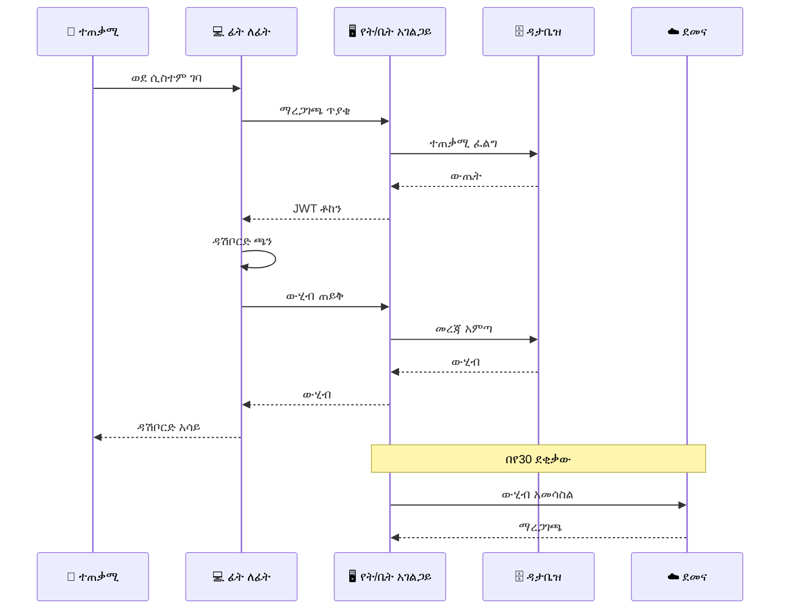

# ምዕራፍ 1 — ZENOVA ምንድን ነው? (What is ZENOVA?)


## 📋 አጠቃላይ እይታ (Overview)


ZENOVA የትምህርት ተቋማትን ከሥር እስከ ቅጠል በዲጂታል መንገድ ለማስተዳደር የተሰራ የተቀናጀ የEdTech መድረክ ነው። ሲስተሙ **13+ የተለያዩ ሚናዎችን**፣ **229 ገፆችን**፣ **3-ደረጃ አርክቴክቸር**ን እና **NFC/QR ቴክኖሎጂ**ን ያጣምራል።


---


## 🧠 የZENOVA አእምሮአዊ ካርታ (Mind Map)


```mermaid

mindmap

  root((ZENOVA))

    ተጠቃሚ ሚናዎች

      ሱፐር አድሚን

      የትምህርት ቤት ባለቤት

      ዳይሬክተር

      አድሚን

      ሬጅስትራር

      ፋይናንስ

      መምህር

      ወላጅ

      ተማሪ

      ቤተ-መጻሕፍት

      ካፍቴሪያ

      መደብር

      ደህንነት

    አርክቴክቸር

      Cloud VPS

      School Ubuntu Server

      Frontend

    ክፍያ መጋራቢያ

      ቻፓ

      ቴሌብር

      ሲቢኢ ብር

    ባህሪያት

      NFC ካርድ

      QR ኮድ

      የፍቃድ ሥርዓት

      ደመና ማመሳሰል

```


---


## 🏛️ የZENOVA ምስላዊ መዋቅር (Visual Structure)


```

┌─────────────────────────────────────────────────────────────────┐

│                    ZENOVA ECOSYSTEM                             │

│  ┌───────────────────────────────────────────────────────────┐  │

│  │                    ☁️ CLOUD VPS                           │  │

│  │  ┌─────────────┐  ┌─────────────┐  ┌─────────────┐      │  │

│  │  │ License     │  │ API         │  │ Central     │      │  │

│  │  │ Server      │  │ Gateway     │  │ Database    │      │  │

│  │  └─────────────┘  └─────────────┘  └─────────────┘      │  │

│  └───────────────────────────────────────────────────────────┘  │

│                          │                                       │

│          ┌───────────────┼───────────────┐                       │

│          ▼               ▼               ▼                       │

│  ┌──────────────┐ ┌──────────────┐ ┌──────────────┐              │

│  │ 🏫 School A  │ │ 🏫 School B  │ │ 🏫 School C  │              │

│  │ Ubuntu       │ │ Ubuntu       │ │ Ubuntu       │              │

│  │ Server       │ │ Server       │ │ Server       │              │

│  │              │ │              │ │              │              │

│  │ ├ NFC Reader│ │ ├ NFC Reader│ │ ├ NFC Reader│              │

│  │ ├ QR Scan   │ │ ├ QR Scan   │ │ ├ QR Scan   │              │

│  │ └ Local DB  │ │ └ Local DB  │ │ └ Local DB  │              │

│  └──────────────┘ └──────────────┘ └──────────────┘              │

│                          │                                       │

│          ┌───────────────┴───────────────┐                       │

│          ▼                               ▼                       │

│  ┌──────────────┐               ┌──────────────┐                 │

│  │ 💻 Browser   │               │ 📱 Mobile    │                 │

│  │ (Web App)    │               │ App (Future) │                 │

│  └──────────────┘               └──────────────┘                 │

└─────────────────────────────────────────────────────────────────┘

```


---


## 📊 የሚናዎች ማነጻጸሪያ ሰንጠረዥ (Role Comparison Table)


| ተ.ቁ. | ሚና | ደረጃ | ዋና ተግባር | መዳረሻ |

|------|------|--------|-------------|---------|

| 👑 | ሱፐር አድሚን | ከፍተኛ | መላውን ሲስተም መቆጣጠር | ሁሉም ትምህርት ቤቶች |

| 🏢 | ባለቤት | ከፍተኛ | የራሱን ትምህርት ቤት ማስተዳደር | አንድ ትምህርት ቤት |

| 👔 | ዳይሬክተር | መካከለኛ | አካዳሚክ ተቆጣጣሪ | የትምህርት ቤቱ አካዳሚክ |

| 👨‍💼 | አድሚን | መካከለኛ | ዕለታዊ አስተዳደር | ተማሪ/ሰራተኛ ውሂብ |

| 📝 | ሬጅስትራር | መካከለኛ | ምዝገባ እና ውጤት | የተማሪ አካዳሚክ |

| 💰 | ፋይናንስ | መካከለኛ | ሂሳብ እና ክፍያ | የፋይናንስ ውሂብ |

| 👩‍🏫 | መምህር | መሰረታዊ | የክፍል አስተዳደር | የራሱ ክፍል |

| 👨‍👩‍👧 | ወላጅ | መሰረታዊ | የልጅ ክትትል | የልጁ ውሂብ |

| 👦 | ተማሪ | መሰረታዊ | የራስ መረጃ | የራሱ ውሂብ |

| 📚 | ቤተ-መጻሕፍት | መካከለኛ | የመጻሕፍት አያያዝ | የቤተ-መጻሕፍት ሞጁል |

| 🍽️ | ካፍቴሪያ | መካከለኛ | የምግብ አቅርቦት | የካፍቴሪያ ሞጁል |

| 🛒 | መደብር | መካከለኛ | የእቃ ሽያጭ | የመደብር ሞጁል |

| 🔒 | ደህንነት | መካከለኛ | የተማሪ ክትትል | የደህንነት ሞጁል |


---


## 🔄 የሲስተም መስተጋብር ፍሰት (System Interaction Flow)





---


## 📈 ዋና ዋና ቁጥሮች (Key Numbers)


| መለኪያ | ቁጥር |

|--------|-------|

| 📄 ጠቅላላ ገፆች | 229 |

| 👥 ሚናዎች | 13+ |

| 🏗️ አርክቴክቸር ደረጃዎች | 3 |

| 💳 የክፍያ መጋራቢያዎች | 3 |

| 📱 ወደ React Query የተቀየሩ | 164/229 (72%) |

| ✅ የTypeScript ስህተቶች | 0 |

| ✅ የESLint ስህተቶች | 0 |


---


## 🎯 ማጠቃለያ (Summary)


ZENOVA የትምህርት ተቋማትን ሙሉ የዲጂታል ለውጥ ያመጣል። ከተማሪ ምዝገባ እስከ ክፍያ አሰባሰብ፣ ከቤተ-መጻሕፍት አያያዝ እስከ ካፍቴሪያ ክፍያ፣ ከNFC ክትትል እስከ ደመና ማመሳሰል — ሁሉም በአንድ የተቀናጀ መድረክ ላይ ይገኛል።


---
