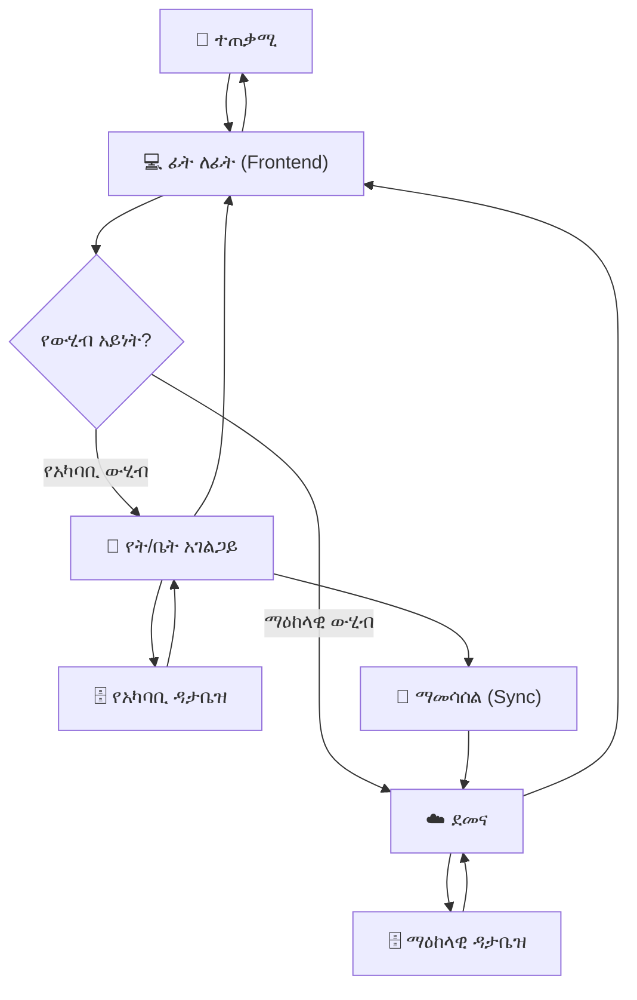
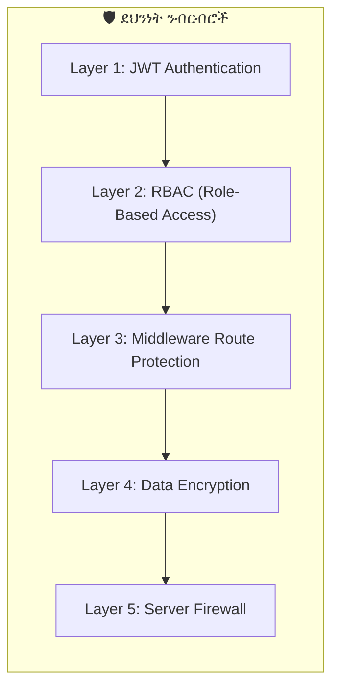

# ምዕራፍ 2 — የሲስተም አርክቴክቸር (System Architecture)


## 🏗️ የ3-ደረጃ አርክቴክቸር ምስላዊ እይታ


```

                        ☁️ ZENOVA CLOUD VPS

                   (ማዕከላዊ የውሂብ ማዕከል)

                   ════════════════════════

                   ┌─────────────────────┐

                   │   Central Database  │

                   │   License Server    │

                   │   Payment Gateway   │

                   │   Super Admin UI    │

                   │   Cloud Sync API    │

                   └─────────────────────┘

                            │

            ┌───────────────┼───────────────┐

            │               │               │

            ▼               ▼               ▼

    ┌───────────────┐ ┌───────────────┐ ┌───────────────┐

    │  🏫 SCHOOL A  │ │  🏫 SCHOOL B  │ │  🏫 SCHOOL C  │

    │  Ubuntu Srvr  │ │  Ubuntu Srvr  │ │  Ubuntu Srvr  │

    │  ───────────  │ │  ───────────  │ │  ───────────  │

    │  • Local DB   │ │  • Local DB   │ │  • Local DB   │

    │  • NFC Reader │ │  • NFC Reader │ │  • NFC Reader │

    │  • QR Scanner │ │  • QR Scanner │ │  • QR Scanner │

    │  • API Server │ │  • API Server │ │  • API Server │

    └───────────────┘ └───────────────┘ └───────────────┘

            │               │               │

            └───────────────┼───────────────┘

                            │

                            ▼

                    ┌───────────────┐

                    │   💻 USERS   │

                    │  ───────────  │

                    │  • Browser    │

                    │  • Mobile App │

                    └───────────────┘

```


---


## 🔧 የቴክኖሎጂ ቁልል (Tech Stack)


### የፊት-ለፊት ክፍል (Frontend)


```

┌─────────────────────────────────────────────┐

│           FRONTEND LAYER                    │

├─────────────────────────────────────────────┤

│  ┌───────────────────────────────────────┐  │

│  │  Next.js 14 (React Framework)        │  │

│  └───────────────────────────────────────┘  │

│  ┌───────────────────────────────────────┐  │

│  │  TypeScript (ደህንነቱ የተጠበቀ ኮድ)    │  │

│  └───────────────────────────────────────┘  │

│  ┌───────────────────────────────────────┐  │

│  │  Tailwind CSS (ምላሽ ሰጪ ዲዛይን)       │  │

│  └───────────────────────────────────────┘  │

│  ┌───────────────────────────────────────┐  │

│  │  React Query (ውሂብ አስተዳደር)         │  │

│  └───────────────────────────────────────┘  │

│  ┌───────────────────────────────────────┐  │

│  │  ESLint (የኮድ ጥራት መመሪያ)            │  │

│  └───────────────────────────────────────┘  │

└─────────────────────────────────────────────┘

```


### የኋላ-ተናጋሪ ክፍል (Backend)


```

┌─────────────────────────────────────────────┐

│            BACKEND LAYER                    │

├─────────────────────────────────────────────┤

│  ┌───────────────────────────────────────┐  │

│  │  Node.js (አገልጋይ ፕሮግራሚንግ)          │  │

│  └───────────────────────────────────────┘  │

│  ┌───────────────────────────────────────┐  │

│  │  PostgreSQL (የውሂብ ጎታ)               │  │

│  └───────────────────────────────────────┘  │

│  ┌───────────────────────────────────────┐  │

│  │  REST API (መገናኛ ዘዴ)                │  │

│  └───────────────────────────────────────┘  │

│  ┌───────────────────────────────────────┐  │

│  │  JWT Authentication (ደህንነት)         │  │

│  └───────────────────────────────────────┘  │

└─────────────────────────────────────────────┘

```


### የሃርድዌር እና ሌሎች ክፍሎች


```

┌─────────────────────────────────────────────┐

│         HARDWARE & INFRASTRUCTURE           │

├─────────────────────────────────────────────┤

│  ┌─────────────┐  ┌─────────────┐          │

│  │ 📡 NFC      │  │ 📸 QR      │          │

│  │ Reader      │  │ Scanner    │          │

│  └─────────────┘  └─────────────┘          │

│  ┌───────────────────────────────────────┐  │

│  │ 🐳 Docker (ኮንቴይነር አስተዳደር)        │  │

│  └───────────────────────────────────────┘  │

│  ┌───────────────────────────────────────┐  │

│  │ 🐧 Ubuntu Server (የት/ቤት አገልጋይ)     │  │

│  └───────────────────────────────────────┘  │

└─────────────────────────────────────────────┘

```


---


## 📡 የውሂብ ፍሰት ዲያግራም (Data Flow Diagram)





---


## 🌐 የኔትወርክ አርክቴክቸር (Network Architecture)


```

                        INTERNET

                           │

                           ▼

                    ┌───────────────┐

                    │   🛡️ FIREWALL │

                    └───────────────┘

                           │

                           ▼

              ┌─────────────────────────┐

              │   ☁️ CLOUD VPS          │

              │   (ማዕከላዊ አገልጋይ)      │

              │   IP: 203.x.x.x         │

              └─────────────────────────┘

                           │

          ┌────────────────┼────────────────┐

          │                │                │

          ▼                ▼                ▼

   ┌────────────┐   ┌────────────┐   ┌────────────┐

   │🏫 SCHOOL A │   │🏫 SCHOOL B │   │🏫 SCHOOL C │

   │192.168.1.x │   │192.168.2.x │   │192.168.3.x │

   │  ┌──────┐  │   │  ┌──────┐  │   │  ┌──────┐  │

   │  │Router│  │   │  │Router│  │   │  │Router│  │

   │  └──────┘  │   │  └──────┘  │   │  └──────┘  │

   │      │     │   │      │     │   │      │     │

   │  ┌──────┐  │   │  ┌──────┐  │   │  ┌──────┐  │

   │  │Ubuntu│  │   │  │Ubuntu│  │   │  │Ubuntu│  │

   │  │Server│  │   │  │Server│  │   │  │Server│  │

   │  └──────┘  │   │  └──────┘  │   │  └──────┘  │

   │  ┌──────┐  │   │  ┌──────┐  │   │  ┌──────┐  │

   │  │NFC   │  │   │  │NFC   │  │   │  │NFC   │  │

   │  │Reader│  │   │  │Reader│  │   │  │Reader│  │

   │  └──────┘  │   │  └──────┘  │   │  └──────┘  │

   └────────────┘   └────────────┘   └────────────┘

```


---


## 🔐 የደህንነት ንብርብሮች (Security Layers)





### የደህንነት ንብርብሮች ማብራሪያ


| ንብርብር | ቴክኖሎጂ | ተግባር |

|----------|-----------|---------|

| 1️⃣ | JWT (JSON Web Token) | ተጠቃሚ ማረጋገጫ |

| 2️⃣ | RBAC (14 ሚናዎች) | በሚና ላይ የተመሰረተ ፍቃድ |

| 3️⃣ | Next.js Middleware | ገፆችን ከማሳየቱ በፊት ፍቃድ ማረጋገጥ |

| 4️⃣ | SSL/TLS + Encryption | የውሂብ ምስጠራ |

| 5️⃣ | Firewall + IP Restriction | የአገልጋይ ደህንነት |


---


## 🎯 ማጠቃለያ (Summary)


የZENOVA አርክቴክቸር በሶስት ደረጃዎች የተከፋፈለ ሲሆን ይህም ሲስተሙን **ደህንነቱ የተጠበቀ**፣ **ተከሳሽ** እና **በቀላሉ ሊስፋፋ የሚችል** ያደርገዋል። እያንዳንዱ ትምህርት ቤት የራሱ የሆነ የአካባቢ አገልጋይ ቢኖረውም ከማዕከላዊ ደመና ጋር በመደበኛነት ይሰማማል።


---
