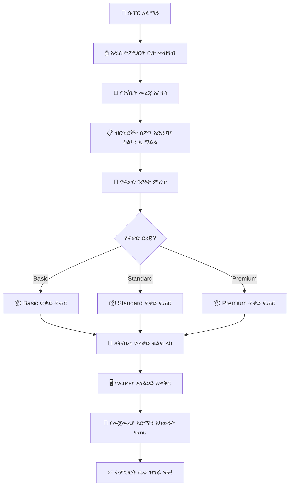

# ምዕራፍ 3 — ሱፐር አድሚን (Super Admin)


## 👑 የሱፐር አድሚን ሚና


ሱፐር አድሚን የZENOVA ሲስተም ከፍተኛው የአስተዳደር ሚና ነው። ይህ ሰው መላውን ሲስተም — ሁሉንም ትምህርት ቤቶች፣ ተጠቃሚዎች፣ ፍቃዶች እና የሲስተም ውቅሮችን — የማስተዳደር ሙሉ ስልጣን አለው።


---


## 🏛️ የፍቃድ ተዋረድ (Permission Hierarchy)


```

                        ┌──────────────┐

                        │  👑 SUPER   │

                        │   ADMIN      │

                        │  (Level 13)  │

                        └──────┬───────┘

                               │

                               ▼

                        ┌──────────────┐

                        │  🏢 SCHOOL  │

                        │   OWNER     │

                        │  (Level 12)  │

                        └──────┬───────┘

                               │

                               ▼

                        ┌──────────────┐

                        │  👔 DIRECTOR│

                        │  (Level 11)  │

                        └──────┬───────┘

                               │

                    ┌──────────┴──────────┐

                    ▼                     ▼

             ┌────────────┐       ┌────────────┐

             │👨‍💼 ADMIN  │       │📝 REGISTRAR│

             │(Level 10)  │       │(Level 10)  │

             └──────┬─────┘       └──────┬─────┘

                    │                    │

                    └──────────┬─────────┘

                               │

                    ┌──────────┴──────────┐

                    ▼                     ▼

             ┌────────────┐       ┌────────────┐

             │💰 FINANCE │       │👩‍🏫 TEACHER│

             │(Level 9)  │       │(Level 9)  │

             └────────────┘       └────────────┘

                               │

                    ┌──────────┴──────────┐

                    ▼                     ▼

             ┌────────────┐       ┌────────────┐

             │👨‍👩‍👧 PARENT │       │👦 STUDENT │

             │(Level 8)  │       │(Level 8)  │

             └────────────┘       └────────────┘

```


---


## 📊 የሱፐር አድሚን ዳሽቦርድ ምስላዊ ንድፍ (Dashboard Wireframe)


```

┌─────────────────────────────────────────────────────────────────┐

│  🔵 ZENOVA  ● ሱፐር አድሚን                    👤 አድሚን │ ውጣ │

├─────────────────────────────────────────────────────────────────┤

│ ┌──────────┐ ┌──────────┐ ┌──────────┐ ┌──────────┐ ┌────────┐│

│ │ 🏫 ት/ቤቶች │ │ 📄 ፍቃዶች │ │ 💰 ገቢ   │ │ ⏰ ማብቂያ │ │ 👥 ተ/ቤት│

│ │   126    │ │   118   │ │ 2.5M ብር │ │   12    │ │ 12,450 ││

│ │  ጠቅላላ  │ │  ንቁ     │ │  ወርሃዊ  │ │  ማስጠን  │ │ ተማሪዎች│

│ └──────────┘ └──────────┘ └──────────┘ └──────────┘ └────────┘│

├─────────────────────────────────────────────────────────────────┤

│  📋 የቅርብ ጊዜ ትምህርት ቤቶች (Recent Schools)              │

│ ┌─────────────────────────────────────────────────────────────┐ │

│ │ ትምህርት ቤት            │ ከተማ │ ፍቃድ │ ሁኔታ  │ ተማሪዎች │ │

│ ├─────────────────────────────────────────────────────────────┤ │

│ │ ቅዱስ ጊዮርጊስ ት/ቤት    │ አ.አ  │ ንቁ   │ ✅    │ 1,250  │ │

│ │ መዋለ ህጻናት ኮከብ     │ ባህርዳር │ ንቁ │ ✅    │ 340    │ │

│ │ ዘመን ትምህርት ቤት     │ አ.አ  │ ያለቀ │ ⚠️    │ 890    │ │

│ │ ራስ መኮንን ት/ቤት     │ ጎንደር│ ንቁ   │ ✅    │ 2,100  │ │

│ └─────────────────────────────────────────────────────────────┘ │

├─────────────────────────────────────────────────────────────────┤

│ ┌─────────────────────────┐ ┌─────────────────────────────┐    │

│ │  📈 ወርሃዊ ምዝገባ      │ │  🖥️ የሲስተም ሁኔታ          │    │

│ │                         │ │  CPU: ████████░░ 80%      │    │

│ │  ██                     │ │  RAM: ██████░░░░ 60%      │    │

│ │  ████████               │ │  DISK: ████████░░ 75%    │    │

│ │  ████████████           │ │  ማመሳሰል: ✅ ተሰምሯል      │    │

│ │  ████████████████       │ └─────────────────────────────┘    │

│ │  ──────────────────     │                                     │

│ │  ጥር የካቲት መጋቢት ሚያዚያ│                                     │

│ └─────────────────────────┘                                     │

└─────────────────────────────────────────────────────────────────┘

```


---


## 🔄 የትምህርት ቤት ምዝገባ ሂደት (School Registration Flow)





---


## ⚙️ የሱፐር አድሚን ተግባራት ዝርዝር


### የትምህርት ቤቶች አስተዳደር

```

┌─────────────────────────────────────────────────────────────────┐

│  🏫 የትምህርት ቤቶች አስተዳደር                                │

├─────────────────────────────────────────────────────────────────┤

│  ✅ አዲስ ትምህርት ቤት መመዝገብ                                    │

│  ✅ የትምህርት ቤት መረጃ ማስተካከል                                 │

│  ✅ ትምህርት ቤት ማንቃት / ማጥፋት                                  │

│  ✅ የትምህርት ቤቶች ዝርዝር እና ሁኔታ መከታተል                     │

│  ✅ የትምህርት ቤት መለኪያዎች (ስታቲስቲክስ) ማየት                    │

└─────────────────────────────────────────────────────────────────┘

```


### የፍቃድ አስተዳደር

```

┌─────────────────────────────────────────────────────────────────┐

│  🔑 የፍቃድ አስተዳደር                                          │

├─────────────────────────────────────────────────────────────────┤

│  ✅ ለአዳዲስ ትምህርት ቤቶች ፍቃድ መስጠት                            │

│  ✅ የነባር ፍቃዶች ማራዘሚያ                                       │

│  ✅ ፍቃድ ማቋረጥ                                                  │

│  ✅ የፍቃድ አጠቃቀም ሪፖርት                                      │

│  ✅ ፍቃድ ደረጃ ማሻሻል (Basic → Standard → Premium)               │

└─────────────────────────────────────────────────────────────────┘

```


### የሲስተም ክትትል

```

┌─────────────────────────────────────────────────────────────────┐

│  🖥️ የሲስተም ክትትል                                             │

├─────────────────────────────────────────────────────────────────┤

│  ✅ የአገልጋይ ሁኔታ (CPU፣ RAM፣ Disk) መከታተል                    │

│  ✅ የደመና ማመሳሰል ሁኔታ                                         │

│  ✅ የስህተት ሪፖርቶች                                             │

│  ✅ የሲስተም እንቅስቃሴ ምዝግብ (System Logs)                     │

└─────────────────────────────────────────────────────────────────┘

```


---


## 📈 የሪፖርት ዓይነቶች (Report Types)


| የሪፖርት ዓይነት | ድግግሞሽ | ይዘት |

|-------------------|-----------|-------|

| 📊 አጠቃላይ የሲስተም አጠቃቀም | ዕለታዊ | ጠቅላላ ት/ቤቶች፣ ተማሪዎች፣ እንቅስቃሴ |

| 📋 የት/ቤቶች አፈጻጸም | ሳምንታዊ | የእያንዳንዱ ት/ቤት አፈጻጸም |

| ⏰ የፍቃድ ጊዜ ማብቂያ | ዕለታዊ | በቅርቡ የሚያልቁ ፍቃዶች |

| 🔄 የደመና ማመሳሰል | ዕለታዊ | የማመሳሰል ሁኔታ እና ስህተቶች |

| ❌ የሲስተም ስህተት | በተከሰተ ጊዜ | የስህተት ዝርዝር እና መፍትሄ |


---


## 🎯 ማጠቃለያ (Summary)


ሱፐር አድሚን የZENOVA ሲስተም በረት ያህል ነው። ሁሉንም ትምህርት ቤቶች ያስተዳድራል፣ ፍቃዶችን ይሰጣል፣ የሲስተሙን ጤና ይከታተላል እና ማንኛውንም ዓይነት ሪፖርት ያዘጋጃል።


---
