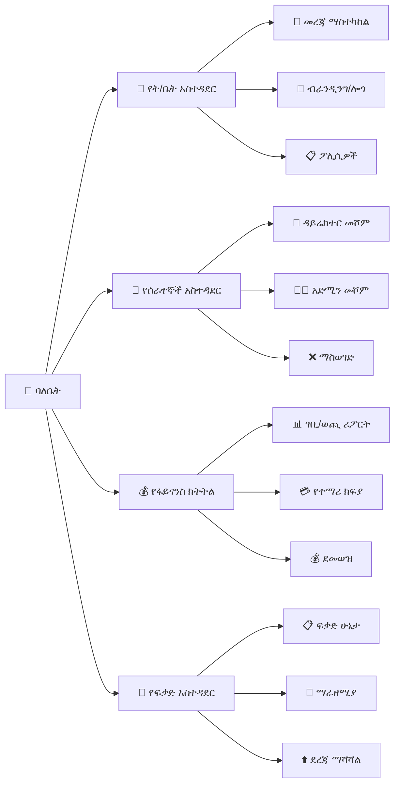

# ምዕራፍ 4 — የትምህርት ቤት ባለቤት (School Owner)


## 🏢 ሚና እና ሃላፊነት


የትምህርት ቤት ባለቤት የአንድ የተወሰነ ትምህርት ቤት ከፍተኛ የአስተዳደር ስልጣን ያለው ሰው ነው። ከሱፐር አድሚን የሚለየው የራሱን ትምህርት ቤት ብቻ ነው የሚያስተዳድረው።


---


## 🏛️ የትምህርት ቤት መዋቅር (School Organizational Chart)


```

┌─────────────────────────────────────────────────────────────────┐

│                    🏢 የትምህርት ቤት ባለቤት                       │

│                         (Owner)                                  │

└─────────────────────────────┬───────────────────────────────────┘

                              │

                              ▼

┌─────────────────────────────────────────────────────────────────┐

│                    👔 ዳይሬክተር (Director)                        │

└─────────────┬───────────────────────────────────┬───────────────┘

              │                                   │

              ▼                                   ▼

┌─────────────────────────┐         ┌─────────────────────────────┐

│     👨‍💼 አድሚን (Admin)     │         │   📝 ሬጅስትራር (Registrar)  │

└─────────────┬───────────┘         └──────────────┬──────────────┘

              │                                    │

              ▼                                    ▼

┌─────────────────────────┐         ┌─────────────────────────────┐

│     💰 ፋይናንስ (Finance) │         │   👩‍🏫 መምህራን (Teachers)      │

└─────────────────────────┘         └─────────────────────────────┘

                                              │

                    ┌─────────────────────────┼──────────┐

                    ▼                         ▼          ▼

          ┌──────────────────┐     ┌──────────────┐ ┌──────────┐

          │ 📚 ቤተ-መጻሕፍት  │     │ 🍽️ ካፍቴሪያ │ │ 🛒 መደብር│

          └──────────────────┘     └──────────────┘ └──────────┘

```


---


## 📊 የባለቤት ዳሽቦርድ ምስላዊ ንድፍ


```

┌─────────────────────────────────────────────────────────────────┐

│  🏢 የተከበሩ ልጆች ትምህርት ቤት      👤 አቶ ኃይሉ │ ውጣ │

├─────────────────────────────────────────────────────────────────┤

│ ┌──────────┐ ┌──────────┐ ┌──────────┐ ┌──────────┐ ┌────────┐│

│ │ 👦 ተማሪዎች│ │ 👩‍🏫 መምህራን│ │ 💰 ገቢ   │ │ 📈 መገኘት│ │ ⏰ ማሳሰቢ│

│ │  1,250   │ │   45    │ │ 350,000  │ │  95%    │ │   3    ││

│ └──────────┘ └──────────┘ └──────────┘ └──────────┘ └────────┘│

├─────────────────────────────────────────────────────────────────┤

│ ┌─────────────────────────────┐ ┌─────────────────────────────┐│

│ │  📈 ወርሃዊ ገቢ እና ወጪ     │ │  👦 የክፍል ተማሪ ብዛት      ││

│ │  ገቢ ████████████████ 350K │ │  ቅ.መ ████████ 120         ││

│ │  ወጪ ██████████░░░░ 250K  │ │  1ኛ  ██████████████ 180    ││

│ │  ትርፍ ██████░░░░░░ 100K  │ │  2ኛ  ████████████ 150      ││

│ │                           │ │  3ኛ  ████████████████ 200   ││

│ └─────────────────────────────┘ └─────────────────────────────┘│

├─────────────────────────────────────────────────────────────────┤

│ ┌─────────────────────────────────────────────────────────────┐│

│ │  ⚠️ ያልተከፈሉ ክፍያዎች (Unpaid Fees)                      ││

│ │ ┌─────────────┬────────┬──────────┬───────────┬────────┐   ││

│ │ │ ተማሪ        │ ክፍል   │ መጠን    │ ዕዳ ከ    │ ሁኔታ  │   ││

│ │ ├─────────────┼────────┼──────────┼───────────┼────────┤   ││

│ │ │ አበበ ከበደ  │ 12ኛ ኤ│ 5,000   │ 3 ወር    │ ⚠️    │   ││

│ │ │ ሳራ ኃይሉ  │ 10ኛ ቢ│ 3,500   │ 2 ወር    │ ⚠️    │   ││

│ │ │ ዮናስ ተስፋ │ 8ኛ ሲ │ 2,000   │ 1 ወር    │ 🟡    │   ││

│ │ └─────────────┴────────┴──────────┴───────────┴────────┘   ││

│ └─────────────────────────────────────────────────────────────┘│

└─────────────────────────────────────────────────────────────────┘

```


---


## 🔑 የባለቤት ተግባራት (Owner Functions)





---


## 💰 የፋይናንስ ክትትል (Financial Monitoring)


| መለኪያ | የአሁኑ ወር | ያለፈው ወር | ለውጥ |

|--------|------------|------------|--------|

| 💵 ጠቅላላ ገቢ | 350,000 ብር | 320,000 ብር | 📈 +9% |

| 💸 ጠቅላላ ወጪ | 250,000 ብር | 240,000 ብር | 📈 +4% |

| 📈 ትርፍ | 100,000 ብር | 80,000 ብር | 📈 +25% |

| 📋 የተከፈለ ክፍያ | 85% | 82% | 📈 +3% |

| ⚠️ ያልተከፈለ ዕዳ | 45,000 ብር | 50,000 ብር | 📉 -10% |


---


## 🎯 ማጠቃለያ (Summary)


የትምህርት ቤት ባለቤት የራሱን ትምህርት ቤት አጠቃላይ አስተዳደር፣ የሰራተኞች አስተዳደር፣ የፋይናንስ ክትትል እና የፍቃድ አስተዳደር ያከናውናል። ከሱፐር አድሚን በታች ቢሆንም በራሱ ትምህርት ቤት ውስጥ ሙሉ ስልጣን አለው።


---
