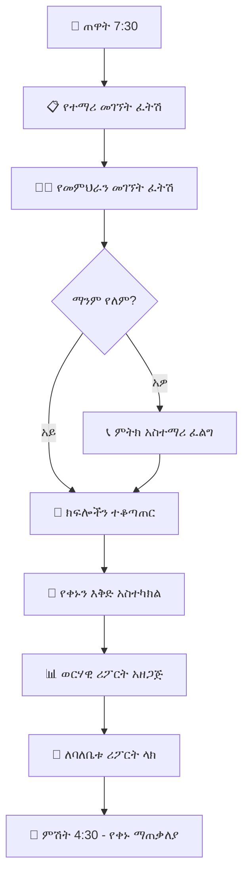

# ምዕራፍ 5 — ዳይሬክተር (Director)


## 👔 ሚና እና ሃላፊነት


ዳይሬክተር የትምህርት ቤቱ ዋና የአካዳሚክ እና የአስተዳደር ተቆጣጣሪ ነው። ይህ ሚና በትምህርት ቤት ባለቤት እና በሌሎች ሰራተኞች መካከል የድልድይ ሚና ይጫወታል።


---


## 🎯 የዳይሬክተር ኃላፊነቶች ካርታ (Responsibility Map)


```mermaid

mindmap

  root((👔 ዳይሬክተር))

    አካዳሚክ

      ሥርዓተ ትምህርት ክትትል

      ፈተና አስተዳደር

      ውጤት ቁጥጥር

      የመምህራን ክትትል

    አስተዳደር

      የአድሚን ክትትል

      የሰራተኞች ፈረቃ

      የቀን መቁጠሪያ አስተዳደር

    ሪፖርት

      የተማሪ መገኘት

      የውጤት ሪፖርት

      አፈጻጸም ሪፖርት

```


---


## 📊 የዳይሬክተር ዳሽቦርድ ምስላዊ ንድፍ


```

┌─────────────────────────────────────────────────────────────────┐

│  👔 ዳይሬክተር ዳሽቦርድ              የ2017 ዓ.ም ትምህርት ዘመን │

├─────────────────────────────────────────────────────────────────┤

│ ┌──────────┐ ┌──────────┐ ┌──────────┐ ┌──────────┐ ┌────────┐│

│ │ 👦 ተማሪ  │ │ 👩‍🏫 መምህር│ │ 📈 መገኘት│ │ 📊 አማካይ│ │ 📝 ክፍል ││

│ │  1,250  │ │   45    │ │   95%   │ │   78%   │ │   32   ││

│ └──────────┘ └──────────┘ └──────────┘ └──────────┘ └────────┘│

├─────────────────────────────────────────────────────────────────┤

│ ┌─────────────────────────────┐ ┌─────────────────────────────┐│

│ │  📈 የክፍል አፈጻጸም       │ │  👩‍🏫 የመምህራን መገኘት      ││

│ │  ቅ.መ  ████████ 85%        │ │  ወ/ሮ አስቴር  ██████████ 98% ││

│ │  1ኛ   ██████████ 78%      │ │  አቶ ኃይሉ    ████████ 85%   ││

│ │  2ኛ   ████████████ 82%    │ │  ወ/ሮ ሳራ    ██████████ 92% ││

│ │  3ኛ   ██████████ 76%      │ │  አቶ ተስፋ   ██████ 72%     ││

│ │  4ኛ   ████████ 70%        │ │                           ││

│ └─────────────────────────────┘ └─────────────────────────────┘│

├─────────────────────────────────────────────────────────────────┤

│ ┌─────────────────────────────────────────────────────────────┐│

│ │  📋 ዛሬ ያልተገኙ ተማሪዎች (Today's Absent Students)       ││

│ │ ┌─────────────┬────────┬──────────┬────────────┬────────┐   ││

│ │ │ ተማሪ        │ ክፍል   │ ምክንያት │ ወላጅ      │ ሁኔታ  │   ││

│ │ ├─────────────┼────────┼──────────┼────────────┼────────┤   ││

│ │ │ አበበ ከበደ │ 12ኛ ኤ│ ሕመም   │ ተነግሯል  │ 📞    │   ││

│ │ │ ሳራ ኃይሉ │ 10ኛ ቢ│ ፈቃድ   │ ተነግሯል  │ ✅    │   ││

│ │ │ ዮናስ ተስፋ│ 8ኛ ሲ │ ያልታወቀ│ አልተነገረም │ ⚠️    │   ││

│ │ └─────────────┴────────┴──────────┴────────────┴────────┘   ││

│ └─────────────────────────────────────────────────────────────┘│

├─────────────────────────────────────────────────────────────────┤

│  ⏰ የፈተና መርሐ ግብር (Exam Schedule)                         │

│  ┌────────────┬───────────┬──────────┬───────────┬──────────┐  │

│  │ ቀን        │ ክፍል     │ ትምህርት │ ሰዓት     │ ክፍል     │  │

│  ├────────────┼───────────┼──────────┼───────────┼──────────┤  │

│  │ ሰኞ        │ 12ኛ ኤ    │ ሒሳብ    │ 8:00-10:00│ ሀላ ኃይሉ│  │

│  │ ማክሰኞ    │ 12ኛ ቢ   │ እንግሊዝኛ│ 8:00-10:00│ ክፍል 1   │  │

│  │ ረቡዕ      │ 11ኛ ኤ   │ ፊዚክስ  │ 10:00-12:00│ ክፍል 2  │  │

│  └────────────┴───────────┴──────────┴───────────┴──────────┘  │

└─────────────────────────────────────────────────────────────────┘

```


---


## 🔄 የዳይሬክተር ዕለታዊ ፍሰት (Daily Director Workflow)





---


## 📋 የዳይሬክተር ተግባራት ማጠቃለያ


| ተግባር | መግለጫ | ድግግሞሽ |

|---------|---------|-----------|

| 📊 የተማሪ መገኘት ክትትል | የዕለቱን መገኘት ፍትሽ እና ሪፖርት አዘጋጅ | ዕለታዊ |

| 👩‍🏫 የመምህራን ክትትል | የመምህራንን መገኘት እና አፈጻጸም ተከታተል | ዕለታዊ |

| 📝 የፈተና አስተዳደር | የፈተና መርሐ ግብር አዘጋጅ እና ተቆጣጠር | ወርሃዊ |

| 📋 የሪፖርት አዘጋጀት | ለባለቤቱ ወርሃዊ ሪፖርት አዘጋጅ | ወርሃዊ |

| 👔 የሰራተኞች ፈረቃ | የሰራተኞችን ፈረቃ እና የእረፍት ጊዜ አስተዳድር | ሳምንታዊ |


---


## 🎯 ማጠቃለያ (Summary)


ዳይሬክተሩ የትምህርት ቤቱ ዋና አካዳሚክ እና አስተዳደር ተቆጣጣሪ ነው። የተማሪ መገኘት፣ የመምህራን አፈጻጸም፣ የፈተና አስተዳደር እና ለባለቤቱ ሪፖርት ማቅረብ ዋና ዋና ተግባራቱ ናቸው።


---
