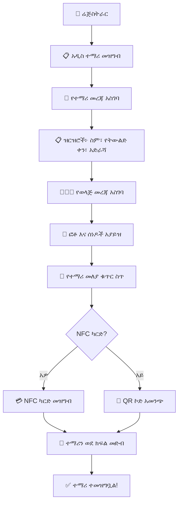
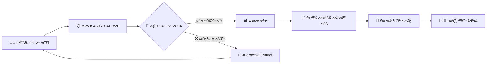

# ምዕራፍ 7 — ሬጅስትራር (Registrar)


## 📝 ሚና እና ሃላፊነት


ሬጅስትራር የተማሪ ምዝገባ፣ የውጤት አያያዝ እና የአካዳሚክ መዛግብትን የማስተዳደር ሃላፊነት አለው።


---


## 🔄 የተማሪ ምዝገባ ሂደት (Student Registration Process)





---


## 📊 የሬጅስትራር ዳሽቦርድ ምስላዊ ንድፍ


```

┌─────────────────────────────────────────────────────────────────┐

│  📝 ሬጅስትራር ዳሽቦርድ                                          │

├─────────────────────────────────────────────────────────────────┤

│ ┌──────────┐ ┌──────────┐ ┌──────────┐ ┌──────────┐ ┌────────┐│

│ │ 👦 ተማሪ  │ │ 📋 ዛሬ   │ │ 📊 ውጤት │ │ 🎓 ተመራቂ│ │ ⏰ በማየት│

│ │  1,250  │ │  አዲስ 5 │ │  ለማረጋገጥ│ │   120   │ │   15   ││

│ │  ጠቅላላ  │ │  ምዝገባ  │ │  23     │ │  ተመራቂ  │ │  ማስተካከል│

│ └──────────┘ └──────────┘ └──────────┘ └──────────┘ └────────┘│

├─────────────────────────────────────────────────────────────────┤

│ ┌─────────────────────────────┐ ┌─────────────────────────────┐│

│ │  📋 ዛሬ የተመዘገቡ ተማሪዎች  │ │  📊 ወደ ማረጋገጥ የሚጠብቁ      ││

│ │  ┌──────────┬─────────┐    │ │  ውጤቶች                      ││

│ │  │ ስም     │ ክፍል   │    │ │  ┌────────────┬──────────┐   ││

│ │  ├──────────┼─────────┤    │ │  │ ክፍል      │ ብዛቤ   │   ││

│ │  │ አለም ኃይሉ│ 1ኛ ኤ  │    │ │  ├────────────┼──────────┤   ││

│ │  │ ሳራ ተስፋ│ 2ኛ ቢ  │    │ │  │ 12ኛ ኤ     │ 15      │   ││

│ │  │ ዮሐንስ ገ/እ│ 3ኛ ሲ │    │ │  │ 12ኛ ቢ    │ 12      │   ││

│ │  │ ማርያም ጴጥ│ 1ኛ ቢ │    │ │  │ 10ኛ ኤ     │ 20      │   ││

│ │  └──────────┴─────────┘    │ │  └────────────┴──────────┘   ││

│ └─────────────────────────────┘ └─────────────────────────────┘│

├─────────────────────────────────────────────────────────────────┤

│  📋 የተማሪ ብዛት በክፍል (Students per Grade)                  │

│  ┌─────┬─────┬─────┬─────┬─────┬─────┬─────┬─────┬─────┬────┐ │

│  │ቅ.መ │ 1ኛ │ 2ኛ │ 3ኛ │ 4ኛ │ 5ኛ │ 6ኛ │ 7ኛ │ 8ኛ │... │ │

│  │ 120 │ 180 │ 150 │ 200 │ 175 │ 160 │ 140 │ 130 │ 145 │    │ │

│  └─────┴─────┴─────┴─────┴─────┴─────┴─────┴─────┴─────┴────┘ │

└─────────────────────────────────────────────────────────────────┘

```


---


## 🎓 የውጤት አስተዳደር ፍሰት (Grade Management Flow)





---


## 🎯 ማጠቃለያ (Summary)


ሬጅስትራር የተማሪ ምዝገባ፣ የውጤት ማረጋገጫ እና የአካዳሚክ መዛግብትን ያስተዳድራል። የተማሪ መረጃ ትክክለኛነት እና ደህንነት ዋነኛ ኃላፊነቱ ነው።


---
