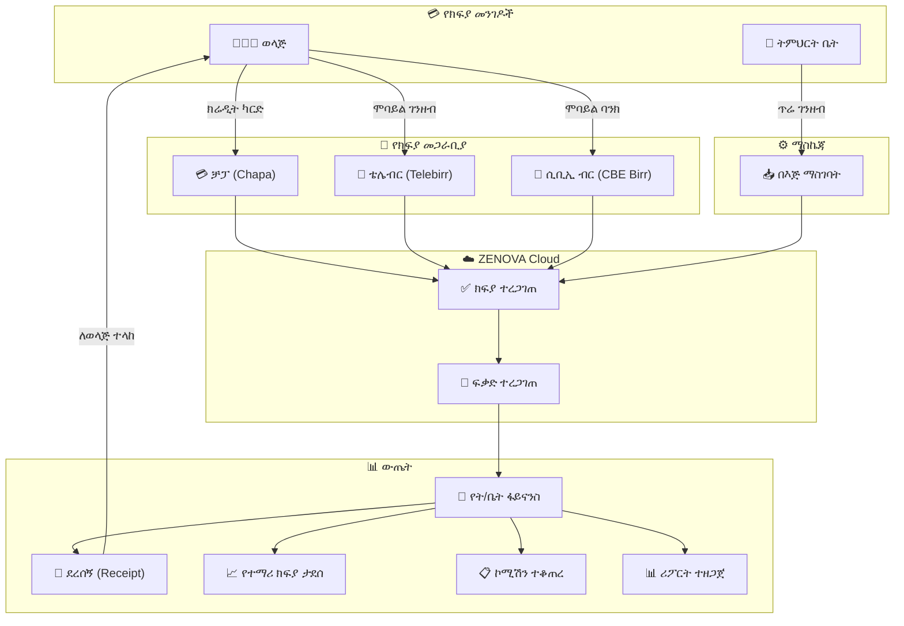
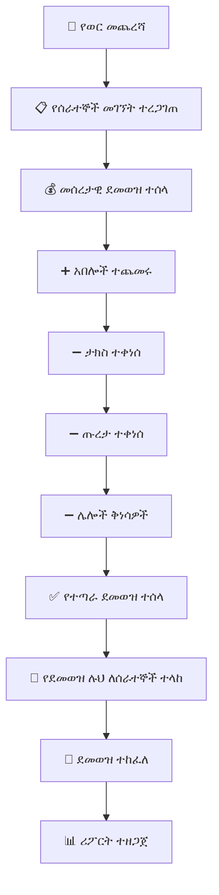

# ምዕራፍ 8 — ፋይናንስ (Finance)


## 💰 የፋይናንስ ሞጁል አጠቃላይ እይታ


የፋይናንስ ሞጁል የትምህርት ቤቱን የገንዘብ ፍሰት ከመጀመሪያ እስከ መጨረሻ የሚቆጣጠር ሲሆን ከተማሪ ክፍያ አሰባሰብ ጀምሮ እስከ ደመወዝ አከፋፈል ድረስ ያሉትን ሁሉንም የፋይናንስ ተግባራት ያከናውናል።


---


## 🏗️ የፋይናንስ ሞጁል መዋቅር (Finance Module Structure)


```

┌─────────────────────────────────────────────────────────────────┐

│                    💰 F I N A N C E                             │

│                     M O D U L E                                 │

├─────────────────────────────────────────────────────────────────┤

│                                                                 │

│  ┌───────────────────────────────────────────────────────────┐  │

│  │  1️⃣ የክፍያ መዋቅር (Fee Structure)                          │  │

│  │  • የትምህርት ክፍያ  • የምዝገባ ክፍያ  • የላብራቶሪ ክፍያ  │  │

│  │  • የትራንስፖርት ክፍያ  • የምግብ ክፍያ  • ሌሎች      │  │

│  └───────────────────────────────────────────────────────────┘  │

│                                                                 │

│  ┌───────────────────────────────────────────────────────────┐  │

│  │  2️⃣ የክፍያ አሰባሰብ (Payment Collection)                  │  │

│  │  • በጥሬ ገንዘብ  • በቻፓ  • በቴሌብር  • በሲቢኢ ብር      │  │

│  └───────────────────────────────────────────────────────────┘  │

│                                                                 │

│  ┌───────────────────────────────────────────────────────────┐  │

│  │  3️⃣ የወጪ አስተዳደር (Expense Management)                  │  │

│  │  • ደመወዝ  • ፍጆታ  • ጥገና  • ቁሳቁስ  • ሌሎች        │  │

│  └───────────────────────────────────────────────────────────┘  │

│                                                                 │

│  ┌───────────────────────────────────────────────────────────┐  │

│  │  4️⃣ የሂሳብ ሪፖርቶች (Financial Reports)                    │  │

│  │  • ዕለታዊ  • ወርሃዊ  • ዓመታዊ  • የኦዲት             │  │

│  └───────────────────────────────────────────────────────────┘  │

│                                                                 │

│  ┌───────────────────────────────────────────────────────────┐  │

│  │  5️⃣ የደመወዝ አስተዳደር (Payroll Management)               │  │

│  │  • ደሞዝ ማስላት  • ታክስ  • የደመወዝ ሉህ              │  │

│  └───────────────────────────────────────────────────────────┘  │

│                                                                 │

│  ┌───────────────────────────────────────────────────────────┐  │

│  │  6️⃣ የበጀት እቅድ (Budget Planning)                         │  │

│  │  • ዓመታዊ በጀት  • ክትትል  • ትንተና                   │  │

│  └───────────────────────────────────────────────────────────┘  │

│                                                                 │

└─────────────────────────────────────────────────────────────────┘

```


---


## 💳 የክፍያ መዋቅር ሰንጠረዥ (Fee Structure Table)


| የክፍያ ዓይነት | ቅድመ-መደበኛ | 1ኛ-4ኛ ክፍል | 5ኛ-8ኛ ክፍል | 9ኛ-12ኛ ክፍል | ድግግሞሽ |

|-----------------|--------------|-------------|-------------|--------------|-----------|

| 📚 የትምህርት ክፍያ | 500 ብር | 800 ብር | 1,200 ብር | 1,800 ብር | ወርሃዊ |

| 📝 የምዝገባ ክፍያ | 200 ብር | 300 ብር | 400 ብር | 500 ብር | ዓመታዊ |

| 🔬 የላብራቶሪ ክፍያ | - | - | 100 ብር | 200 ብር | ወርሃዊ |

| 🚌 የትራንስፖርት ክፍያ | 300 ብር | 300 ብር | 400 ብር | 500 ብር | ወርሃዊ |

| 🍽️ የምግብ ክፍያ | 500 ብር | 600 ብር | 700 ብር | 800 ብር | ወርሃዊ |

| 👔 የዩኒፎርም ክፍያ | 800 ብር | 1,000 ብር | 1,200 ብር | 1,500 ብር | ዓመታዊ |


---


## 🔄 የክፍያ ፍሰት ዲያግራም (Payment Flow Diagram)





---


## 📊 የፋይናንስ ዳሽቦርድ ምስላዊ ንድፍ


```

┌─────────────────────────────────────────────────────────────────┐

│  💰 ፋይናንስ ዳሽቦርድ                          ጥር 2017 ዓ.ም    │

├─────────────────────────────────────────────────────────────────┤

│ ┌──────────┐ ┌──────────┐ ┌──────────┐ ┌──────────┐ ┌────────┐│

│ │ 💵 ገቢ   │ │ 💸 ወጪ   │ │ 📈 ትርፍ │ │ 📋 ተከፍሏል│ │ ⚠️ ዕዳ ││

│ │ 350,000  │ │ 250,000  │ │ 100,000 │ │   85%   │ │ 45,000 ││

│ │  ወርሃዊ  │ │  ወርሃዊ  │ │  ወርሃዊ  │ │  መቶኛ   │ │  ጠቅላላ ││

│ └──────────┘ └──────────┘ └──────────┘ └──────────┘ └────────┘│

├─────────────────────────────────────────────────────────────────┤

│ ┌─────────────────────────────┐ ┌─────────────────────────────┐│

│ │  📈 ወርሃዊ ገቢ እና ወጪ     │ │  💳 የክፍያ ሁኔታ በክፍል   ││

│ │  ┌─────────────────────┐   │ │  ቅ.መ ████████████ 90%     ││

│ │  │    ████████████     │   │ │  1ኛ  ██████████░░ 80%      ││

│ │  │    ████████████     │   │ │  2ኛ  ████████████ 85%     ││

│ │  │    ░░░░████████     │   │ │  3ኛ  ██████░░░░░░ 60%     ││

│ │  │    ░░░░████████     │   │ │  4ኛ  ████████████ 88%     ││

│ │  │    ገቢ   ወጪ        │   │ │                           ││

│ │  └─────────────────────┘   │ │  ✅ ተከፍሏል  ❌ አልተከፈለም││

│ └─────────────────────────────┘ └─────────────────────────────┘│

├─────────────────────────────────────────────────────────────────┤

│ ┌─────────────────────────────────────────────────────────────┐│

│ │  ⚠️ ያልተከፈለ ዕዳ ዝርዝር (Unpaid Debt List)               ││

│ │ ┌─────────────┬────────┬──────────┬───────────┬──────────┐  ││

│ │ │ ተማሪ        │ ክፍል   │ የሚከፈለው│ የተከፈለው│ ቀሪ    │  ││

│ │ ├─────────────┼────────┼──────────┼───────────┼──────────┤  ││

│ │ │ አበበ ከበደ  │ 12ኛ   │ 18,000   │ 3,000    │ 15,000  │  ││

│ │ │ ሳራ ኃይሉ  │ 10ኛ   │ 15,000   │ 5,000    │ 10,000  │  ││

│ │ │ ዮናስ ተስፋ │ 8ኛ    │ 12,000   │ 4,000    │ 8,000   │  ││

│ │ │ ሩት ዳዊት  │ 6ኛ    │ 10,000   │ 2,000    │ 8,000   │  ││

│ │ └─────────────┴────────┴──────────┴───────────┴──────────┘  ││

│ └─────────────────────────────────────────────────────────────┘│

├─────────────────────────────────────────────────────────────────┤

│  📋 የዛሬው ክፍያ እንቅስቃሴ (Today's Payment Activity)        │

│  ┌────────────┬───────────┬────────────┬──────────┬─────────┐  │

│  │ ሰዓት      │ ተማሪ     │ መጠን      │ ዘዴ     │ ሁኔታ   │  │

│  ├────────────┼───────────┼────────────┼──────────┼─────────┤  │

│  │ 8:30      │ አለም ኃይሉ│ 5,000 ብር │ ቻፓ    │ ✅     │  │

│  │ 9:15      │ ሳራ ተስፋ│ 3,500 ብር │ ቴሌብር │ ✅     │  │

│  │ 10:00     │ ዮሐንስ   │ 8,000 ብር │ ጥሬ    │ ✅     │  │

│  │ 11:30     │ ማርያም   │ 2,000 ብር │ ሲቢኢ   │ ✅     │  │

│  └────────────┴───────────┴────────────┴──────────┴─────────┘  │

└─────────────────────────────────────────────────────────────────┘

```


---


## 📋 የፋይናንስ ሪፖርቶች ዓይነቶች


| የሪፖርት ዓይነት | ድግግሞሽ | ይዘት |

|-------------------|-----------|-------|

| 📊 ዕለታዊ የገቢ ሪፖርት | ዕለታዊ | የዕለቱ ክፍያዎች ዝርዝር |

| 📊 ወርሃዊ የገቢ እና ወጪ | ወርሃዊ | የወሩ ማጠቃለያ |

| 💳 የተማሪ ክፍያ ሪፖርት | ወርሃዊ | በክፍል የተከፈለ ክፍያ |

| 💰 የደመወዝ ሪፖርት | ወርሃዊ | የሰራተኞች ደመወዝ |

| ⚠️ ያልተከፈለ ዕዳ ሪፖርት | ሳምንታዊ | ዕዳ ያለባቸው ተማሪዎች |

| 📈 ዓመታዊ ሒሳብ | ዓመታዊ | የዓመቱ የሒሳብ ማጠቃለያ |


---


## 🧾 የደመወዝ አስተዳደር ሂደት (Payroll Process)





---


## 🎯 ማጠቃለያ (Summary)


የፋይናንስ ሞጁል የZENOVA ሲስተም ዋነኛ ክፍል ነው። የክፍያ መዋቅርን መወሰን፣ ክፍያ መሰብሰብ፣ ወጪ ማስተዳደር፣ ደመወዝ ማከፋፈል እና የተለያዩ ሪፖርቶችን ማዘጋጀት ያካትታል። ሶስት የክፍያ መጋራቢያዎችን (ቻፓ፣ ቴሌብር፣ ሲቢኢ ብር) ይደግፋል።


---
