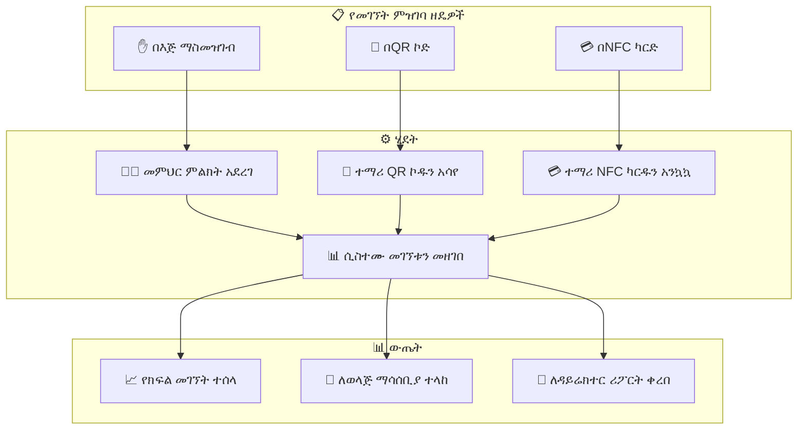

# ምዕራፍ 9 — መምህር (Teacher)


## 👩‍🏫 ሚና እና ሃላፊነት


መምህር የZENOVA ሲስተም ውስጥ የትምህርት ሂደቱን በቀጥታ የሚያከናውን ሚና ነው። መምህሩ የራሱን የክፍል እንቅስቃሴ፣ የፈተና ውጤት እና የተማሪ ክትትል ያስተዳድራል።


---


## 🎯 የመምህር ኃላፊነቶች ካርታ


```mermaid

mindmap

  root((👩‍🏫 መምህር))

    የክፍል አስተዳደር

      የተመደቡ ክፍሎች

      የክፍል መርሐ ግብር

      የተማሪ ዝርዝር

    የመገኘት ምዝገባ

      በእጅ ማስመዝገብ

      በQR ኮድ

      በNFC ካርድ

    የውጤት አስተዳደር

      ፈተና መፍጠር

      ውጤት ማስገባት

      ስታቲስቲክስ

    የተማሪ ክትትል

      የመገኘት ታሪክ

      የውጤት ታሪክ

      ሪፖርት መላክ

```


---


## 📊 የመምህር ዳሽቦርድ ምስላዊ ንድፍ


```

┌─────────────────────────────────────────────────────────────────┐

│  👩‍🏫 ወ/ሮ አስቴር ገብረ ማርያም        የሒሳብ መምህር │ ውጣ │

├─────────────────────────────────────────────────────────────────┤

│ ┌──────────┐ ┌──────────┐ ┌──────────┐ ┌──────────┐ ┌────────┐│

│ │ 👦 ተማሪ  │ │ 📚 ትምህርት│ │ 🏫 ክፍል  │ │ 📈 ዛሬ   │ │ ⏰ የሚቀር│

│ │   120   │ │  ሒሳብ   │ │   4    │ │ መገኘት  │ │ ፈተና 2 │

│ │  ጠቅላላ  │ │         │ │  ክፍሎች  │ │   95%   │ │         │

│ └──────────┘ └──────────┘ └──────────┘ └──────────┘ └────────┘│

├─────────────────────────────────────────────────────────────────┤

│ ┌─────────────────────────────┐ ┌─────────────────────────────┐│

│ │  📋 የዛሬ የትምህርት መርሐ ግብር│ │  📈 የክፍል አፈጻጸም       ││

│ │  ┌──────────┬──────────┐   │ │  ┌────────┬────────────┐   ││

│ │  │ ሰዓት    │ ክፍል    │   │ │  │ ክፍል  │ አማካይ    │   ││

│ │  ├──────────┼──────────┤   │ │  ├────────┼────────────┤   ││

│ │  │ 8:00-9:00│ 12ኛ ኤ  │   │ │  │ 12ኛ ኤ │ ████████ 78%│   ││

│ │  │ 9:00-10:00│ 12ኛ ቢ │   │ │  │ 12ኛ ቢ│ ██████ 65% │   ││

│ │  │ 10:00-11:00│ 11ኛ ኤ│   │ │  │ 11ኛ ኤ│ ███████ 72% │   ││

│ │  │ 11:00-12:00│ 11ኛ ቢ│   │ │  │ 11ኛ ቢ│ ██████ 68% │   ││

│ │  └──────────┴──────────┘   │ │  └────────┴────────────┘   ││

│ └─────────────────────────────┘ └─────────────────────────────┘│

├─────────────────────────────────────────────────────────────────┤

│ ┌─────────────────────────────────────────────────────────────┐│

│ │  📝 የመገኘት ምዝገባ (Attendance) - 12ኛ ኤ                 ││

│ │  ┌─────┬─────┬─────┬─────┬─────┬─────┬─────┬─────┬────┐   ││

│ │  │ 1   │ 2   │ 3   │ 4   │ 5   │ 6   │ 7   │ 8   │... │   ││

│ │  │ ✅  │ ✅  │ ✅  │ ❌  │ ✅  │ ✅  │ ✅  │ ✅  │    │   ││

│ │  │ አበበ│ ሳራ│ ኃይሉ│ ተስፋ│... │    │    │    │    │   ││

│ │  ├─────┼─────┼─────┼─────┼─────┼─────┼─────┼─────┼────┤   ││

│ │  │ ዛሬ አልተገኙም: 3 │ ያለ ምክንያት: 1 │ 📞 ለወላጅ ተነግሯል│   ││

│ │  └─────────────────────────────────────────────────────────┘   ││

│ └─────────────────────────────────────────────────────────────┘│

├─────────────────────────────────────────────────────────────────┤

│  📊 ወደ ማስገባት የሚጠብቁ ውጤቶች (Pending Grades)          │

│  ┌────────────┬──────────┬──────────┬───────────┬────────────┐  │

│  │ ፈተና      │ ክፍል     │ ተማሪዎች │ የገባ   │ ሁኔታ      │  │

│  ├────────────┼──────────┼──────────┼───────────┼────────────┤  │

│  │ የወር ፈተና │ 12ኛ ኤ  │ 45      │ 30/45   | ⏳ በሂደት │  │

│  │ የወር ፈተና │ 12ኛ ቢ │ 38      │ 0/38    | ⏳ አልተጀመረም│  │

│  └────────────┴──────────┴──────────┴───────────┴────────────┘  │

└─────────────────────────────────────────────────────────────────┘

```


---


## 🔄 የመገኘት ምዝገባ ፍሰት (Attendance Recording Flow)





---


## 🎯 ማጠቃለያ (Summary)


መምህሩ የክፍል አስተዳደር፣ የመገኘት ምዝገባ፣ የውጤት አስተዳደር እና የተማሪ ክትትል ያከናውናል። መገኘትን በሶስት ዘዴዎች (በእጅ፣ በQR፣ በNFC) መመዝገብ ይችላል።


---
