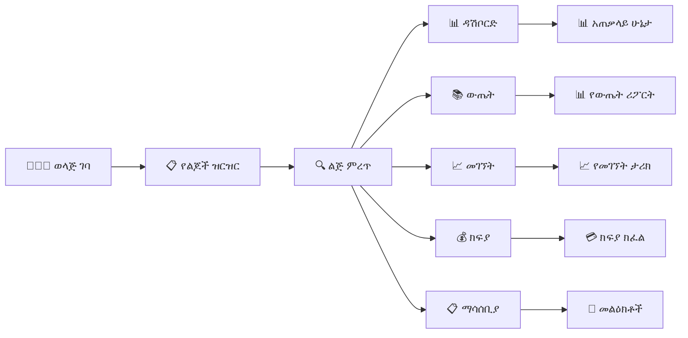
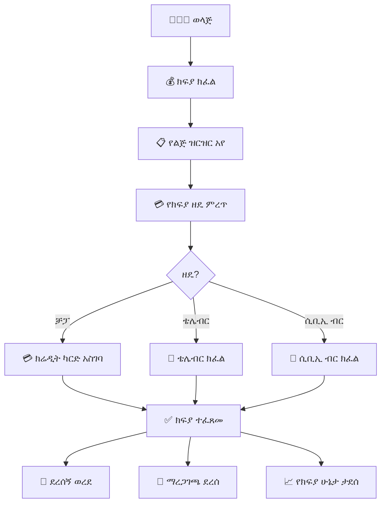

# ምዕራፍ 10 — ወላጅ (Parent)


## 👨‍👩‍👧 ሚና እና ሃላፊነት


ወላጅ የራሱን ልጅ/ልጆች የትምህርት እና የሌሎች እንቅስቃሴዎች መከታተል የሚችል ሚና ነው። ወላጁ በተንቀሳቃሽ ስልክ ወይም በኮምፒውተር በኩል የልጁን መረጃ በማንኛውም ጊዜ ማየት ይችላል።


---


## 🔄 የወላጅ በይነገጽ ፍሰት (Parent Interface Flow)





---


## 📊 የወላጅ ዳሽቦርድ ምስላዊ ንድፍ (Mobile View)


```

┌─────────────────────────────────────────────┐

│  👨‍👩‍👧 የአቶ ኃይሉ ዳሽቦርድ              │

├─────────────────────────────────────────────┤

│  ┌───────────────────────────────────────┐  │

│  │  👦 አበበ ኃይሉ                         │  │

│  │  12ኛ ክፍል ኤ · ተማሪ መለያ፦ 2023-001 │  │

│  │  🟢 በትምህርት ቤት ይገኛል             │  │

│  └───────────────────────────────────────┘  │

│                                             │

│  ┌──────────┐ ┌──────────┐ ┌──────────┐     │

│  │ 📚 ውጤት  │ │ 📈 መገኘት│ │ 💰 ክፍያ│     │

│  │  85%    │ │  95%    │ │  ተከፍሏል│     │

│  └──────────┘ └──────────┘ └──────────┘     │

│                                             │

│  📈 የቅርብ ጊዜ ውጤቶች                    │

│  ┌───────────────────────────────────────┐  │

│  │ ሒሳብ        ████████████ 88%       │  │

│  │ እንግሊዝኛ    ██████████ 80%         │  │

│  │ ፊዚክስ      ████████ 70%           │  │

│  │ ኬሚስትሪ    ██████████████ 92%     │  │

│  │ ባዮሎጂ      █████████ 75%          │  │

│  └───────────────────────────────────────┘  │

│                                             │

│  ⏰ የዛሬ መግቢያ: 7:45 ጠዋት              │

│  ⏰ የዛሬ መውጫ: 4:30 ከሰዓት              │

│                                             │

│  ⚠️ ማሳሰቢያ: 2 አልተነበቡም               │

└─────────────────────────────────────────────┘

```


---


## 💳 የወላጅ የክፍያ ፍሰት (Parent Payment Flow)





---


## 📊 የወላጅ ጥቅሞች (Parent Benefits)


| ተግባር | ጥቅም | እንዴት እንደሚሰራ |

|---------|-------|-------------------|

| 📚 ውጤት ማየት | የልጅን አፈጻጸም በማንኛውም ጊዜ ማወቅ | በዳሽቦርዱ ላይ ወዲያውኑ ይታያል |

| 📈 መገኘት ክትትል | ልጅ ትምህርት ቤት መግባቱን ማረጋገጥ | NFC/QR ሲያንኳኳ ማሳሰቢያ ይደርሳል |

| 💳 ክፍያ | ከቤት ሆኖ ክፍያ መክፈል | በቻፓ/ቴሌብር/ሲቢኢ ብር |

| 📋 ማሳሰቢያ | ከትምህርት ቤት መልዕክት መቀበል | በSMS/ኢሜይል/ዳሽቦርድ |


---


## 🎯 ማጠቃለያ (Summary)


ወላጅ የልጁን ውጤት፣ መገኘት፣ ክፍያ እና ማሳሰቢያዎች በተንቀሳቃሽ ስልክ ወይም ኮምፒውተር መከታተል ይችላል። ክፍያን ከቤት ሆኖ በመስመር ላይ መክፈል ይችላል።


---
