# ምዕራፍ 11 — ተማሪ (Student)


## 👦 ሚና እና ሃላፊነት


ተማሪ የZENOVA ሲስተም ዋነኛ ተጠቃሚ ነው። እያንዳንዱ ተማሪ የራሱ የሆነ የተለየ አካውንት አለው ይህም የተማሪውን የትምህርት ቤት ሕይወት ሙሉ በሙሉ የሚሸፍን ነው።


---


## 🆔 የተማሪ መለያ ካርድ ምስላዊ ንድፍ (Student ID Card Mockup)


```

┌────────────────────────────────────┐

│       🏫 የተከበሩ ልጆች ት/ቤት       │

│                                    │

│  ┌────────────────────────────┐    │

│  │                            │    │

│  │      📸 ተማሪ ፎቶ          │    │

│  │                            │    │

│  └────────────────────────────┘    │

│                                    │

│  ስም፦ አበበ ኃይሉ                   │

│  ክፍል፦ 12ኛ ኤ                      │

│  የተማሪ መለያ፦ 2023-001            │

│  የተወለዱበት ቀን፦ 2000-05-15      │

│                                    │

│  ┌──────┐  ┌──────────────────┐   │

│  │📱 QR │  │ 🟦 NFC Chip     │   │

│  │📸    │  │                  │   │

│  └──────┘  └──────────────────┘   │

│                                    │

│  ይህ ካርድ የZENOVA ሲስተም ንብረት ነው   │

│  የተሰጠበት ቀን፦ መስከረም 1 2017    │

└────────────────────────────────────┘

```


---


## 📊 የተማሪ ዳሽቦርድ ምስላዊ ንድፍ


```

┌─────────────────────────────────────────────┐

│  👦 አበበ ኃይሉ · 12ኛ ክፍል ኤ            │

│  የተማሪ መለያᦁ 2023-001                    │

├─────────────────────────────────────────────┤

│  ┌──────────┐ ┌──────────┐ ┌──────────┐     │

│  │ 📚 ውጤት  │ │ 📈 መገኘት│ │ 💳 NFC  │     │

│  │  85%    │ │  95%    │ │  ንቁ     │     │

│  └──────────┘ └──────────┘ └──────────┘     │

│                                             │

│  📋 የዛሬ የትምህርት መርሐ ግብር            │

│  ┌───────────────────────────────────────┐  │

│  │ 8:00-9:00 │ ሒሳብ    │ ወ/ሮ አስቴር  │  │

│  │ 9:00-10:00│ እንግሊዝኛ│ አቶ ኃይሉ    │  │

│  │ 10:00-11:00│ ፊዚክስ  │ አቶ ተስፋ   │  │

│  │ 11:00-12:00│ ኬሚስትሪ│ ወ/ሮ ሳራ    │  │

│  │ 12:00-1:00 │ እረፍት  │ 🍽️ ካፍቴሪያ│  │

│  │ 1:00-2:00  │ ባዮሎጂ  │ ወ/ሮ ማርታ   │  │

│  └───────────────────────────────────────┘  │

│                                             │

│  📈 የቅርብ ጊዜ ውጤቶች                    │

│  ┌───────────────────────────────────────┐  │

│  │ ሒሳብ        ██████████████ 88%      │  │

│  │ እንግሊዝኛ    ██████████ 80%         │  │

│  │ ፊዚክስ      ████████ 70%           │  │

│  └───────────────────────────────────────┘  │

│                                             │

│  ⏰ የሚቀጥለው ፈተና: ሒሳብ - ሰኞ ዕለት   │

└─────────────────────────────────────────────┘

```


---


## 🔄 የተማሪ ዕለታዊ እንቅስቃሴ (Student Daily Journey)

```mermaid

flowchart LR

    A["🏠 ከቤት ወጣ"] --> B["🏫 ወደ ት/ቤት ገባ"]

    B --> C["💳 NFC ካርዱን አንኳኳ"]

    C --> D["📋 መገኘት ተመዘገበ"]

    D --> E["📱 ለወላጅ ማሳሰቢያ ደረሰ"]

    

    E --> F["📚 1ኛ ትምህርት"]

    F --> G["📚 2ኛ ትምህርት"]

    G --> H["🍽️ እረፍት - ካፍቴሪያ"]

    H --> I["💳 NFC በመጠቀም ምግብ ገዛ"]

    I --> J["📚 3ኛ ትምህርት"]

    J --> K["📚 4ኛ ትምህርት"]

    K --> L["🏫 ከት/ቤት ወጣ"]

    L --> M["💳 NFC ካርዱን አንኳኳ"]

    M --> N["📱 ለወላጅ 'ወጥቷል' ማሳሰቢያ"]

    N --> O["🏠 ወደ ቤት ገባ"]

```





---


## 🎯 ማጠቃለይ (Summary)


ተማሪ የራሱን መረጃ፣ የትምህርት መርሐ ግብር፣ ውጤት እና የNFC ካርድ ሁኔታ ማየት ይችላል። የNFC ካርዱን በመጠቀም መገኘቱን ማስመዝገብ፣ ከካፍቴሪያ ምግብ መግዛት እና ከመደብር መግዛት ይችላል።


---
