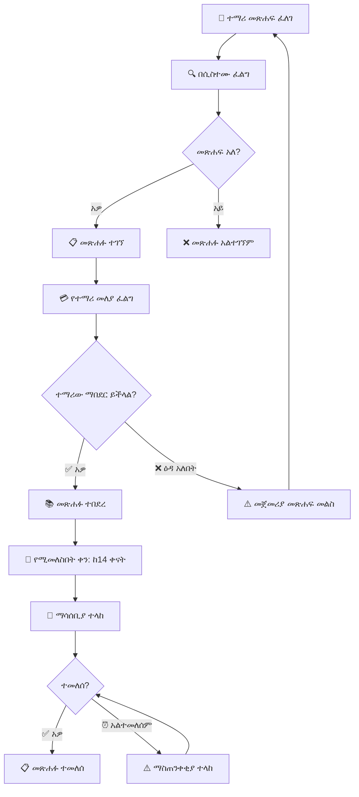

# ምዕራፍ 12 — ቤተ-መጻሕፍት (Library)


## 📚 ሚና እና ሃላፊነት


የቤተ-መጻሕፍት ሞጁል የትምህርት ቤቱን ቤተ-መጻሕፍት በዲጂታል መንገድ ለማስተዳደር ያገለግላል። መጻሕፍትን መመዝገብ፣ አበዳሪ ማድረግ፣ መመለስ እና ሪፖርት ማዘጋጀት ያካትታል።


---


## 🔄 የአበዳሪ ሂደት (Borrowing Process)





---


## 📊 የቤተ-መጻሕፍት ዳሽቦርድ ምስላዊ ንድፍ


```

┌─────────────────────────────────────────────────────────────────┐

│  📚 ቤተ-መጻሕፍት ዳሽቦርዑ                                     │

├─────────────────────────────────────────────────────────────────┤

│ ┌──────────┐ ┌──────────┐ ┌──────────┐ ┌──────────┐ ┌────────┐│

│ │ 📚 ጠቅላላ │ │ 📕 አበዳሪ │ │ 📗 ዛሬ   │ │ ⏰ ዘግይተው│ │ 📈 ተወዳጅ│

│ │  3,450  │ │   320   │ │ የተበደሩ│ │   45    │ │ ሒሳብ   ││

│ │  መጻሕፍት │ │          │ │ 28      │ │          │ │         ││

│ └──────────┘ └──────────┘ └──────────┘ └──────────┘ └────────┘│

├─────────────────────────────────────────────────────────────────┤

│ ┌─────────────────────────────┐ ┌─────────────────────────────┐│

│ │  📕 ዛሬ የሚመለሱ መጻሕፍት     │ │  ⚠️ ዘግይተው ያልተመለሱ    ││

│ │  ┌─────────┬───────────┐   │ │  ┌─────────┬────────────┐  ││

│ │  │ መጽሐፍ  │ ተማሪ     │   │ │  │ መጽሐፍ │ ዘግይቷል  │  ││

│ │  ├─────────┼───────────┤   │ │  ├─────────┼────────────┤  ││

│ │  │ ሒሳብ 101│ አበበ ኃይሉ│   │ │  │ ፊዚክስ │ 5 ቀናት │  ││

│ │  │ ፊዚክስ  │ ሳራ ተስፋ│   │ │  │ ኬሚስትሪ│ 3 ቀናት │  ││

│ │  │ ታሪክ   │ ኃይሉ ገ/እ│   │ │  │ ባዮሎጂ │ 7 ቀናት │  ││

│ │  └─────────┴───────────┘   │ │  └─────────┴────────────┘  ││

│ └─────────────────────────────┘ └─────────────────────────────┘│

├─────────────────────────────────────────────────────────────────┤

│  📊 የመጻሕፍት ምደባ በዘውግ (Books by Category)               │

│  ┌──────┬──────┬──────┬──────┬──────┬──────┬──────┬──────┐    │

│  │ሒሳብ  │ሳይንስ│ቋንቋ │ታሪክ │ሥነ-ጽሁፍ│ሃይማኖት│ሌሎች │    │    │

│  │ 850  │ 720  │ 580  │ 450  │ 380  │ 270  │ 200  │    │    │

│  └──────┴──────┴──────┴──────┴──────┴──────┴──────┴──────┘    │

└─────────────────────────────────────────────────────────────────┘

```


---


## 📋 የቤተ-መጻሕፍት ተግባራት


| ተግባር | መግለጫ | ድግግሞሽ |

|---------|---------|-----------|

| 📕 አበዳሪ መስጠት | ተማሪዎች መጽሐፍ እንዲበደሩ ማድረግ | ዕለታዊ |

| 📗 መጽሐፍ መመለስ | የተበደሩ መጻሕፍትን መቀበል | ዕለታዊ |

| 📦 አዲስ መጽሐፍ መዝግብ | አዳዲስ መጻሕፍትን ወደ ሲስተም ማስገባት | ሳምንታዊ |

| ⏰ ዘግይቶ የመመለስ ቅጣት | ዘግይተው ለመላሹ ቅጣት ማስላት | ዕለታዊ |

| 📊 ሪፖርት | ወርሃዊ የቤተ-መጻሕፍት ሪፖርት ማዘጋጀት | ወርሃዊ |


---


## 🎯 ማጠቃለያ (Summary)


የቤተ-መጻሕፍት ሞጁል መጻሕፍትን መመዝገብ፣ አበዳሪ ማድረግ፣ መመለስ እና ሪፖርት ማዘጋጀት ያከናውናል። ተማሪዎች በNFC ካርዳቸው መጽሐፍ መበደር ይችላሉ።


---
