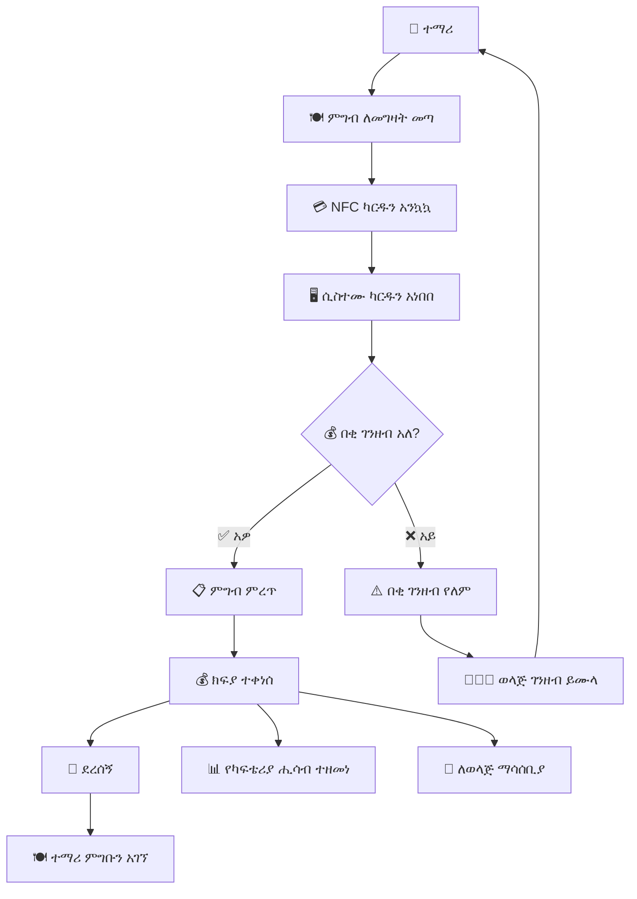

# ምዕራፍ 13 — ካፍቴሪያ (Cafeteria)


## 🍽️ ሚና እና ሃላፊነት


የካፍቴሪያ ሞጁል የትምህርት ቤቱን የምግብ አቅርቦት፣ የተማሪ ምርጫ እና ክፍያ አሰባሰብ ያስተዳድራል። ተማሪዎች በNFC ካርዳቸው በመጠቀም ምግብ መግዛት ይችላሉ።


---


## 🔄 የካፍቴሪያ ክፍያ ፍሰት (Cafeteria Payment Flow)





---


## 📊 የካፍቴሪያ ዳሽቦርድ ምስላዊ ንድፍ


```

┌─────────────────────────────────────────────────────────────────┐

│  🍽️ ካፍቴሪያ ዳሽቦርድ                                        │

├─────────────────────────────────────────────────────────────────┤

│ ┌──────────┐ ┌──────────┐ ┌──────────┐ ┌──────────┐ ┌────────┐│

│ │ 🍽️ ዛሬ   │ │ 💰 ዛሬ   │ │ 📈 አማካይ │ │ 🥇 ከፍተኛ│ │ 📦 ክምችት│

│ │ የተሸጠ  │ │ ገቢ     │ │ ዕለታዊ │ │ ሽያጭ  │ │ ሁኔታ  │

│ │  128    │ │ 3,500   │ │ 3,200   │ │ በርገር │ │ ⚠️ ዝቅተኛ│

│ └──────────┘ └──────────┘ └──────────┘ └──────────┘ └────────┘│

├─────────────────────────────────────────────────────────────────┤

│ ┌─────────────────────────────┐ ┌─────────────────────────────┐│

│ │  📋 የዛሬው ሜኑ             │ │  📈 የሽያጭ ስታቲስቲክስ    ││

│ │  ┌──────────┬──────────┐   │ │  በርገር ████████████ 45   ││

│ │  │ ምግብ    │ ዋጋ     │   │ │  ሳንድዊች ████████ 32     ││

│ │  ├──────────┼──────────┤   │ │  ፓስታ    ██████ 25       ││

│ │  │ በርገር   │ 50 ብር  │   │ │  ሩዝ     ████████ 30     ││

│ │  │ ሳንድዊች │ 35 ብር  │   │ │  ሾርባ   ████ 18         ││

│ │  │ ፓስታ    │ 45 ብር  │   │ │  ውሃ      ██████████ 40   ││

│ │  │ ሩዝ     │ 40 ብር  │   │ └─────────────────────────────┘│

│ │  │ ሾርባ   │ 25 ብር  │   │                               │

│ │  │ ውሃ     │ 10 ብር  │   │                               │

│ │  └──────────┴──────────┘   │                               │

│ └─────────────────────────────┘                               │

├─────────────────────────────────────────────────────────────────┤

│  ⚠️ ዝቅተኛ ክምችት (Low Stock Alerts)                           │

│  ┌──────────┬──────────┬──────────┬────────────┬────────────┐  │

│  │ እቃ      │ የአሁኑ   │ ዝቅተኛ   │ ሁኔታ       │ ማዘዝ     │  │

│  ├──────────┼──────────┼──────────┼────────────┼────────────┤  │

│  │ ዳቦ      │ 2       │ 10       │ 🔴 ወሳኝ  │ ✅ ታዝዟል│  │

│  │ ዘይት    │ 5       │ 8        │ 🟡 ማስጠንቀቂያ│ አልታዘዘም│  │

│  │ ስኳር    │ 3       │ 10       │ 🔴 ወሳኝ  │ አልታዘዘም│  │

│  └──────────┴──────────┴──────────┴────────────┴────────────┘  │

└─────────────────────────────────────────────────────────────────┘

```


---


## 📊 የካፍቴሪያ ሪፖርቶች


| የሪፖርት ዓይነት | ድግግሞሽ | ይዘት |

|-------------------|-----------|-------|

| 💰 ዕለታዊ ገቢ | ዕለታዊ | የዕለቱ ሽያጭ |

| 📈 ወርሃዊ ሽያጭ | ወርሃዊ | የወሩ አጠቃላይ ሽያጭ |

| 🥇 ተወዳጅ ምግቦች | ሳምንታዊ | ከፍተኛ ሽያጭ ያላቸው ምግቦች |

| 📦 የእቃ ክምችት | ዕለታዊ | የእቃ ክምችት ሁኔታ |

| 👦 የተማሪ ምርጫ | ወርሃዊ | የተማሪዎች ምርጫ ትንተና |


---


## 🎯 ማጠቃለያ (Summary)


የካፍቴሪያ ሞጁል ምግብ መሸጥ፣ በNFC ካርድ ክፍያ መቀበል፣ የምግብ ክምችት ማስተዳደር እና የሽያጭ ሪፖርቶችን ማዘጋጀት ያከናውናል። ተማሪዎች ያለ ጥሬ ገንዘብ በNFC ካርዳቸው ምግብ መግዛት ይችላሉ።


---
