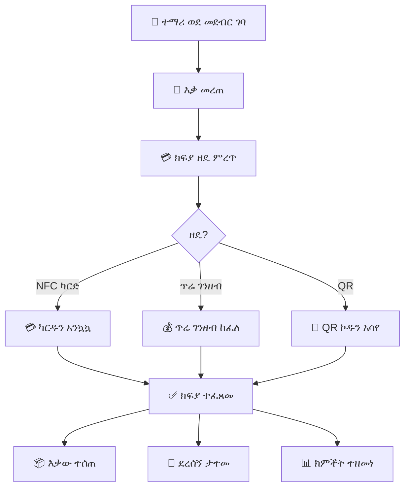

# ምዕራፍ 14 — መደብር (Store)


## 🛒 ሚና እና ሃላፊነት


የመደብር ሞጁል የትምህርት ቤቱን ዩኒፎርም፣ የትምህርት ቁሳቁስ እና ሌሎች እቃዎች ሽያጭ በዲጂታል መንገድ ያስተዳድራል።


---


## 🔄 የመደብር ክፍያ ፍሰት (Store Purchase Flow)





---


## 📊 የመደብር ዳሽቦርድ ምስላዊ ንድፍ


```

┌─────────────────────────────────────────────────────────────────┐

│  🛒 የትምህርት ቤት መደብር ዳሽቦርድ                            │

├─────────────────────────────────────────────────────────────────┤

│ ┌──────────┐ ┌──────────┐ ┌──────────┐ ┌──────────┐ ┌────────┐│

│ │ 📦 እቃ    │ │ 💰 ዛሬ   │ │ 📈 ወርሃዊ │ │ ⚠️ ዝቅተኛ│ │ 👕 ዩኒፎርም│

│ │  156    │ │ 2,000   │ │ 25,000  │ │   8    │ │ ብዛት │

│ │  ዓይነቶች │ │ ሽያጭ   │ │ ጠቅላላ  │ │ ክምችት  │ │ 120   │

│ └──────────┘ └──────────┘ └──────────┘ └──────────┘ └────────┘│

├─────────────────────────────────────────────────────────────────┤

│ ┌─────────────────────────────┐ ┌─────────────────────────────┐│

│ │  🥇 ከፍተኛ ሽያጭ ያላቸው    │ │  ⚠️ ዝቅተኛ ክምችት ያላቸው  ││

│ │  ┌──────────┬──────────┐   │ │  ┌──────────┬──────────┐   ││

│ │  │ እቃ      │ ብዛት    │   │ │  │ እቃ      │ ቀሪ    │   ││

│ │  ├──────────┼──────────┤   │ │  ├──────────┼──────────┤   ││

│ │  │ ነጭ ሸሚዝ│ 45       │   │ │  │ ጥቁር ካልሲ│ 2       │   ││

│ │  │ ጥቁር ሱሪ│ 38       │   │ │  │ ክራቫት  │ 5       │   ││

│ │  │ ልብስ ስፌት│ 30       │   │ │  │ ስፖርት ቲሸርት│ 3    │   ││

│ │  │ ካልሲ   │ 25       │   │ │  │ ቦርሳ   │ 4       │   ││

│ │  │ ቦርሳ   │ 18       │   │ │  └──────────┴──────────┘   ││

│ │  └──────────┴──────────┘   │ │                           ││

│ └─────────────────────────────┘ └─────────────────────────────┘│

├─────────────────────────────────────────────────────────────────┤

│  📋 የዛሬው ሽያጭ (Today's Sales)                              │

│  ┌────────────┬───────────┬────────┬──────────┬───────────┐   │

│  │ ሰዓት      │ ተማሪ     │ እቃ    │ መጠን    │ ክፍያ     │   │

│  ├────────────┼───────────┼────────┼──────────┼───────────┤   │

│  │ 8:30      │ አበበ    │ ነጭ ሸሚዝ│ 250 ብር│ NFC       │   │

│  │ 9:15      │ ሳራ     │ ጥቁር ሱሪ│ 350 ብር│ ጥሬ      │   │

│  │ 10:00     │ ዮሐንስ  │ ካልሲ   │ 50 ብር │ NFC       │   │

│  │ 11:30     │ ማርያም  │ ቦርሳ   │ 400 ብር│ ጥሬ      │   │

│  └────────────┴───────────┴────────┴──────────┴───────────┘   │

└─────────────────────────────────────────────────────────────────┘

```


---


## 🎯 ማጠቃለያ (Summary)


የመደብር ሞጁል ዩኒፎርም፣ የትምህርት ቁሳቁስ እና ሌሎች እቃዎች ሽያጭ፣ የክምችት አስተዳደር እና የሽያጭ ሪፖርት ያከናውናል። ተማሪዎች በNFC ካርድ ወይም በጥሬ ገንዘብ መግዛት ይችላሉ።


---
