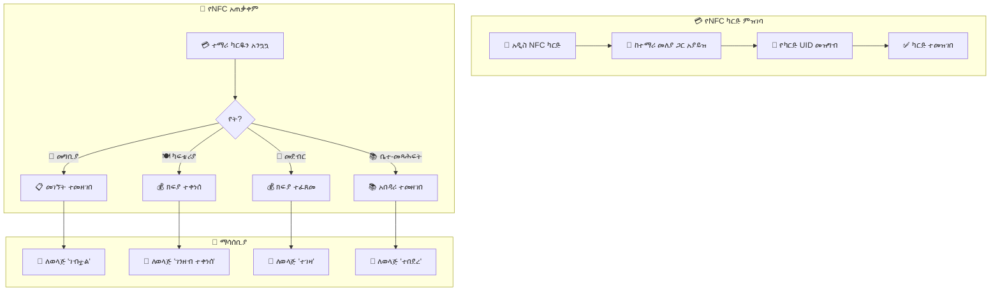

# ምዕራፍ 15 — NFC ሥርዓት (NFC System)


## 💳 NFC ቴክኖሎጂ ምንድን ነው?


NFC (Near Field Communication) በአጭር ርቀት (4-10 ሴሜ) የሚሰራ ሽቦ አልባ የመገናኛ ቴክኖሎጂ ነው። ZENOVA ውስጥ እያንዳንዱ ተማሪ የራሱ የሆነ የNFC ካርድ ይሰጠዋል።


---


## 🏗️ የNFC ሥርዓት አርክቴክቸር (NFC System Architecture)


```

                        ┌──────────────────┐

                        │    💳 NFC CARD   │

                        │  (ተማሪ ካርድ)      │

                        └────────┬─────────┘

                                 │

                                 ▼

                        ┌──────────────────┐

                        │   📡 NFC READER  │

                        │  (ማንበቢያ)       │

                        └────────┬─────────┘

                                 │

                                 ▼

                        ┌──────────────────┐

                        │  🖥️ UBUNTU      │

                        │  SCHOOL SERVER   │

                        └────────┬─────────┘

                                 │

                    ┌────────────┼────────────┐

                    ▼            ▼            ▼

            ┌────────────┐ ┌────────────┐ ┌────────────┐

            │ 📋 መገኘት  │ │ 🍽️ ካፍቴሪያ │ │ 🛒 መደብር  │

            │ ምዝገባ    │ │ ክፍያ     │ │ ክፍያ     │

            └────────────┘ └────────────┘ └────────────┘

                    │            │            │

                    ▼            ▼            ▼

            ┌──────────────────────────────────────┐

            │          📱 ማሳሰቢያዎች               │

            │  • ለወላጅ: "ልጅዎ ት/ቤት ገብቷል"    │

            │  • ለዳይሬክተር: የመገኘት ሪፖርት     │

            │  • ለፋይናንስ: የካፍቴሪያ ገቢ        │

            └──────────────────────────────────────┘

```


---


## 🔄 የNFC ካርድ አሰራር ፍሰት (NFC Card Flow)





---


## 📊 የNFC አጠቃቀም ስታቲስቲክስ


```

┌─────────────────────────────────────────────────────────────────┐

│  📊 የNFC አጠቃቀም ሪፖርት - ጥር 2017 ዓ.ም                    │

├─────────────────────────────────────────────────────────────────┤

│                                                                 │

│  ጠቅላላ ንቁ ካርዶች: 1,240                                    │

│  የታገዱ ካርዶች: 12                                            │

│  አዲስ የተሰጡ ካርዶች (ይህ ወር): 23                            │

│                                                                 │

│  የNFC አጠቃቀም ስታቲስቲክስ (ዛሬ)                              │

│  ┌──────────────────┬──────────┬──────────┬──────────┐         │

│  │ ቦታ              │ መግቢያ  │ ውጪ     │ ጠቅላላ  │         │

│  ├──────────────────┼──────────┼──────────┼──────────┤         │

│  │ 🏫 ዋና መግቢያ   │ 1,100   │ 1,080   │ 2,180   │         │

│  │ 🍽️ ካፍቴሪያ    │ -       │ -       │ 128     │         │

│  │ 🛒 መደብር       │ -       │ -       │ 45      │         │

│  │ 📚 ቤተ-መጻሕፍት │ -       │ -       │ 28      │         │

│  └──────────────────┴──────────┴──────────┴──────────┘         │

│                                                                 │

│  የካርድ ሁኔታ ስርጭት                                          │

│  ┌────────────────────────────────────────────────────────┐    │

│  │ ንቁ     ██████████████████████████████████████████ 95% │    │

│  │ የታገደ  ██ 1%                                          │    │

│  │ ጠፍቷል   ████ 2%                                       │    │

│  │ አዲስ     ██ 2%                                          │    │

│  └────────────────────────────────────────────────────────┘    │

│                                                                 │

└─────────────────────────────────────────────────────────────────┘

```


---


## 🎯 ማጠቃለያ (Summary)


NFC ሥርዓት የተማሪን መለያ ለመለየት፣ መገኘትን ለመመዝገብ፣ ክፍያ ለመቀበል እና አበዳሪ ለማስተዳደር ያገለግላል። እያንዳንዱ ተማሪ ልዩ የሆነ የNFC ካርድ አለው።


---
