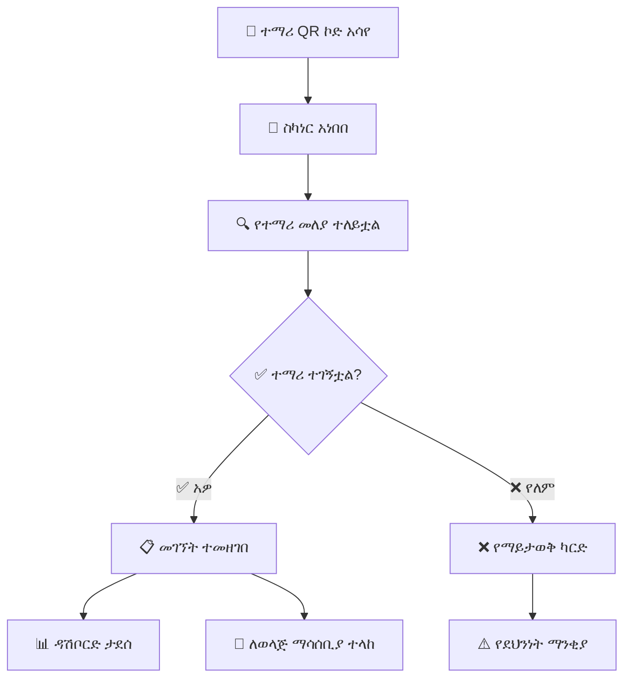

# ምዕራፍ 16 — QR ኮድ ሥርዓት (QR Code System)


## 📱 QR ኮድ ምንድን ነው?


QR (Quick Response) ኮድ በፍጥነት ሊነበብ የሚችል ባለ ሁለት ልኬት ባርኮድ ነው። ZENOVA ውስጥ እያንዳንዱ ተማሪ ከNFC ካርዱ በተጨማሪ የራሱ የሆነ ልዩ QR ኮድ አለው።


---


## 🏗️ የQR ሥርዓት አሰራር (QR System Operation)


```

                     ┌──────────────────┐

                     │   📱 QR CODE     │

                     │  (በተማሪ ካርድ ላይ) │

                     └────────┬─────────┘

                              │

                              ▼

                     ┌──────────────────┐

                     │   📸 QR SCANNER  │

                     │  (ካሜራ/ስካነር)    │

                     └────────┬─────────┘

                              │

                              ▼

                     ┌──────────────────┐

                     │  🔍 ውሂብ ተነበበ  │

                     │  የተማሪ መለያ ቁጥር│

                     └────────┬─────────┘

                              │

                              ▼

                     ┌──────────────────┐

                     │  🖥️ SCHOOL      │

                     │     SERVER       │

                     └────────┬─────────┘

                              │

                              ▼

                     ┌──────────────────┐

                     │  ✅ መገኘት ተመዘገበ │

                     └──────────────────┘

```


---


## 🔄 የQR ኮድ ንባብ ሂደት (QR Scan Process)





---


## 📊 የQR ኮድ ይዘት (QR Code Content)


```

┌─────────────────────────────────────────────────────────────────┐

│                    📱 QR CODE ይዘት                               │

├─────────────────────────────────────────────────────────────────┤

│                                                                 │

│  አይነት:         የተማሪ መለያ QR ኮድ                           │

│  መረጃ ዓይነት:    JSON                                        │

│                                                                 │

│  {                                                               │

│    "student_id": "2023-001",     ← የተማሪ መለያ ቁጥር          │

│    "name": "አበበ ኃይሉ",           ← ሙሉ ስም                   │

│    "school": "ZENOVA-ETH-001",   ← የት/ቤት ኮድ                │

│    "grade": "12",                ← ክፍል                         │

│    "section": "A",               ← ክፍልፋይ                       │

│    "type": "STUDENT"             ← ዓይነት                       │

│  }                                                               │

│                                                                 │

└─────────────────────────────────────────────────────────────────┘

```


---


## 🆚 የNFC እና QR ንጽጽር (NFC vs QR Comparison)


| ባህሪ | 💳 NFC ካርድ | 📱 QR ኮድ |

|-------|-------------|-----------|

| 📡 ቴክኖሎጂ | ራዲዮ ሞገድ (13.56 MHz) | ኦፕቲካል (ካሜራ) |

| 📏 ርቀት | 4-10 ሴሜ | እስከ 50 ሴሜ |

| ⏱ ፍጥነት | በጣም ፈጣን (0.1 ሰከንድ) | መካከለኛ (1-2 ሰከንድ) |

| 🔒 ደህንነት | ከፍተኛ (ምስጠራ) | መካከለኛ |

| 💵 ዋጋ | ከፍተኛ (ካርድ + ማንበቢያ) | ዝቅተኛ (ህትመት ብቻ) |

| 🔄 መልሶ መጠቀም | ✅ አዎ (እንደገና መሙላት) | ❌ አይ (እንደገና ማተም ያስፈልጋል) |

| 📱 መሣሪያ | ልዩ ማንበቢያ ያስፈልጋል | ማንኛውም ካሜራ ይሰራል |


---


## 🎯 ማጠቃለያ (Summary)


QR ኮድ ሥርዓት የNFC አማራጭ ሲሆን ተማሪዎች የራሳቸውን QR ኮድ በማሳየት መገኘታቸውን ማረጋገጥ ይችላሉ። QR ኮድ ከNFC ያነሰ ወጪ የሚጠይቅ ቢሆንም ደህንነቱ አነስተኛ ነው።


---
