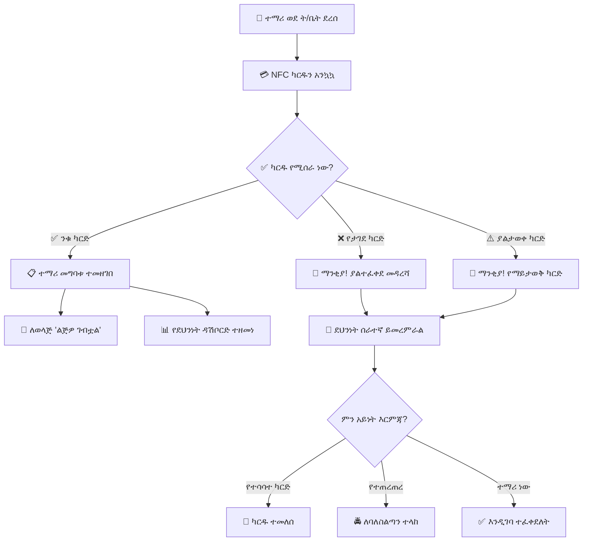

# ምዕራፍ 17 — የደህንነት ሥርዓት (Security System)


## 🔒 ሚና እና ሃላፊነት


የደህንነት ሞጁል የተማሪዎችን እና የሰራተኞችን ወደ ትምህርት ቤት መግባት እና መውጣት ይቆጣጠራል። የደህንነት ሰራተኞች የተማሪ እንቅስቃሴን በእውነተኛ ጊዜ መከታተል ይችላሉ።


---


## 🏗️ የደህንነት ሥርዓት አርክቴክቸር (Security Architecture)


```

┌─────────────────────────────────────────────────────────────────┐

│                    🔒 የደህንነት ሥርዓት                          │

│                     (Security System)                            │

├─────────────────────────────────────────────────────────────────┤

│                                                                  │

│  ┌──────────────┐    ┌──────────────┐    ┌──────────────┐      │

│  │ 🏫 ዋና መግቢያ│    │ 🚪 የኋላ በር  │    │ 🚗 መኪና    │      │

│  │ NFC Reader   │    │ NFC Reader   │    │ መግቢያ      │      │

│  └──────┬───────┘    └──────┬───────┘    └──────┬───────┘      │

│         │                  │                  │               │

│         └──────────────────┼──────────────────┘               │

│                            ▼                                  │

│                  ┌──────────────────┐                         │

│                  │  🖥️ SECURITY    │                         │

│                  │     SERVER       │                         │

│                  └────────┬─────────┘                         │

│                           │                                   │

│                           ▼                                   │

│                  ┌──────────────────┐                         │

│                  │  🔔 ማንቂያ ደወል   │                         │

│                  │  ለተማሪ/ለወላጅ     │                         │

│                  │  ማሳሰቢያ          │                         │

│                  └──────────────────┘                         │

│                                                                  │

└─────────────────────────────────────────────────────────────────┘

```


---


## 🔄 የደህንነት ቁጥጥር ፍሰት (Security Monitoring Flow)





---


## 📊 የደህንነት ዳሽቦርድ ምስላዊ ንድፍ


```

┌─────────────────────────────────────────────────────────────────┐

│  🔒 ደህንነት ዳሽቦርድ                            ዛሬ ሰኞ    │

├─────────────────────────────────────────────────────────────────┤

│ ┌──────────┐ ┌──────────┐ ┌──────────┐ ┌──────────┐ ┌────────┐│

│ │ 👦 በት/ቤት│ │ 📈 ዛሬ   │ │ 📈 መገኘት│ │ 🔔 ማንቂያ│ │ 🚗 መኪና│

│ │ ውስጥ    │ │ ገብተው  │ │ መቶኛ   │ │  0      │ │  12    │

│ │  1,100  │ │ 1,120  │ │   95%  │ │  ዛሬ    │ │  ገብተው │

│ └──────────┘ └──────────┘ └──────────┘ └──────────┘ └────────┘│

├─────────────────────────────────────────────────────────────────┤

│ ┌─────────────────────────────┐ ┌─────────────────────────────┐│

│ │  📋 የቅርብ ጊዜ መግቢያ    │ │  ⏰ ያልተገኙ ተማሪዎች    ││

│ │  ┌────────┬────────┬────┐ │ │  ┌────────┬────────┬─────┐││

│ │  │ ሰዓት  │ ስም   │ሁኔታ│ │ │  │ ስም   │ክፍል │ ሁኔታ││

│ │  ├────────┼────────┼────┤ │ │  ├────────┼────────┼─────┤││

│ │  │ 7:45  │ አበበ  │ ✅ │ │ │  │ አለም  │ 12ኛ ኤ│ ⚠️  │││

│ │  │ 7:48  │ ሳራ   │ ✅ │ │ │  │ ሳራ   │ 10ኛ ቢ│ 📞  │││

│ │  │ 7:50  │ ኃይሉ  │ ✅ │ │ │  │ ዮሐንስ│ 8ኛ ሲ│ ⚠️  │││

│ │  │ 7:52  │ ተስፋ  │ ❌ │ │ │  └────────┴────────┴─────┘││

│ │  └────────┴────────┴────┘ │ └─────────────────────────────┘│

│ └─────────────────────────────┘                               │

├─────────────────────────────────────────────────────────────────┤

│  📈 የሰዓት አቆጣጠር የመግቢያ ስታቲስቲክስ (Hourly Entry Stats)  │

│  ┌─────┬─────┬─────┬─────┬─────┬─────┬─────┬─────┬─────┐      │

│  │7፡00│7፡30│8፡00│8፡30│9፡00│9፡30│10:00│10:30│11:00│      │

│  │ 120 │ 350 │ 280 │ 150 │ 80  │ 40  │ 30  │ 20  │ 10  │      │

│  └─────┴─────┴─────┴─────┴─────┴─────┴─────┴─────┴─────┘      │

│  🟢 ጠዋት ከፍተኛ መግቢያ  🔴 ዘግይተው የገቡ ተማሪዎች: 23       │

└─────────────────────────────────────────────────────────────────┘

```


---


## 🎯 ማጠቃለያ (Summary)


የደህንነት ሥርዓት የተማሪዎችን መግቢያ እና መውጫ በNFC ካርዶች ይቆጣጠራል። ያልተፈቀደ መዳረሻ ሲኖር ማንቂያ ያነሳል እና ለወላጆች የልጃቸውን መግቢያ/መውጫ ማሳሰቢያ ይልካል።


---
