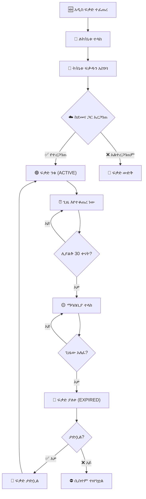

# ምዕራፍ 18 — የፍቃድ አሰጣጥ ሥርዓት (License System)


## 🔑 የፍቃድ ሥርዓት አጠቃላይ እይታ


የፍቃድ አሰጣጥ ሥርዓት ZENOVA እንዴት እንደሚሸጥ እና እንደሚሰራ የሚቆጣጠር ወሳኝ ክፍል ነው። እያንዳንዱ ትምህርት ቤት ሲስተሙን መጠቀም የሚችለው የሚሰራ ፍቃድ ካለው ብቻ ነው።


---


## 🏗️ የፍቃድ ሥርዓት አርክቴክቸር (License System Architecture)


```

                        ☁️ ZENOVA CLOUD

                     ┌──────────────────────┐

                     │   🔑 LICENSE SERVER  │

                     │  (ማዕከላዊ ፍቃድ አገልጋይ)  │

                     └──────────┬───────────┘

                                │

            ┌───────────────────┼───────────────────┐

            ▼                   ▼                   ▼

    ┌──────────────┐   ┌──────────────┐   ┌──────────────┐

    │ 🏫 SCHOOL A │   │ 🏫 SCHOOL B │   │ 🏫 SCHOOL C │

    │  ፍቃድ ያረጋግጡ │   │  ፍቃድ ያረጋግጡ │   │  ፍቃድ ያረጋግጡ │

    └──────┬───────┘   └──────┬───────┘   └──────┬───────┘

           │                  │                  │

           ▼                  ▼                  ▼

    ┌──────────────┐   ┌──────────────┐   ┌──────────────┐

    │  ✅ ፍቃድ ንቁ │   │  ⚠️ ሊያልቅ  │   │  ❌ ፍቃድ ያለቀ │

    │  ሲስተም ይሰራል│   │ 30 ቀናት ቀርቷል│   │ ሲስተም ተዘግቷል│

    └──────────────┘   └──────────────┘   └──────────────┘

```


---


## 🎚️ የፍቃድ ደረጃዎች (License Tiers)

```mermaid

flowchart LR

    subgraph Basic["📦 BASIC"]

        B1["• ተማሪ/ሰራተኛ አስተዳደር"]

        B2["• ክፍያ አሰባሰብ"]

        B3["• መገኘት ክትትል"]

        B4["• ውሱን ተማሪ ብዛት"]

    end

    

    subgraph Standard["📦 STANDARD"]

        S1["• ሁሉም Basic ባህሪያት"]

        S2["• ቤተ-መጻሕፍት አስተዳደር"]

        S3["• ካፍቴሪያ ማገናኘት"]

        S4["• NFC ድጋፍ"]

        S5["• መሰረታዊ ሪፖርቶች"]

    end

    

    subgraph Premium["📦 PREMIUM"]

        P1["• ሁሉም Standard ባህሪያት"]

        P2["• ሙሉ ፋይናንስ ሪፖርቶች"]

        P3["• ደመና ማመሳሰል"]

        P4["• የሞባይል መዳረሻ"]

        P5["• QR ኮድ ሥርዓት"]

        P6["• የላቀ ደህንነት"]

    end

    

    Basic -->|"⬆️ ማሻሻል"| Standard

    Standard -->|"⬆️ ማሻሻል"| Premium

```





---


## 🔄 የፍቃድ አሰራር ዑደት (License Lifecycle)





---


## 📊 የፍቃድ ሪፖርት ምስላዊ ንድፍ


```

┌─────────────────────────────────────────────────────────────────┐

│  🔑 የፍቃድ አስተዳደር ዳሽቦርድ                               │

├─────────────────────────────────────────────────────────────────┤

│ ┌──────────┐ ┌──────────┐ ┌──────────┐ ┌──────────┐ ┌────────┐│

│ │ 📦 ጠቅላላ │ │ 🟢 ንቁ   │ │ 🟡 ሊያልቅ │ │ 🔴 ያለቀ  │ │ 📈 ገቢ  │

│ │   126   │ │   118   │ │   12    │ │   8     │ │ 2.5M   ││

│ │ ፍቃዶች  │ │         │ │  በ30 ቀን│ │         │ │ ወርሃዊ │

│ └──────────┘ └──────────┘ └──────────┘ └──────────┘ └────────┘│

├─────────────────────────────────────────────────────────────────┤

│  📋 ሊያልቁ የተቃረቡ ፍቃዶች (Expiring Soon)                  │

│  ┌──────────────┬──────────┬──────────┬───────────┬──────────┐ │

│  │ ትምህርት ቤት  │ ደረጃ    │ ከተሰጠ  │ የሚያልቅበት│ የቀረው │ │

│  ├──────────────┼──────────┼──────────┼───────────┼──────────┤ │

│  │ ቅዱስ ጊዮርጊስ│ Premium  │ ጥር 2016│ ጥር 2018 │ 30 ቀን │ │

│  │ መዋለ ህጻናት│ Basic    │ ሚያዚያ 2016│ ሚያዚያ 2017│ 15 ቀን│ │

│  │ ዘመን ት/ቤት│ Standard │ መስከረም 2017│ መስከረም 2018│ 7 ቀን │ │

│  └──────────────┴──────────┴──────────┴───────────┴──────────┘ │

└─────────────────────────────────────────────────────────────────┘

```


---


## 🎯 ማጠቃለያ (Summary)


የፍቃድ ሥርዓት ZENOVA እንዴት እንደሚሸጥ እና እንደሚሰራ ይቆጣጠራል። ሶስት ደረጃዎች (Basic፣ Standard፣ Premium) አሉት። እያንዳንዱ ትምህርት ቤት ሲስተሙን መጠቀም የሚችለው ንቁ ፍቃድ ካለው ብቻ ነው።


---
