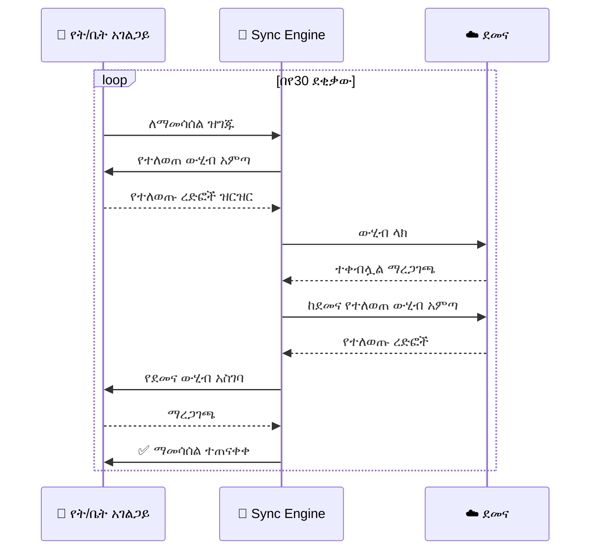

# ምዕራፍ 19 — የደመና ማመሳሰል (Cloud Sync)


## ☁️ የደመና ማመሳሰል ምንድን ነው?


የደመና ማመሳሰል የትምህርት ቤቱን የአካባቢ አገልጋይ ውሂብ ከZENOVA ደመና አገልጋይ ጋር በማዛመድ ውሂቡ በሁለቱም ቦታ እንዲገኝ የሚያደርግ ሂደት ነው።


---


## 🏗️ የደመና ማመሳሰል አርክቴክቸር (Cloud Sync Architecture)


```

                         ☁️ ZENOVA CLOUD VPS

                    ┌──────────────────────────┐

                    │     CENTRAL DATABASE      │

                    │  (ማዕከላዊ ዳታቤዝ)          │

                    │                           │

                    │  • የሁሉም ት/ቤቶች ውሂብ    │

                    │  • የፍቃድ መረጃ           │

                    │  • የሱፐር አድሚን ዳሽቦርድ│

                    │  • የወላጅ ርቀት መዳረሻ     │

                    └────────────┬─────────────┘

                                 │

                    ┌────────────┴─────────────┐

                    │     SYNC ENGINE           │

                    │  (የማመሳሰል ሞተር)          │

                    │  • በየ30 ደቂቃው ይሰራል    │

                    │  • የተለወጠውን ውሂብ ብቻ  │

                    │  • ግጭት መፍቻ (Conflict) │

                    └────────────┬─────────────┘

                                 │

            ┌────────────────────┼────────────────────┐

            ▼                    ▼                    ▼

    ┌───────────────┐   ┌───────────────┐   ┌───────────────┐

    │  🏫 SCHOOL A  │   │  🏫 SCHOOL B  │   │  🏫 SCHOOL C  │

    │  ───────────  │   │  ───────────  │   │  ───────────  │

    │  Local DB     │   │  Local DB     │   │  Local DB     │

    │  Last Sync:   │   │  Last Sync:   │   │  Last Sync:   │

    │  10:30 AM     │   │  10:28 AM     │   │  10:25 AM     │

    │  ✅ Synced    │   │  ⚠️ Pending  │   │  ✅ Synced    │

    └───────────────┘   └───────────────┘   └───────────────┘

```


---


## 🔄 የማመሳሰል ሂደት (Sync Process)





---


## 📊 የማመሳሰል ሁኔታ ዳሽቦርድ


```

┌─────────────────────────────────────────────────────────────────┐

│  🔄 የደመና ማመሳሰል ዳሽቦርድ                                │

├─────────────────────────────────────────────────────────────────┤

│ ┌──────────┐ ┌──────────┐ ┌──────────┐ ┌──────────┐ ┌────────┐│

│ │ 🏫 ት/ቤቶች│ │ 🔄 ዛሬ   │ │ ⏰ አማካይ │ │ ❌ ስህተት│ │ 📦 ውሂብ │

│ │   126   │ │   ተሰምሯል│ │ ጊዜ    │ │  2      │ │ 1.2GB  ││

│ │         │ │   120   │ │ 45 ሰከንድ│ │  ዛሬ    │ │ ተልኳል │

│ └──────────┘ └──────────┘ └──────────┘ └──────────┘ └────────┘│

├─────────────────────────────────────────────────────────────────┤

│  📋 የቅርብ ጊዜ ማመሳሰል እንቅስቃሴ (Recent Sync Activity)    │

│  ┌────────────┬──────────────┬──────────┬──────────┬─────────┐│

│  │ ትምህርት ቤት│ ሰዓት        │ ሁኔታ    │ ፋይሎች  │ ስህተት  ││

│  ├────────────┼──────────────┼──────────┼──────────┼─────────┤│

│  │ ቅዱስ ጊዮርጊስ│ 10:30       │ ✅      │ 1,240   │ -       ││

│  │ መዋለ ህጻናት│ 10:28       │ ⚠️      │ 890     │ አያያዝ ││

│  │ ዘመን ት/ቤት│ 10:25       │ ✅      │ 2,100   │ -       ││

│  │ ራስ መኮንን│ 10:22       │ ❌      │ -       │ ግንኙነት││

│  └────────────┴──────────────┴──────────┴──────────┴─────────┘│

├─────────────────────────────────────────────────────────────────┤

│  📡 የኔትወርክ ሁኔታ (Network Status)                          │

│  ┌──────────────────────────────────────────────────────────┐  │

│  │ Cloud VPS:    🟢 ንቁ    የምላሽ ጊዜ: 45ms               │  │

│  │ Internet:     🟢 ንቁ    ፍጥነት: 100Mbps               │  │

│  │ School A:     🟢 የተሰማራ   የመጨረሻ: 10:30            │  │

│  │ School B:     🟡 በሂደት ላይ  የመጨረሻ: 10:28            │  │

│  │ School C:     🔴 አልተሰማራም የመጨረሻ: 10:00            │  │

│  └──────────────────────────────────────────────────────────┘  │

└─────────────────────────────────────────────────────────────────┘

```


---


## 🎯 ማጠቃለያ (Summary)


የደመና ማመሳሰል የትምህርት ቤቱን ውሂብ ከማዕከላዊ ደመና ጋር በየ30 ደቂቃው ያመሳስላል። ይህ የውሂብ ምትኬ፣ የርቀት መዳረሻ እና ማዕከላዊ አስተዳደር ያስችላል።


---
