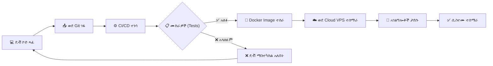

# ምዕራፍ 20 — የሲስተም አሰማራት (Deployment)


## 🚀 የሲስተም አሰማራት አጠቃላይ እይታ


ZENOVA ሲስተም በሶስት ዋና ዋና ክፍሎች ይሰማራል፦ የደመና አገልጋይ (Cloud VPS)፣ የትምህርት ቤት አገልጋይ (School Ubuntu Server) እና የተጠቃሚ ፊት ለፊት (Web Frontend)።


---


## 🏗️ የአሰማራት ፍሰት (Deployment Pipeline)


```

                        💻 DEVELOPER PC

                             │

                             ▼

                        ┌──────────┐

                        │   GIT    │

                        │  (ኮድ)   │

                        └────┬─────┘

                             │

                             ▼

                        ┌──────────┐

                        │  CI/CD   │

                        │ ማረጋገጫ  │

                        └────┬─────┘

                             │

                             ▼

                        ┌──────────┐

                        │  🐳     │

                        │  DOCKER  │

                        └────┬─────┘

                             │

                ┌────────────┴────────────┐

                ▼                         ▼

        ┌──────────────┐         ┌──────────────┐

        │  ☁️ CLOUD    │         │  🖥️ SCHOOL   │

        │  VPS         │         │  UBUNTU      │

        │  (ደመና)      │         │  (የት/ቤት)    │

        └──────┬───────┘         └──────┬───────┘

               │                       │

               ▼                       ▼

        ┌──────────────┐         ┌──────────────┐

        │  🌐 Web App  │         │  🔌 Local    │

        │  (Frontend)  │         │  Services    │

        └──────────────┘         └──────────────┘

               │                       │

               └───────────┬───────────┘

                           ▼

                  ┌──────────────────┐

                  │   💻 BROWSER   │

                  │   (ተጠቃሚ)      │

                  └──────────────────┘

```


---


## 🔄 የCI/CD ፍሰት (CI/CD Flow)





---


## 📋 የአሰማራት ተግባራት


| ደረጃ | ተግባር | ዝርዝር |

|-------|---------|---------|

| 1️⃣ | ☁️ VPS ውቅር | ምናባዊ የግል አገልጋይ መግዛት እና ማዋቀር |

| 2️⃣ | 🗄️ ዳታቤዝ | ማዕከላዊ የውሂብ ጎታ ማዋቀር (PostgreSQL) |

| 3️⃣ | 🔙 Backend | የኋላ-ተናጋሪ አገልግሎቶችን መጫን (Node.js) |

| 4️⃣ | 🎨 Frontend | የተጠቃሚ በይነገጽ ማሰማራት (Next.js) |

| 5️⃣ | 🔒 ደህንነት | ፋየርዎል፣ SSL ሰርተፍኬት እና ሌሎች ውቅሮች |

| 6️⃣ | 🖥️ የት/ቤት አገልጋይ | Ubuntu ማዋቀር፣ Docker ኮንቴይነሮች |

| 7️⃣ | 📡 NFC/QR | የሃርድዌር መሣሪያዎችን ማዋቀር |

| 8️⃣ | 🌐 ኔትወርክ | ከደመና ጋር የሚገናኝ ኔትወርክ ማዋቀር |


---


## 🎯 ማጠቃለያ (Summary)


የሲስተም አሰማራት ሂደቱ ከዴቭ ኮምፒውተር እስከ ደመና እና የትምህርት ቤት አገልጋይ ድረስ ያለውን ሙሉ ሰንሰለት ያካትታል። CI/CD ፓይፕላይን ሙከራዎችን አልፎ ኮዱን በራስ-ሰር ወደ አገልጋዮች ያሰማራል።


---
