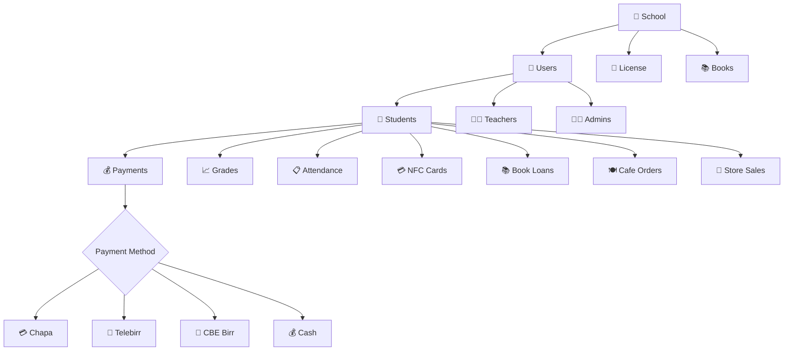

# ምዕራፍ 21 — የውሂብ ጎታ ዝምድና (Database Relationships)


## 🗄️ የዳታቤዝ አካላት ዝምድና ካርታ


ZENOVA ዳታቤዝ የተለያዩ አካላት እርስ በርስ የሚገናኙበት መዋቅር አለው። የሚከተለው ዲያግራም ዋና ዋና የውሂብ ጎታ አካላትን እና ዝምድናቸውን ያሳያል።


---


## 🏗️ የዳታቤዝ ዝምድና ዲያግራም (Entity Relationship Diagram)


```

┌─────────────────────────────────────────────────────────────────┐

│                   🗄️ ZENOVA DATABASE SCHEMA                     │

│                                                                  │

│  ┌─────────────┐       ┌──────────────┐       ┌──────────────┐ │

│  │  🏫 SCHOOL  │──────▶│  👥 USERS    │──────▶│  👦 STUDENTS │ │

│  │  ─────────  │       │  ──────────  │       │  ─────────── │ │

│  │  id (PK)    │       │  id (PK)      │       │  id (PK)     │ │

│  │  name       │       │  school_id(FK)│       │  user_id(FK) │ │

│  │  address    │       │  role        │       │  grade       │ │

│  │  phone      │       │  name        │       │  section     │ │

│  │  license_key│       │  email       │       │  student_id  │ │

│  └─────────────┘       │  password    │       │  nfc_uid     │ │

│         │              └──────────────┘       └──────┬───────┘ │

│         │                                            │         │

│         ▼                                            ▼         │

│  ┌─────────────┐                            ┌──────────────┐   │

│  │  🔑 LICENSE │                            │  💳 NFC      │   │

│  │  ─────────  │                            │  CARDS       │   │

│  │  id (PK)    │                            │  ─────────── │   │

│  │  school_id  │                            │  id (PK)     │   │

│  │  type       │                            │  student_id  │   │

│  │  start_date │                            │  uid         │   │

│  │  end_date   │                            │  status      │   │

│  │  status     │                            └──────────────┘   │

│  └─────────────┘                                               │

│         │                                                      │

│         ▼                                                      │

│  ┌────────────────────────────────────────────────────────┐    │

│  │                        🔽                              │    │

│  └────────────────────────────────────────────────────────┘    │

│                                                                  │

│  ┌─────────────┐  ┌─────────────┐  ┌─────────────┐  ┌────────┐ │

│  │  📚 BOOKS   │  │  💰 PAYMENTS│  │  📈 GRADES │  │  📋    │ │

│  │  ─────────  │  │  ─────────  │  │  ───────── │  │ ATTEND │ │

│  │  id (PK)    │  │  id (PK)   │  │  id (PK)   │  │ ────── │ │

│  │  title      │  │  student_id│  │  student_id│  │ id(PK) │ │

│  │  author     │  │  amount    │  │  subject   │  │ student│ │

│  │  isbn       │  │  method    │  │  score     │  │ date   │ │

│  │  quantity   │  │  date      │  │  grade     │  │ status │ │

│  │  available  │  │  status    │  │  term      │  └────────┘ │

│  └─────────────┘  └─────────────┘  └─────────────┘            │

│                                                                  │

│  ┌─────────────┐  ┌─────────────┐  ┌─────────────┐            │

│  │  📚 BOOK    │  │  🍽️ CAFE   │  │  🛒 STORE  │            │

│  │  LOANS      │  │  ORDERS    │  │  SALES     │            │

│  │  ─────────  │  │  ─────────  │  │  ─────────  │            │

│  │  student_id │  │  student_id│  │  student_id│            │

│  │  book_id    │  │  item      │  │  item      │            │

│  │  borrow_date│  │  amount    │  │  amount    │            │

│  │  return_date│  │  payment   │  │  payment   │            │

│  │  status     │  │  date      │  │  date      │            │

│  └─────────────┘  └─────────────┘  └─────────────┘            │

└─────────────────────────────────────────────────────────────────┘

```


---


## 🔗 የውሂብ ፍሰት ዝምድና (Data Flow Relationships)





---


## 📋 ዋና ዋና የውሂብ ጎታ ሠንጠረዦች (Main Database Tables)


| ሠንጠረዥ | ዋና ቁልፍ | የውጭ ቁልፎች | መግለጫ |

|----------|-----------|---------------|---------|

| 🏫 schools | id | - | የትምህርት ቤቶች መረጃ |

| 👥 users | id | school_id | ሁሉም ተጠቃሚዎች (13 ሚናዎች) |

| 👦 students | id | user_id | የተማሪ ዝርዝር መረጃ |

| 💳 nfc_cards | id | student_id | የNFC ካርዶች |

| 💰 payments | id | student_id | የክፍያ መዛግብት |

| 📈 grades | id | student_id | የውጤት መረጃ |

| 📋 attendance | id | student_id | የመገኘት ምዝግብ |

| 📚 books | id | school_id | የቤተ-መጻሕፍት መጻሕፍት |

| 📖 book_loans | id | student_id, book_id | የአበዳሪ መዛግብት |

| 🔑 licenses | id | school_id | የፍቃድ አስተዳደር |


---


## 🎯 ማጠቃለያ (Summary)


የZENOVA ዳታቤዝ በዋናነት በትምህርት ቤቶች እና ተማሪዎች ዙሪያ የተዋቀረ ነው። ሁሉም ሠንጠረዦች ከትምህርት ቤት ወይም ከተማሪ ጋር የተገናኙ ናቸው። የክፍያ መዛግብት ከተማሪ ጋር የተያያዙ ሲሆኑ የNFC ካርዶች ደግሞ ከተማሪዎች ጋር ተገናኝተዋል።


---
