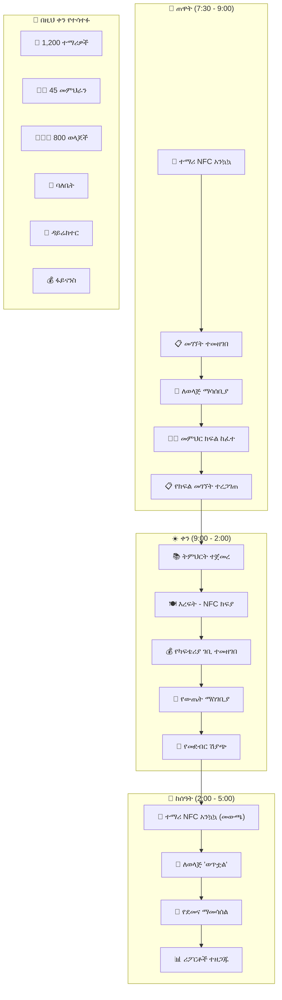

# ምዕራፍ 23 — የተሟላ ዕለታዊ ምሳሌ (Complete Daily Example)


## 📋 የአንድ ቀን የZENOVA ሕይወት


የሚከተለው በZENOVA ሲስተም የሚተዳደር የአንድ ትምህርት ቤት የተሟላ የአንድ ቀን ሂደት ነው።


---


## ⏰ የጊዜ መስመር (Timeline)


```

ሰዓት     እንቅስቃሴ                           ተሳታፊ            ሲስተም

─────    ────────────────────────────────────    ───────────────    ─────────────────────

7:30     🏫 ተማሪዎች ወደ ት/ቤት መግባት ጀመሩ    👦 ተማሪዎች       NFC ካርድ አንኳኳ

7:45     📱 ለወላጆች "ልጅዎ ገብቷል" ማሳሰቢያ   👨‍👩‍👧 ወላጆች    አውቶማቲክ SMS

8:00     🔔 የመጀመሪያ ደወል                     👩‍🏫 መምህራን      ዝግጁ ሁኔታ

8:00     📋 የመገኘት ምዝገባ ተጀመረ            👩‍🏫 መምህራን      የክፍል ዝርዝር

8:30     📊 ለዳይሬክተር የመገኘት ሪፖርት       👔 ዳይሬክተር     ዳሽቦርድ ተዘመነ

9:00     💰 አንድ ወላጅ ክፍያ ከፈለ             👨‍👩‍👧 ወላጅ       ቴሌብር ክፍያ

10:30    🍽️ የእረፍት ሰዓት - ካፍቴሪያ         👦 ተማሪዎች       NFC ክፍያ

11:00    📊 የፋይናንስ ዳሽቦርድ ተዘመነ        💰 ፋይናንስ      የካፍቴሪያ ገቢ

12:00    📝 የፈተና ውጤት መግባት ተጀመረ      👩‍🏫 መምህራን      ውጤት ማስገቢያ

1:00     🛒 የመደብር ሽያጭ                      👦 ተማሪ          NFC ክፍያ

2:00     🚪 የተማሪ መውጫ ተጀመረ                👦 ተማሪዎች       NFC ካርድ አንኳኳ

4:30     🔄 የደመና ማመሳሰል (የቀኑ የመጨረሻ)     ☁️ ሲስተም       ውሂብ ተሰማማ

5:00     📊 የቀኑ ሪፖርቶች ተዘጋጁ             👑 ባለቤት        ወርሃዊ ሪፖርት

```


---


## 🔄 የተሟላ የቀን ፍሰት (Complete Day Flow)





---


## 📊 የቀኑ መጨረሻ ሪፖርቶች (End of Day Reports)


### ለባለቤት የቀኑ ማጠቃለያ

| መለኪያ | ውጤት |

|--------|--------|

| 👦 ጠቅላላ ተማሪዎች | 1,250 |

| 📈 የተማሪ መገኘት | 95% (1,188 ተገኝተዋል) |

| 👩‍🏫 የመምህራን መገኘት | 98% |

| 💰 ዕለታዊ ገቢ | 5,500 ብር |

| 🍽️ የካፍቴሪያ ገቢ | 3,500 ብር |

| 🛒 የመደብር ገቢ | 2,000 ብር |

| 📚 አዲስ የተመዘገቡ | 5 ተማሪዎች |

| ⚠️ ያልተከፈለ ዕዳ | 45,000 ብር |

| 🔔 ማንቂያዎች | 0 |


---


## 🎯 ማጠቃለያ (Summary)


ይህ የአንድ ቀን ምሳሌ የሚያሳየው ZENOVA ሁሉንም የትምህርት ቤት እንቅስቃሴዎች እንዴት በአንድ ላይ እንደሚያስተናግድ ነው። ከተማሪ መግቢያ ጀምሮ እስከ ደመና ማመሳሰል ድረስ ሁሉም ነገር በራስ-ሰር እና ያለ ችግር ይከናወናል።


---
