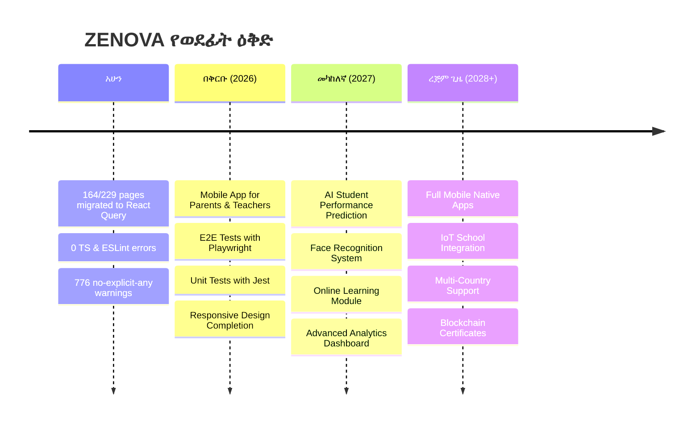

# ምዕራፍ 24 — የወደፊት ዕቅድ እና የተረፉ ክፍተቶች (Future Roadmap & Gaps)


## 🚀 የወደፊት ዕቅድ (Future Roadmap)





---


## 🏗️ የአርክቴክቸር ክፍተቶች እና ምክሮች (Architecture Gaps & Recommendations)


```

┌─────────────────────────────────────────────────────────────────┐

│           📋 የአርክቴክቸር ክፍተቶች ምደባ                        │

│  ከፍተኛ (High)  |  መካከለኛ (Medium)  |  ዝቅተኛ (Low)          │

├─────────────────────────────────────────────────────────────────┤

│  🔴 ሙከራ እጥረት    |  🟡 Loading States |  ⚪ API Docs        │

│  🔴 Error Handling  |  🟡 State Mgmt     |  ⚪ Performance    │

│  🔴 Input Validate  |  🟡 Responsive     |  ⚪ TypeScript     │

│                     |  🟡 Offline Mode    |  ⚪ Accessibility │

└─────────────────────────────────────────────────────────────────┘

```


### 🔴 ከፍተኛ ቅድሚያ (High Priority)


| # | ክፍተት | መግለጫ | ምክረ ሀሳብ |

|---|---------|---------|-------------|

| 1 | 🧪 የUnit/Integration ሙከራ እጥረት | 229 ገፆች ቢኖሩም የሙከራ ሽፋን ዝቅተኛ ነው | Jest + React Testing Library ሙከራዎች መፃፍ |

| 2 | ❌ ወጥ የስህተት አያያዝ አለመኖር | ስህተቶች ለተጠቃሚ ሳይታወቅ ይቀራሉ | Error Boundary + Toast Notifications |

| 3 | 🔍 የግብዓት ማረጋገጫ አለመኖር | የተሳሳተ ውሂብ ወደ ዳታቤዝ ሊገባ ይችላል | Zod ወይም Yup በመጠቀም ማረጋገጫ |


### 🟡 መካከለኛ ቅድሚያ (Medium Priority)


| # | ክፍተት | መግለጫ | ምክረ ሀሳብ |

|---|---------|---------|-------------|

| 4 | ⏳ የLoading/Skeleton እጥረት | ውሂብ በሚጫንበት ጊዜ ምንም አመልካች የለም | Skeleton Components መዘርጋት |

| 5 | 🎯 የተከፋፈለ የውሂብ አመንጪ | Local እና Server state ይደባለቃሉ | React Query cache ማዘመን |

| 6 | 📱 የሞባይል ምላሽ ሰጪነት | አንዳንድ ገፆች በሞባይል አይታዩም | Tailwind responsive classes |


### ⚪ ዝቅተኛ ቅድሚያ (Low Priority)


| # | ክፍተት | መግለጫ | ምክረ ሀሳብ |

|---|---------|---------|-------------|

| 7 | 📄 የAPI ዘገባ እጥረት | የAPI ኤንድፖይንቶች ሰነድ የላቸውም | Swagger/OpenAPI ዘገባ |

| 8 | ⚡ የአፈጻጸም መለኪያ | የገፅ ጭነት ጊዜ የሚለካበት ዘዴ የለም | Lighthouse / Web Vitals |

| 9 | 🔄 የE2E ሙከራ እጥረት | የCypress/Playwright ሙከራዎች የሉም | ለዋና ዋና የተጠቃሚ ጉዞዎች E2E |

| 10 | 📝 የTypeScript ማሻሻያ | 776 የno-explicit-any ማስጠንቀቂያዎች | ወሳኝ ቦታዎች ላይ ማስተካከል |


---


## 📈 የአሁኑ የሲስተም ሁኔታ (Current Status)


```

┌─────────────────────────────────────────────────────────────────┐

│                    📊 ZENOVA STATUS DASHBOARD                    │

├─────────────────────────────────────────────────────────────────┤

│                                                                  │

│  🟢 የተጠናቀቁ (Completed)                                     │

│  ┌──────────────────────────────────────────────────────────┐   │

│  │  React Query Migration      ████████████████████ 72%    │   │

│  │  TypeScript Errors Fixed    ████████████████████ 100%   │   │

│  │  ESLint Errors Fixed        ████████████████████ 100%   │   │

│  └──────────────────────────────────────────────────────────┘   │

│                                                                  │

│  🟡 በሂደት ላይ (In Progress)                                   │

│  ┌──────────────────────────────────────────────────────────┐   │

│  │  Remaining Pages            ██████░░░░░░░░░░░░░░ 28%    │   │

│  │  Warning Cleanup            ██████████░░░░░░░░░░ 50%    │   │

│  └──────────────────────────────────────────────────────────┘   │

│                                                                  │

│  🔴 መከናወን ያለባቸው (Needs Work)                             │

│  ┌──────────────────────────────────────────────────────────┐   │

│  │  Unit/Integration Tests    ░░░░░░░░░░░░░░░░░░░░ 0%      │   │

│  │  E2E Tests                 ░░░░░░░░░░░░░░░░░░░░ 0%      │   │

│  │  Error Handling            ██░░░░░░░░░░░░░░░░░░ 15%     │   │

│  │  Input Validation          ██░░░░░░░░░░░░░░░░░░ 10%     │   │

│  │  Mobile Responsiveness     ██████░░░░░░░░░░░░░░ 30%     │   │

│  │  API Documentation         ░░░░░░░░░░░░░░░░░░░░ 0%      │   │

│  └──────────────────────────────────────────────────────────┘   │

│                                                                  │

└─────────────────────────────────────────────────────────────────┘

```


---


## 🎯 ማጠቃለያ (Final Summary)


ZENOVA የትምህርት ተቋማትን ሙሉ በሙሉ በዲጂታል መንገድ ለማስተዳደር የተሰራ ዘመናዊ የEdTech መድረክ ነው።


**ዋና ዋና ጠቀሜታዎች፦**

- ✅ 13+ ሚናዎች ለሁሉም ባለድርሻ አካላት

- ✅ 3-ደረጃ አርክቴክቸር (ደመና → የት/ቤት አገልጋይ → ፊት ለፊት)

- ✅ NFC/QR ቴክኖሎጂ ውህደት

- ✅ ሶስት የክፍያ መጋራቢያዎች (ቻፓ፣ ቴሌብር፣ ሲቢኢ ብር)

- ✅ የደመና ማመሳሰል እና ምትኬ

- ✅ 0 የTypeScript እና 0 የESLint ስህተቶች


**ለማሻሻል የሚቀሩ ቦታዎች፦**

- 📝 የሙከራ ሽፋን (0% Unit/E2E Tests)

- 🔧 የስህተት አያያዝ እና የግብዓት ማረጋገጫ

- 📱 የሞባይል ምላሽ ሰጪነት

- 📄 የAPI ዘገባ


---


<div style="text-align: center; padding: 40px 0;">


## 📘 ZENOVA


### ምስላዊ የሥርዓት መመሪያ መጽሐፍ


**ስሪት 1.0** | **ሐምሌ 2026**


---


*ይህ ሰነድ የተዘጋጀው ለZENOVA ተጠቃሚዎች፣ ገንቢዎች እና ባለድርሻ አካላት ነው።*


*ሁሉም መብቶች የተጠበቁ ናቸው © 2026 ZENOVA*


</div>
